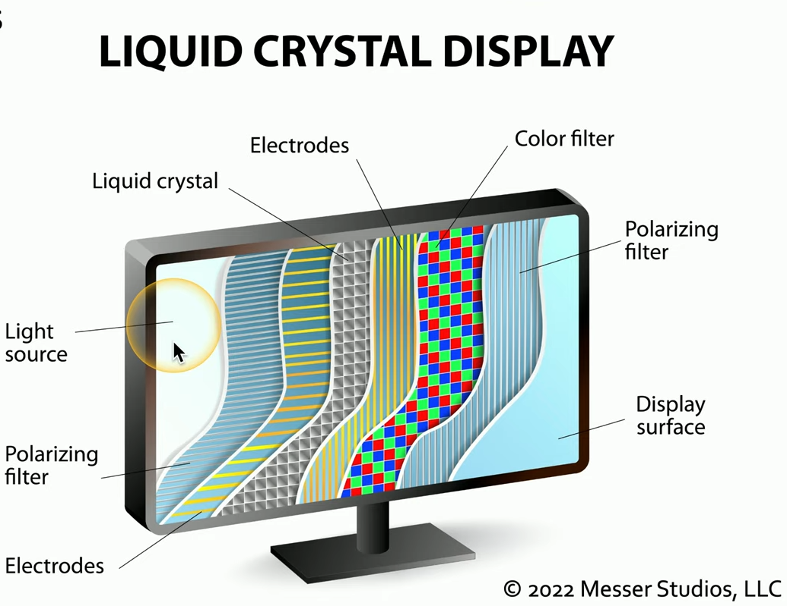
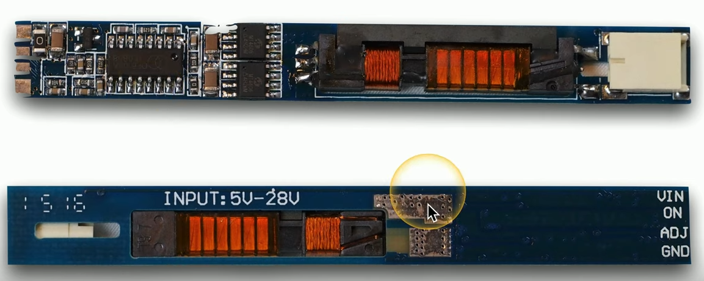

# Laptop Displays

## Portable LCD

* Liquid Crystal Display 
    * Light shines through liquid crystals

* Advantages
    * Lightweight
    * Relatively low power
    * Relatively inexpensive

* Disadvantages
    * Black levels are a challenge
    * Requires separate backlight 
        * Florescent, LED, etc
        * Lights are difficult to replace

## LCD Technologies

* TN (Twisted Nematic) LCD
    * The original LCD technology
    * Fast response times (gaming!)
    * Poor viewing angles - color shifts

* IPS (In Plane Switching) LCD
    * Excellent color representation
    * More expensive to produce than TN

* VA (Vertical Alignment) LCD
    * A good compromise between TN and IPS
    * Good color representation
    * Slower response times than TN

## OLED 

* Organic Light Emitting Diode
    * Organic compound emits light when receiving an electric current

* Thinner and lighter
    * Flexible and mobile - no glass needed

* No backlight
    * The organic compound provides the light 

* Tablets, phones, smart watches
    * Very accurate color representation
    * A bit higher cost than LCD

## WiFi antennas

* Multiple antennas
    * WiFi main and aux
    * Bluetooth 

* Antenna wires wrap around the laptop screen
    * It's up high!

## Webcam

* Video capture
    * Built-in camera and microphone

* Usually includes both audio and video
    * Specialized drivers and software

## Microphone

* Built-in to the laptop display
    * Useful for video calls

* Not good for non-casual use
    * Analog or USB microphones can help

## Fluorescent vs LED backlighting

* CCFL - Cold Cathode Fluorescent Lamp
    * Higher voltage and power needed
    * Added thickness to the display
    * No longer a common backlight
    * Older laptops will use these

* LED-backlit LCD display
    * Backlight is LED instead of fluorescent
    * LEDs around the edge of the screen
    * An array of LEDs behind the screen
    * The latest laptops are LED-backlit

## Backlight and inverter

* LCD displays need a backlight 
    * Fluorescent lamp/LED to LCD display to your eyes 

* Some laptops have inverters
    * Turn DC into AC

* Verify backlight 
    * Look closely
    * Use a flashlight

* May need to replace the LCD inverter or display
    * Choose carefully 

## Digitizer

* Use a pen-like device as input
    * Stylus input
    * Useful for graphical input

* Used commonly on laptops/tablets
    * Or hybrid devices

## Touchscreen

* Merge laptop and tablet input 
    * Digitizers respond to touch 
    * No keyboard required
    * But often still available

* Many options for input
    * Use the best one for the job

