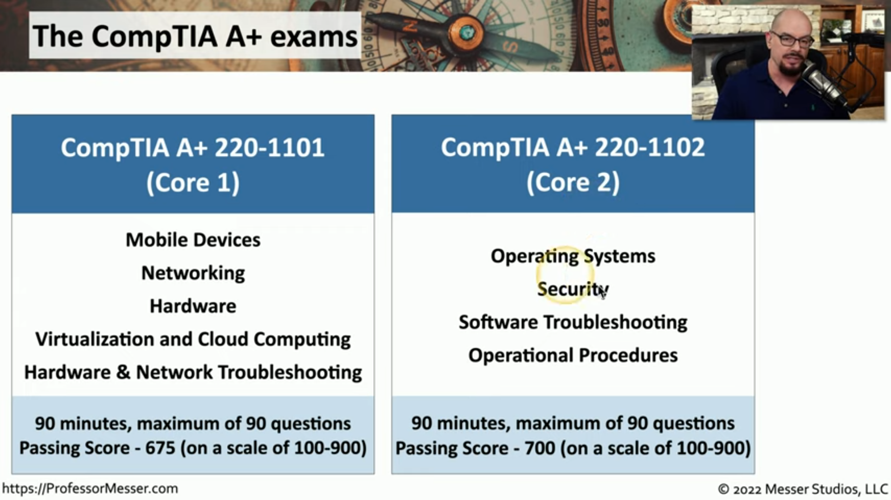

# How to Pass your 220-1101 and 220-1102 A+ Exams

## The CompTIA A+ advantage

* CompTIA Certifications:
    - The most popular technology certifications in the world

* Career growth
    - A+ is a common starting point

* Professional prerequisite
    - Many organizations require some type of certification

## CompTIA

* Who is the Computing Technology Industry Association (CompTIA)? 
    - The largest provider of vendor-neutral IT certifications
    - Members include IT resellers, IT distributors, IT manufacturers, and IT training centers
    - Certifications used to be vendor-specific

* Worldwide reach to over 100 countries
    - A+ Certification offered in many languages
    

## About Professor Messer

* Actual IT industry experience
    - Supercomputer operations
    - PC Hardware troubleshooting
    - Corporate training
    - Software engineering
    - Network analysis and troubleshooting SE
    - IT security Systems Engineer

* Training course author
    - Technology, networking, security, Linux, Cisco, Microsoft, etc. 

## About this training course

* CompTIA 220-1101 (Core 1) and 220-1102 (Core 2)
    - Released April 20, 2022

* Bite-sized videos
    - Quick and easy
    - Follow the CompTIA exam objectives

* Quality educational materials
    - A complete course

* My goal: A strong foundation of technical professionals

## What's the catch?

* No catch!
    - Free can be good

* The entire course is available to watch online
    - Not just one or two videos

* Want an offline version?
    - Purchase a copy and download immediately

* All of my notes can be yours!
    - Comprehensive 220-1101 and 220-1102 A+ Course Notes

* Video index:
https://www.ProfessorMessor.com

## The CompTIA A+ exams

* There's no time restriction between exams
    - Take both exams before the series is retired, in any order

* 220-1101/220-1102 were released on April 20, 2022
    - Must take both before they retire
    - Usually in three and a half years

* Check the CompTIA web site for details
    - Don't get caught!

## Exam questions

* Multiple choice
    - Very straightforward
    - Single, multiple answers

* Performance-based 
    - Complete a task
    - Command line, matching, sorting, drag-and-drop, etc.

* Know your stuff!
    - You'll be using it right away

## The four paths to success

* CompTIA certification objectives
    - http:/www.compTIA.org

* Watch these videos
    - Every exam objective is covered

* Get a good book
    - Get another explanation in another way

* Get as much hands-on as possible

* Test yourself
    - Sample exam questions and answers

## How to use my videos

* Sorted by CompTIA objective number
    - Matches the official Exam Objectives
    - Easy to find what you're looking for

* Most books will cross-reference
    - Beginning of chapter, list in appendix

* Watch straight through, or pick and choose
    - Each video can be used as a standalone resource

## Before the exam

* Use the exam objectives as your final checklist
    - You downloaded the objectives, right?

* Familiarize yourself with the testing location
    - Ask to see the testing room prior to booking your exam

* Check the online exam requirements
    - Set up your home testing environment

* Arrive on-site or set up early
    - You might be able to start early or go through your notes before the
      exam

## During the A+ exam

* Relax
    - Inform the testing center immediately if there are any noise,
      environmental, or technical concerns
    - Don't wait until the test is over!

* Time management
    - Jump over the performance-based questions 
    - Take a guess and check the "Mark" box

* Check the entire exam before submitting

* Did you pass?
    - Certified results are available online

## Are you ready?

* https://www.ProfessorMesser.com
    - Watch the videos, get the books

* Comprehensive video-based training
    - Categorized, indexed, and transcribed

* Get the exam objectives
    - https://www.professormesser.com/objectives/

* Ask questions in my real-time chat
    - https://www.professormesser.com/discord/

* Free monthly study group live streams
    - Check the event calendar

