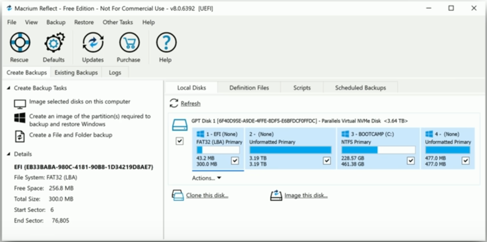
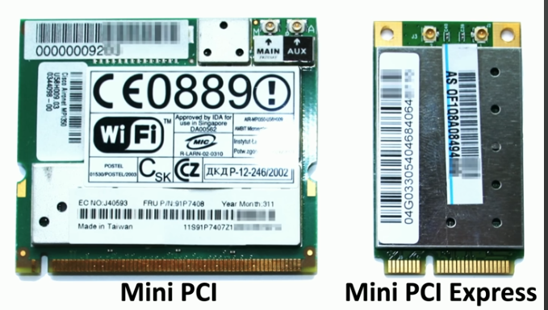
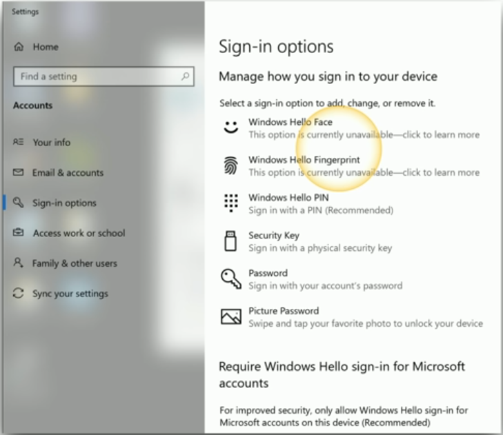

# Laptop Hardware

## Laptop Hardware

* Engineered to precise specifications
    * A challenging repair
* Some laptops are easier to fix than others
    * An ongoing learning process
* Understand the process
    * The details will vary between laptop manufacturers 

## Laptop batteries

* The power source when unplugged
    * May be easily replaced or require a teardown
    * Five minutes vs one hour
* Lithium-Ion and Lithium-Ion polymer are common
    * No memory effect
    * Charging the battery diminishes capacity
* Different form factor for each laptop
    * Battery types and styles can vary
    * Battery technology is changing constantly

### new defintion :)

**Memory Effect** - also known as battery effect, lazy battery effect, or battery memory, is an effect observed in nickel-cadmium rechargeable batteries that causes them to hold less charge. It describes the situation in which nickel-cadmium batteries gradually lose their maximum energy capacity if they are repeatedly recharged after being only partially discharged. The battery appears to "remember" the smaller capacity.

## Laptop Keyboard

* The most used component of the laptop
    * Can be easy to replace
    * A few screws and a single ribbon cable
    * May not always be this simple
* Or connect an external USB keyboard
    * Not very portable, but works in a pinch

## Laptop keys

* Some repairs might require the replacement of a key cap
    * This can be a delicate procedure
* Check with the manufacturer's instructions
    * It's very easy to accidentally break the key cap or the components
      underneath

## Laptop memory

* Small Outline Dual In-line Memory Module (SO-DIMM)
* Memory used in laptops and mobile devices
    * Often easy to install and replace
* Some laptop memory is soldered to the system board
    * No upgrade available
    * Requires a full system board replacement

## Laptop storage

* Magnetic disk
    * Traditional spinning drive platters
    * 2.5 form factors (3.5 for desktops)
* SSD (Solid-State Drive)
    * All memory, no moving parts
    * Silent, fast access time, no latency
    * 2.5 inch form factors
* M.2 
    * Smaller form factor
    * No SATA data or power cables
    * Easy to install and replace

## Replacing laptop storage

* All internal
    * Open a cover on the back
    * Open the entire laptop
* Can be very modular
    * Two screws and the drive slides out
* M.2 drives are even easier
    * One screw
    * Similar to RAM installation

## Migrating from HDD to SSD

* An impressive upgrade
    * Move from spinning mechanical drive to solid state memory
* It's almost like getting a new laptop
* Install an OS on the SSD
    * Move user documents between drives
    * Install any required applications 
    * Can be time consuming
* Image/Clone the HDD
    * No OS installation required
    * Move everything from one to the other
* Imaging software needed
    * Sometimes included with the SSD
    * Many commercial and open source options

* Create an image file
    * One drive at a time
* Drive-to-drive image
    * Image directly from one drive to another

## 802.11 wireless and Bluetooth

* Wireless network connectivity
    * Connect without wires
* 802.11
    * Local Area Network (LAN)
    * High speed
    * Internet Access
* Bluetooth 
    * Personal Area Network
    * Short range
    * Connect peripherals and other nearby devices

## Biometrics

* Sign in or unlock your device with a fingerprint reader or face recognition
    * Something you are
* Requires additional configuration in the OS
    * Hardware required for most options
* Relatively secure
    * Faces and fingerprints are quite unique

## Near-Field Communication (NFC)

* Short-distance communication 
    * 4 centimeters or less
    * Data transfers or authentication
* Common on mobile phones and smart watches
    * Payment method on your wrist
* Use it for authentication without typing a password
    * Hospital workstations
    * Warehouses
    * Manufacturing

