## Introduction

### Welcome to HTB Academy

Hack The Box Academy's goal is to provide a highly interactive and streamlined
learning process to allows users to have fun while learning. The content is 
based on a guided learning approach, and enables you to practice what you learn
through interactive content.

You will face many hands-on exercises to reproduce what was covered in the
section, as well as challenge your understanding of the content by tackling new
scenarios of the same concept.

Most HTB Academy modules also culminate in a Skills Assessment that tests your
understanding of the whole module with a real-world scenario.

## HTB Academy Structure

In HTB Academy, we break the material into digestible chunks to enable a
seamless understanding of the content. The largest learning block is a path,
which is broken into multiple modules, each of which covers a specific
self-contained topic. Modules are further broken down into sections. 

Some paths are linked to certifications, which can be obtained after completing
their path and exam. 

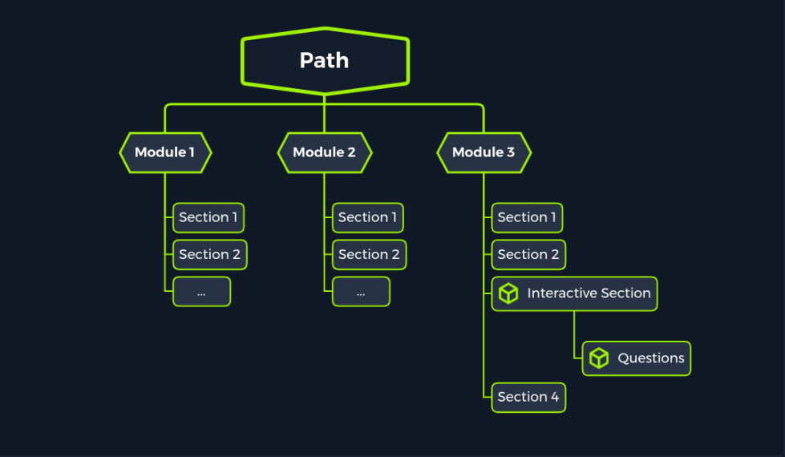

While a major step, like a path, may look intimidating and heavy with
information, breaking it into modules and sections makes it much more digestable
and easier to learn. This allows anyone to start with a single session, and take
small steps until they reach their major achievement by obtaining a certificate.

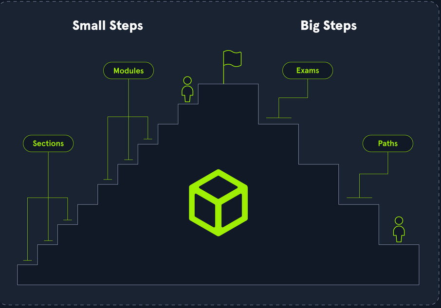

This process not only allows you to take it one step at a time, but also ensures
that you are constanly testing your knowledge and challenging your skills, which
is necessary to reaffirm the knowledge gained through modules and turn it into
gained skills.

"Great things are not done by impulse, but by a series of small things brought
together." - Vincent Van Gogh

## Modules

### What is a Module?

A module is the core building block within HTB Academy, and represents a signle
course that covers a specific topic. Modules consist of multiple sections, as
mentioned previously, and a group of modules make a path.

You can click on any module in the Modules page to preview its summary, which
mentions what the module covers, what is the expected outcome, and what are the
requirements for starting the module (if any).

**Note:** You can click on the (heart) icon to add a module to your favorite
"i.e. To-Do" list, which can be accessed from your Dashboard.

### Types of Modules 

HTB Academy modules are categorized into: Offensive, Defensive, and General
modules. They are also rated based on their difficulty, as: Fundamental, Easy,
Medium, Hard.

You can filter modules based on the above categories (and other criteria) in the
Modules page. Furthermore you can filter modules by name to find the exact
module you are looking for.

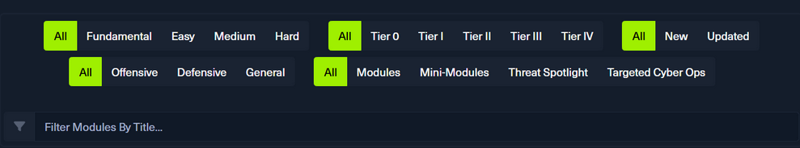

### Module Tiers

Modules are split into 5 tiers based on their cost, as follows:

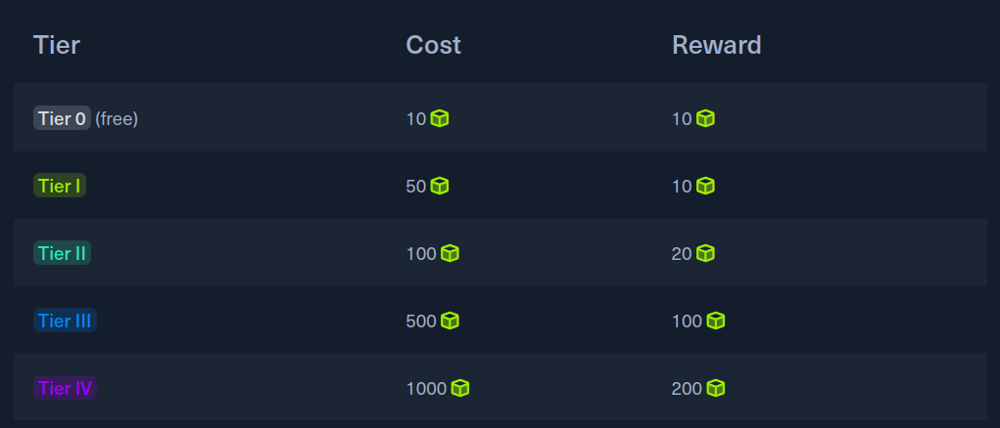

Each module costs a specific amount of cubes to unlock, and will always return
20% of those cubes back upon 100% completion of the module. 

Tier 0 modules are considered free modules, as they cost 10 cubes and reward
back 10 cubes, thus not affecting your remaining cubes balance. Remember, you
must complete the module to gain back the cubes, which is done to incentivize
students to complete each module.

**Note:** If you have annual subscription, then included modules will cost you 0
cubes, while still giving you back their reward.

### Completing a Module

To complete a module, you need to solve all of its exercises and mark all
sections as "completed". Once that's done, you will usually face the module's
Skills Assessment, which represents a real-world scenario of the topic the
module covered, and tests your understanding of most/all of the skills shown
within it. 

If you are able to complete the module's Skill Assessment, then you have
demonstrated that you have solid understanding of the module's content, and can
thus move to your next module. To do so, simply click on the Finish button
found at the last section of the module (often Skills Assessment section).

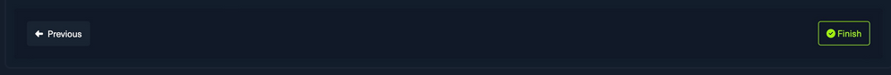

When you finish a module, you will be redirected to its Completion page. Here
you can share your achievement on social media, write a review for the module,
and find suggesstions for modules to do next. You will also unlock the module's
badge, which you can find on the My Badges page.

## Sections 

### What is a Section?

A section is the smallest building block in the HTB Academy structure. Each
section covers a specific area in the larger module topic, and is designed to be
completed in one setting. 

For example, in this Intro to Academy module, this Sections section discusses
sections. 

### Types of Sections

There are two types of sections: Theory Sections and Interactive Sections.

Theory sections do not contain any practical elements. Instead, they build the
foundational knowledge that is necessary to understand any upcoming
practice/interactive lessons, and establish the basics for the entire module. 

On the other hand, interactive lessons, which are denoted with a small cube,
form the majority of sections within HTB Academy. This is where you will learn
through practical examples and demos.

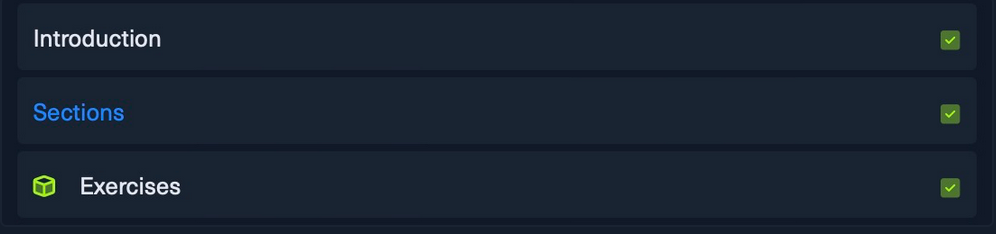

You are always highly encouraged to re-apply what you learned throughout any
interactive section, to ensure you get to practice what you learned.

### My Workstation

To allow easier practice of what you learn in interactive lessons, each module
provides your own workstation (a.k.a. PwnBox), which is a Linux operating system
(Parrot OS), pre-packed with many tools to assist you in the learning process.

Your workstation allows you to re-do any examples shown in Academy, as well as
solve any exercises or skill assessments.

You can spawn your workstation by clicking on the Start Instance button found at
the end of any interactive section, and/or in the My Workstation box on the
right of your screen, as shown below:

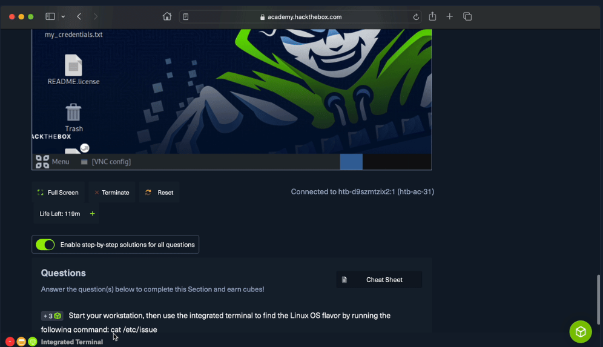

### Completing a Section

You can click on the Mark Complete and Next button to complete any section.
However if a section has any questions, then you must first solve those
questions to be able to successfully complete the section.

If you wish to skip a section, or delay solving questions until later, you can
click on the Next button or navigate to any other section in the module by
clicking on it in the Table of Contents.

## Exercises

### What is an Exercise?

In addition to the examples and demos demonstrated within interactive lessons,
most also end with exercises to test that knowledge. 

An exercise will usually have an accompanying Docker target or VM target(s). A
target can be started by clicking on Click here to spawn the target system!,
which will be populated with its access details, in the format
http://<ip>:<port>. It may also provide authentication details, in the form of a
username and password.

**Note:** Only a single target per user can be active at any one time. Each
target has a timer that shows how much time is left before it is terminated, but
it can be manually extended or re-spawned by clicking on the appropriate
buttons.

### Docker Targets

Most exercises, especially in web modules, utilize Docker targets, which are
faster to spawn and can be accesses without additional setup. Once a docker
target is active, you can simply click on the IP/PORT to copy it, and then
access the target (e.g. in a web browser for web modules). Most docker targets
are ready to use instantly, although some may take up to a minute after IP/PORT
are shown.

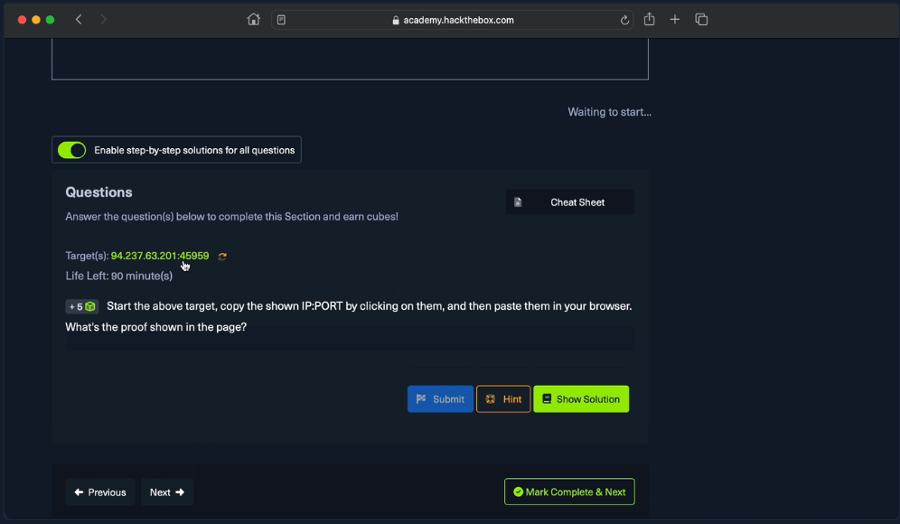

**Note:** You can spot a docker target by its lack of a VPN button, as no VPN
connection is required to access it.

### VM Targets 

Certain modules have advanced requirements for their exercises, like a Windows
target, an Active Directory (AD) target, or a network environment target. Such
modules utilize a Virtual Machine (VM) as their target, which can be spawned
like docker targets, but may take a little longer to start. 

If you use your Workstation, then you can start accessing the VM once its IP is
shown. Otherwise, if you prefer to use your own machine, then the VM can be
accessed by connecting to the provided VPN key, which can be downloaded by
clicking on the Download VPN Connection File button.

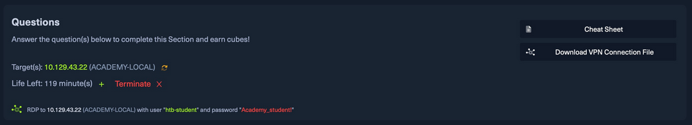

**Note:** To find out more about connecting to the HTB Academy VPN, check out
[this help
article](https://help.hackthebox.com/en/articles/9297532-connecting-to-academy-vpn).

### Completing an Exercise

Some questions have a Hint button, which may point you in the right direction if
you are struggling with them. Once you obtain the answer or the flag, you can
type it in the field and hit Submit to complete the exercise/question.

Solving a question correctly will reward you with a certain amount of cubes,
which may be collected to unlock other modules in the HTB Academy, as we will
discuss in the next section. 

Most questions are required to complete the section, but any questions marked as
Optional Exercises may be solved by clicking Reveal Answer button, and the
section may be completed without solving them.

**Note:** You can always use the exercise targets to practice what was shown in
the section. However, solving the exercise will not always match the exact
commands shown in the section, as they will have some variance to test your
understanding and gradually build your skills. Exercises in easier modules will
have a minor variance from the shown demo, while harder modules will be more
challenging.

## Paths and Certifications

### What is a Path

Paths are a collection of modules that share a broader topic. Certain paths lead
to an HTB Certification after completing their corresponding exam. A single
module may show up in multiple modules if its topic matches the path's topic.

### Types of Paths

There are two types of paths in HTB Academy: Skill Paths and Job-Role Paths. You
can enroll in any path by clicking on the Enroll button, which will make it
easier to track your progress in the path and see the upcoming modules in it
through the Dashboard page.

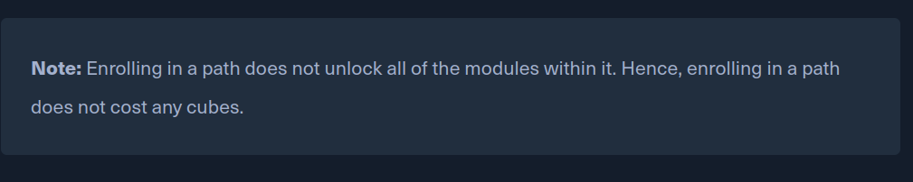

A Skill Path groups modules with a specific popular skill stat students may want
to learn. For example, students who are looking to learn the basics of different
operating systems can enroll in the Operating System Fundamentals path.

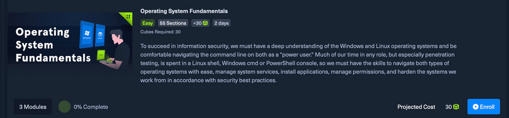

Job-Role paths, on the other hand, are curated to prepare students for a
specific job role in the cyber security market. Each Job-Role path is linked to
a certification, which requires passing a multi-day practical exam to obtain.

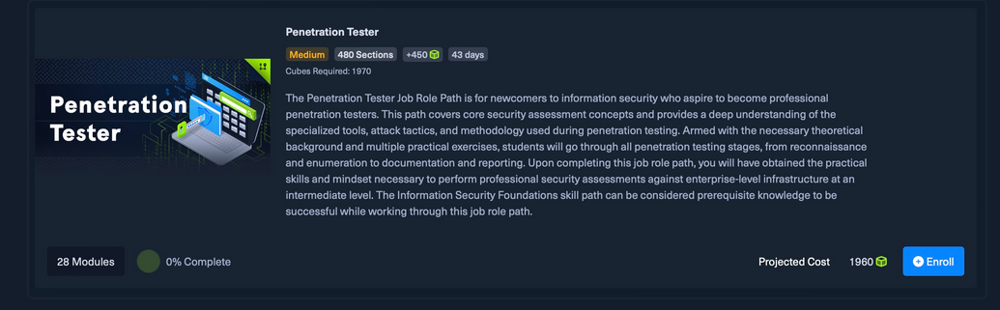

**Tip:** You can estimate how long a path will take to complete by checking the
duration mentioned underneath the path's title. This represents the sum of the
estimated time for completion of each module in the path "in 8-hour work days".

### Obtaining a Certification

An HTB certification is the key achievements students should target within HTB
Academy. As mentioned earlier, each certification is linked to a Job-Role path,
which is specifically designed to prepare you for the certification exam. 

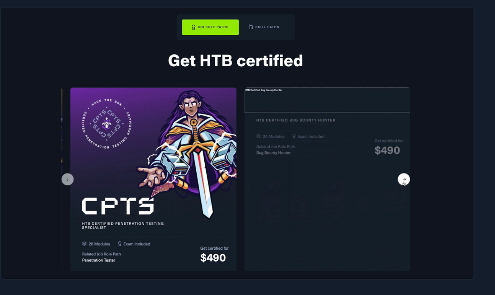

Any student, regardless of their level, can progress through HTB Academy and
follow a path to advance their skills until they obtain a certification. 

By the time you obtain an HTB certification, you will have completed hundreds of
sections and exercises, tens of modules and skills assessments, and have passed
a real-world multi-day practical exam. So you will be market-ready for the
specified job role.

**Note:** Completing a path also unlocks a new badge, and so does obtaining a
certificate. 

## Getting Help

During your learning journey, you may face hurdles and get stuck on specific
challenges, and the HTB Academy's got your back!

If you have any general questions about certain features within HTB Academy,
then you can click on the help button found in the bottom-right corner of your
screen.

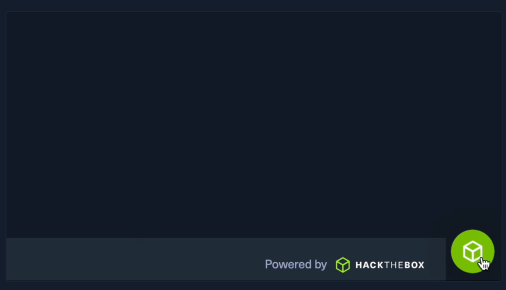

If you are ever struggling with any exercises or skill assessment, then HTB
Academy also provided detailed solutions for every exercises, for a fully guided
learning mode. 

You can simply click on the Show Solution button found underneath the question,
and you'll be taken to its solution. This feature is only available for students
with an annual subscription and business customers.

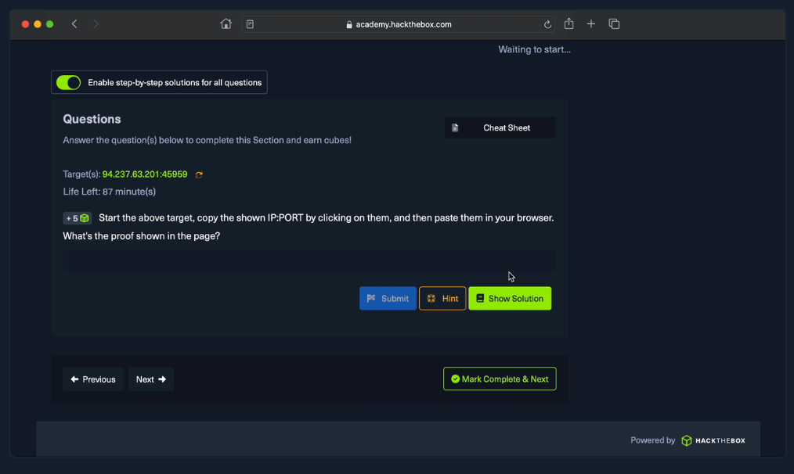

Finally, we strongly recommend all students join our Hack The Box community,
through which you can ask others for help or just chat about your learning
journey. The best place to do so is through our Hack The Box Discord server. You
may also join our Hack The Box Forum or our Hack The Box Sub-reddit.

## Next Steps

You are now familiar with the core aspects of HTB Academy, and you can start
your learning journey!

### Pick a Path

We highly encourage students to always follow a specific path in their learning
journey.

If you are just beginning your cybersecurity journey, then we suggest enrolling
in the Information Security Foundations path. This skill path will prepare you
for your first HTB certification regardless of your current level.

If you have some experience in cyber security, and would like to obtain your
first HTB Certification, then we suggest enrolling in one of our intermediate
job role paths, depending on your job/field preference as shown below:

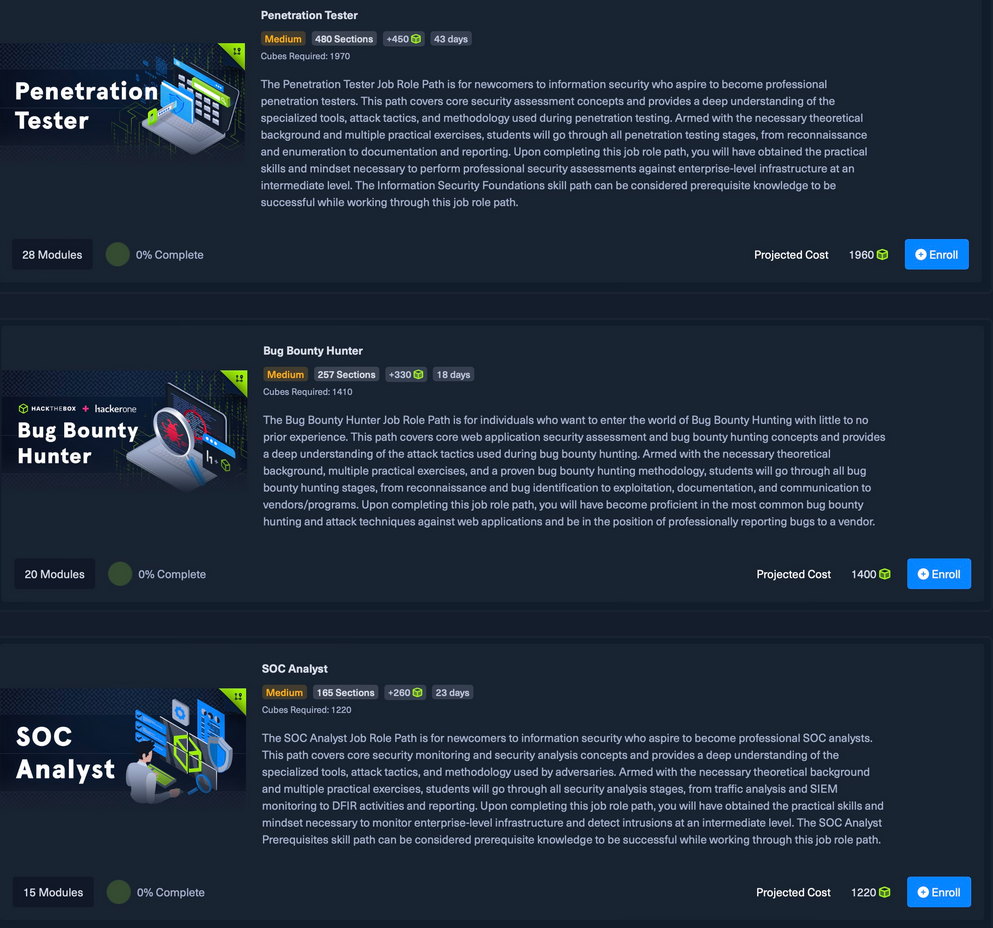

If you are experienced in cyber security, and would like to get advanced in a
specific field, then we suggest you enroll in our advanced jor role paths, like
the Senior Web Penetration Tester to become a HTB Certified Web Exploitation
Expert.

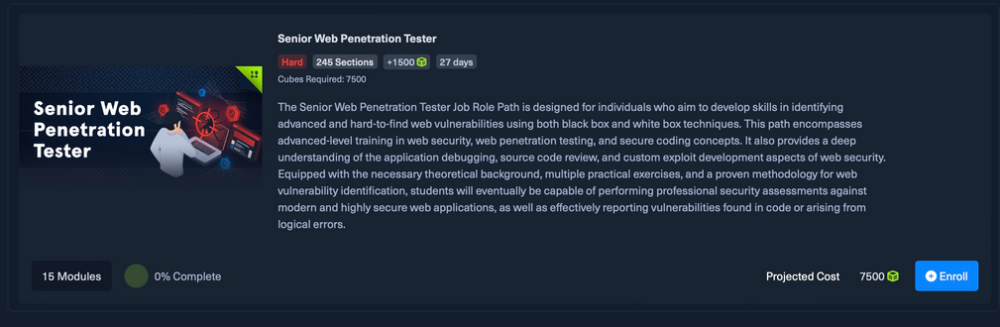

HTB Academy will keep pushing more modules, paths and certifications, so keep an
eye out for our upcoming content.

Good luck!

FINISHED!

