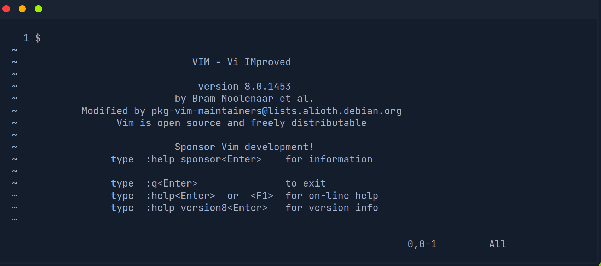
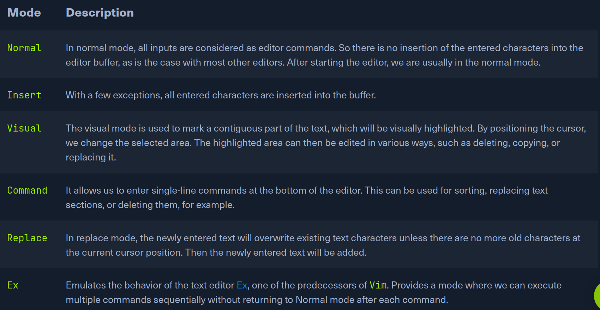

# Editing Files

```
nano (how dare you?)
vi 
vim
cat
vimtutor
```
- `^` means CTRL

- See some real shit below, soy boy, don't you ever use nano around me!





Did you know there was an editor called Ex? Of course you didn't, you never had
exes hahahahahhahahahahha! Hey, just kidding, you are doing amazing, I hope
Jesus loves you!


