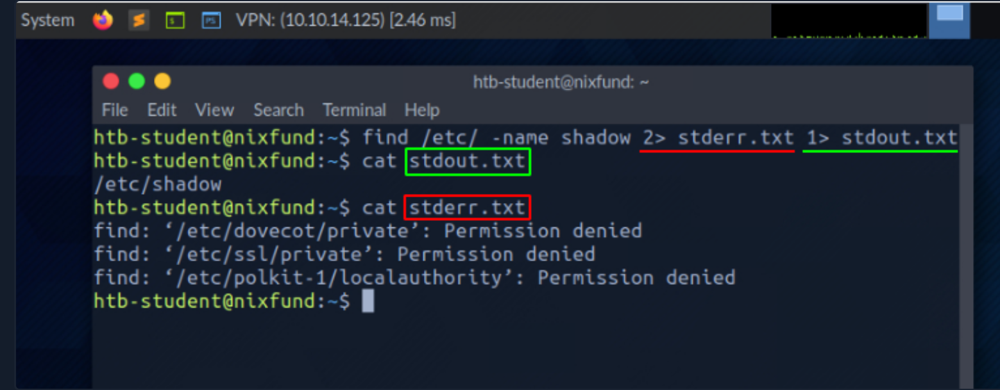
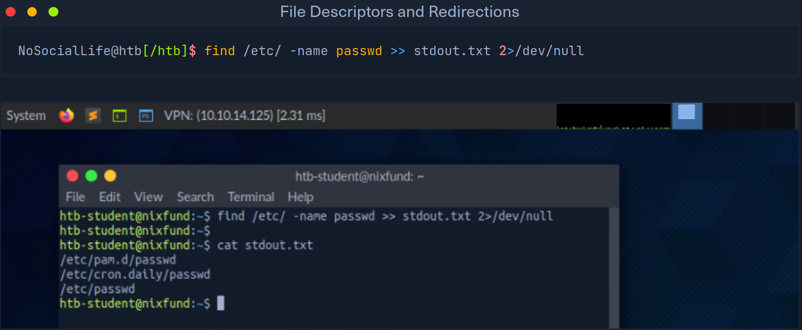
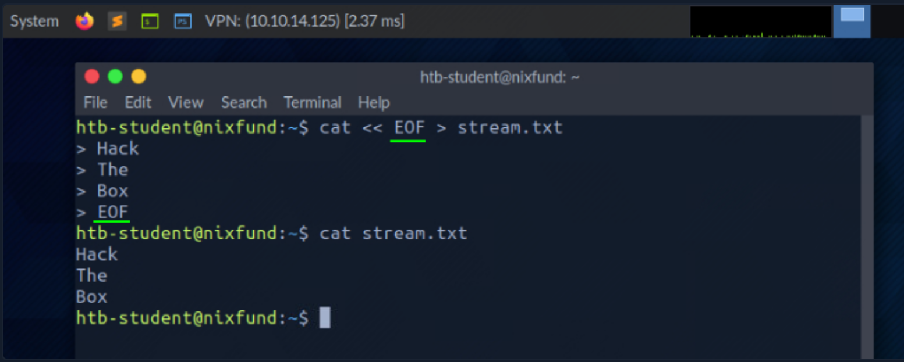
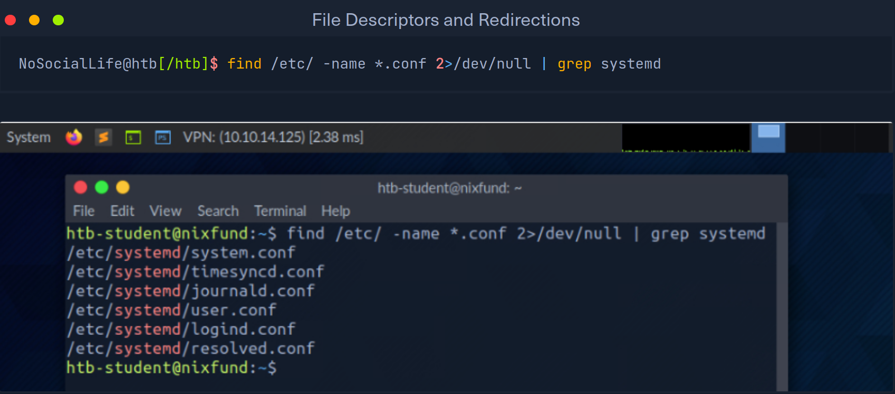
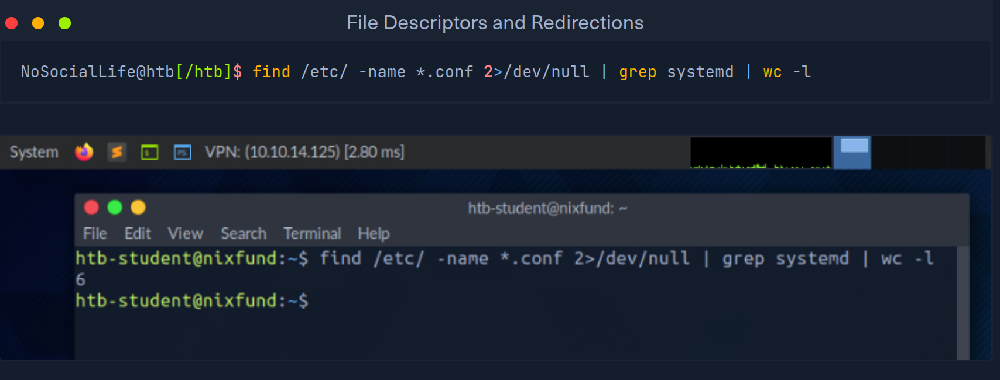

# File Descriptors and Redirections

## File Descriptors

- indicator of connection maintained by kernel for I/O operations
- in Windows called filehandles
- some really interesting low level stuff 

