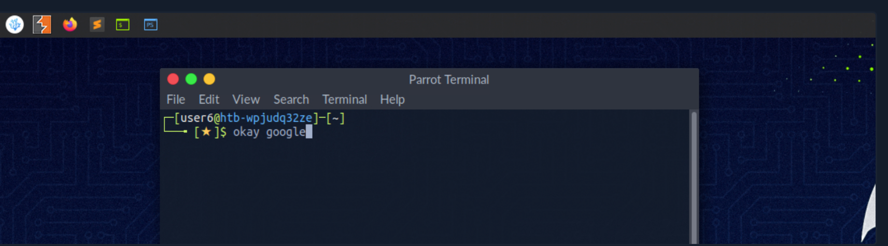
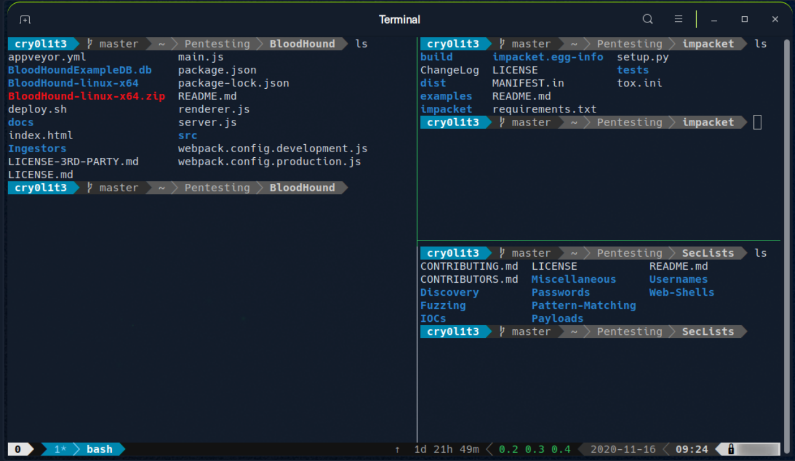

# Introduction to Shell

- Many servers based on Linux
- Less error prone than Windows
- Shell is key

- Shell provides text-based I/O between user & kernel

## Terminal Emulators

- Text-based programs with GUI
- Terminal is interface to shell interpreter 

- Emulators and multiplexers are beneficial
- Tmux is one of them

## Shell

- Bourne-Again Shell (part of GNU project)
- Everything you can do in GUI you can do in shell
- Fast, less manual work
- Other shells include Zsh, Fish, Ksh, Csh, etc.

