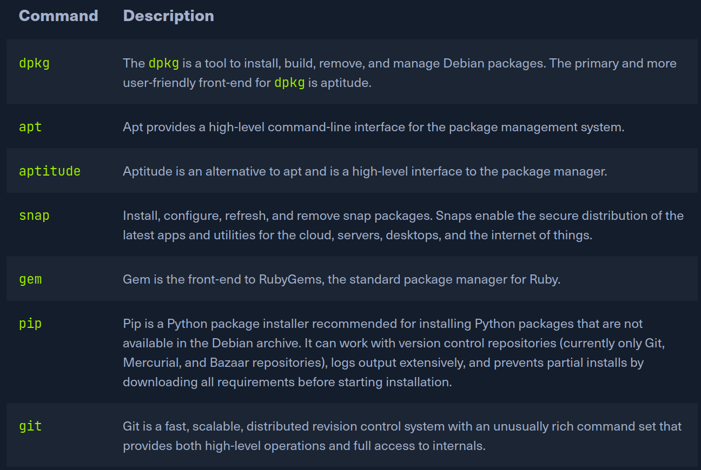

# Package Management

Packages are archives that contain binaries of software, configuration files, information about dependencies and keep track of updates and upgrades. The features that most package management systems provide are:

* Package downloading
* Dependency resolution
* A standard binary package format
* Common installation and configuration locations
* Additional system-related configuration and functionality
* Quality control

