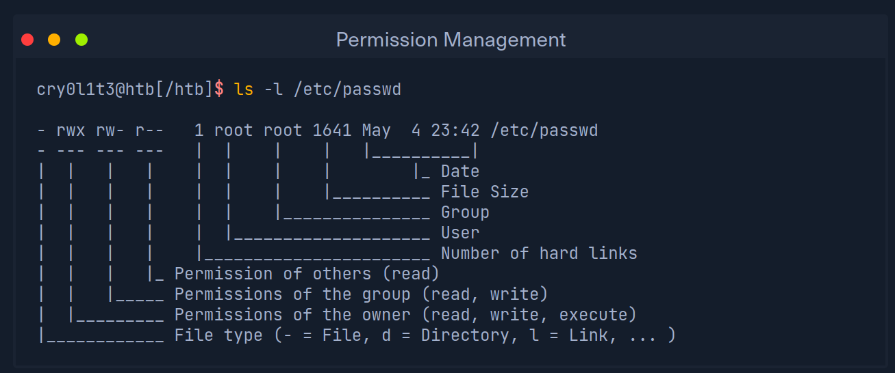
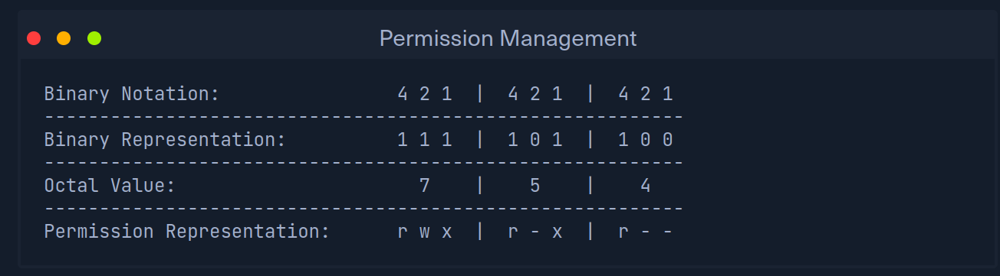
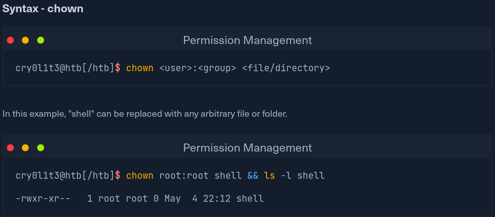

# Permission Management

- must have execute permission to access directory
- must have execute file permission to execute file
- write permissions to write to file
- SUID & SGID - set user id, set group id
- Sticky bit - only owner can change or delete
- in sticky bits T - no execute, t - execute 

