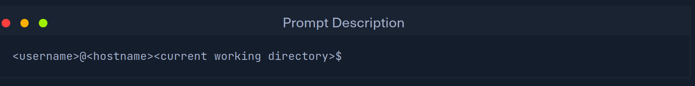
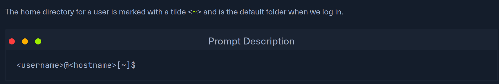
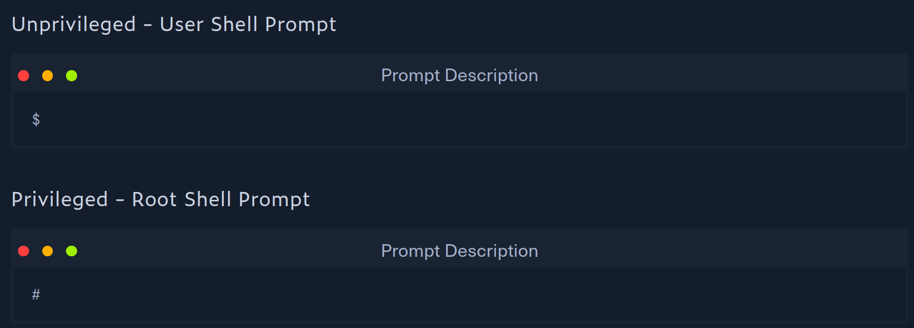
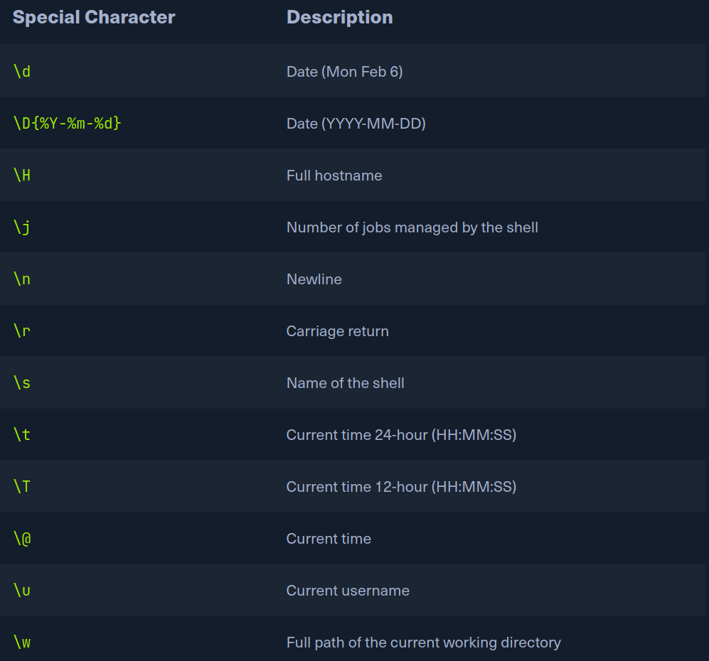

# Prompt Description

- Default: user, hostname, directory

- ~ jeans home dir

- $ means user, # means root

- We won't always see the components of the prompt

- Customizable to include other things 

- Customization = more personalized and efficient
- It can provide meaningful info

- Add colors and etc. to make more appealing

- Check out bash-prompt-generator and powerline

