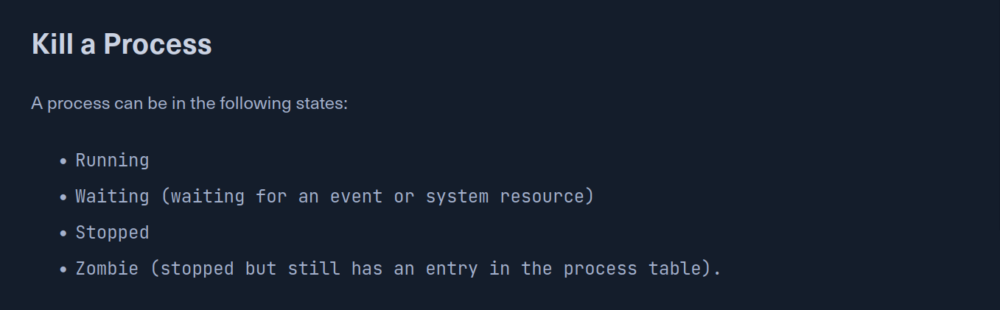
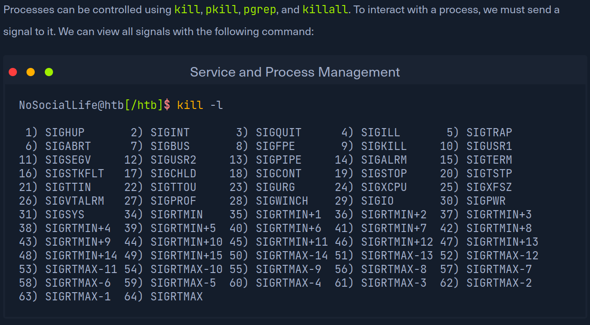
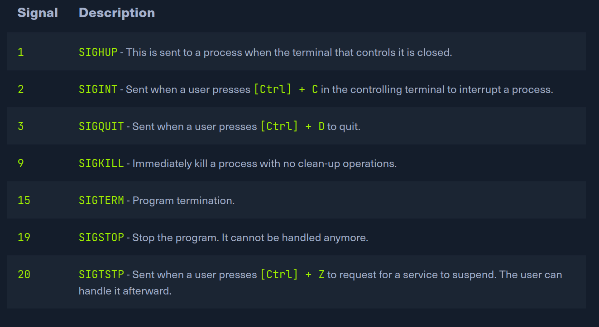

# Service and Process Management

In general, there are two types of services: internal, the relevant services that are required at system startup, which for example, perform hardware-related tasks, and services that are installed by the user, which usually include all server services. Such services run in the background without any user interaction. These are also called daemons and are identified by the letter 'd' at the end of the program name, for example, sshd or systemd.

Most Linux distributions have now switched to systemd. This daemon is an Init process started first and thus has the process ID (PID) 1. This daemon monitors and takes care of the orderly starting and stopping of other services. All processes have an assigned PID that can be viewed under /proc/ with the corresponding number. Such a process can have a parent process ID (PPID), and if so, it is known as the child process.

