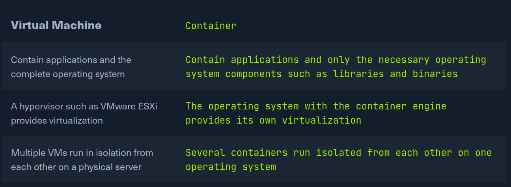
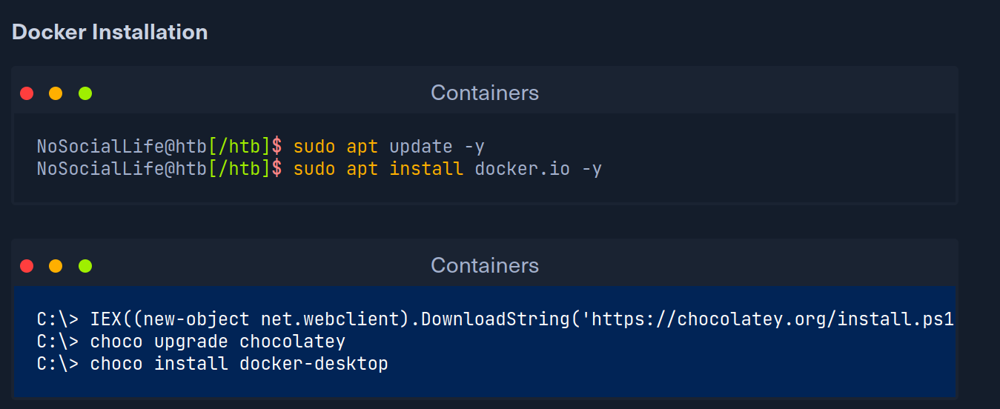
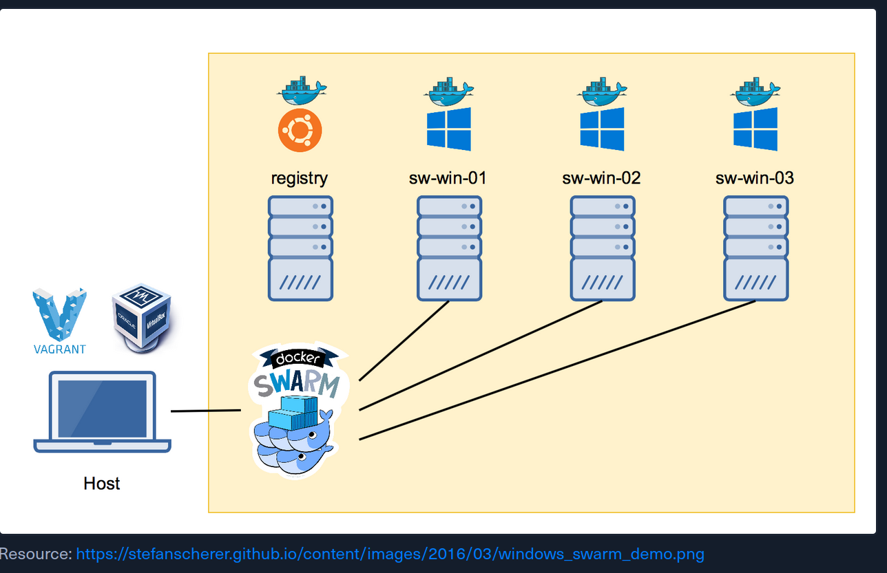

# Containers

A container cannot be defined as a virtual machine but as an isolated group of
processes running on a single host that corresponds to a complete application,
including its configuration and dependencies. This application is packaged in a
precisely defined and reusable format. Unlike a usual VM on VMware Workstation,
however, a container does not contain its operating system or kernel. It is, 
therefore, not a virtualized operating system. For this reason, containers are
significantly slimmer than conventional virtual machines. Precisely because they
are not virtual machines, they are also referred to as application
virtualization in this context. 

A significant issue when rolling out new applications or new releases is that
each application depends on some aspects of its environment. These include, for
example, local settings or function libraries. Often, the settings in the
development environment differ from those in the test environment and
production. It can then quickly happen that, contrary to expectations, an
application works differently or not at all in production. 

Application containers are technically based on functions that have been available
under the Linux operating system for some time. The kernel uses these functions
to isolate applications. Thus, applications run isolated from each other as a
process in different user accounts. However, they belong at the same time to a
familiar Linux environment. The cooperation of various applications is also
possible, and if the containers run on the same system, a container daemon is
used, for example, Linux Container Daemon (LXD). LXD is a similar technology to
Linux Containers (LXC). LXC is a container-based virtualization technology at
the operating system level. Technically, LXC combines isolated namespaces and
the Linux kernel "cgroups" to implement isolated environments for code
execution. Historically, LXC was also the basis for the widely used Docker
virtualization technology. Using LXD, Linux operating system containers can be
configured and controlled via a defined set of commands. It is therefore
suitable for automating mass container management and it is used in cloud
computing and data centers. 

An image of the file system forms the basis of each container. We can choose
whether to use an image that has already been created or create one ourselves.
Containers are also characterized by outstanding scalability. Improved
scalability is ideally suited to the requirements of the new highly dynamic IT
infrastructure in companies. Indeed, the high scalability of containers makes it
possible to ideally adapt the capacities for the user's provision of
applications. Meanwhile, even large container setups can be managed without any
problems because of orchestration systems such as Apache Mesos or Google
Kubernetes. These systems distribute the containers over the existing hardware
based on predefined rules and monitor them.

## Introduction to Docker

Docker is open-source software that can isolate applications to containers,
similar to operating system virtualization. This approach significantly
simplifies the deployment of applications. The application data stored in
containers can be transported and installed easily. The use of containers
ensures that computer resources are strictly separated from each other. Docker
stores the programs together with their dependencies in images. These form the
basis for the virtualized containers that can run on any operating system. This
makes applications portable and uncomplicated, whether during development or
when scaling SaaS clusters. 

Docker engine is the main component of container virtualization. The software
provides the interface between host resources and running containers. Any system
that has Docker Engine installed can use Docker containers. Originally, Docker
was designed to be used on Linux systems. However, with virtualization via VMware
or Hyper-V, the engine also works on Windows and Mac OS devices. Docker can
therefore be used in virtually all common scenarios. 

## Introduction to Vagrant

Vagrant is a tool that can create, configure and manage virtual machines or
virtual machine environments. The VMs are not created and configured manually
but described in code in a Vagrant file. To better structure the program code,
the Vagrant file can also include additional code files. This code can then be
processed using the Vagrant CLI. In this way, we can create, provision and start
our own VMs. Moreover, if the VMs are no longer needed, they can be destroyed
just as quickly and easily. Out of the box, Vagrant offers providers for VMware
and Docker. 

It is highly recommended to play around with different containers and experiment
to get a feel for them. We should look at the documentation and read through it
to understand how containers work and what they depend on. It will also help us
understand what advantages and disadvantages they bring. 

