# Linux

Linux is the most widely used Operating System for penetration testing purposes.
Therefore, we must be very familiar with it. If we have to prepare an operating
system, it is best to develop a certain standard for it that leads to the same
setup we are used to. 

Suppose we are asked to perform a penetration test to test the network's
internal and external security. Therefore, if we have not prepared a system in
advance, we should do it now at the latest. Otherwise, we will lose valuable
during the penetration test that we could have used to test different components
of the network instead of configuring and installing various tools. However,
before we prepare a system, we need to look at the available penetration testing
distributions. 

## Penetration Testing Distributions

There are many different distributions that we can use, all which have
different advantages and disadvantages. Many people ask themselves which system
is the best. Nevertheless, what many do not understand is that it is a personal
decision. This means that it depends a lot on our needs and desires, which is
the best for us. The tools installed on these operating systems can be installed
on any distribution, so we should instead ask ourselves what we should expect
from this Linux distribution for penetration testing. The best penetration
testing distributions are characterized by their large and active community and
comprehensible and detailed documentation. Among the most popular include, but
not limited to:

- ParrotOS
- Kali Linux
- BlackArch (use the real ARch lol)
- BlackBox

In this case, we will deal with ParrotOS Security as out penetration testing
distribution of choice. 

## VM Setup

Before installing our ParrotOS Security operating system, we need to create a
VM. Here we also specify which installation file will be used for the operating
system (.iso file). 

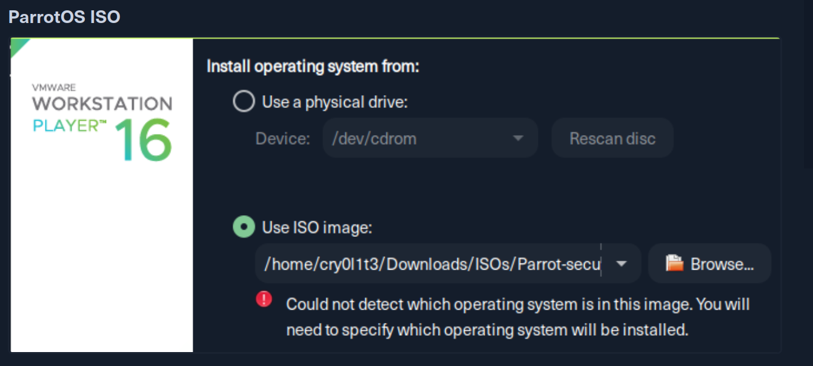

Since VMware doesn't know all the operating systems, it may be that the system
is not recognized. Therefore, we have to specify which distribution the system
we want to install is based upon in the next step. In the case of ParrotOS, this
is a Debian-based operating system. 

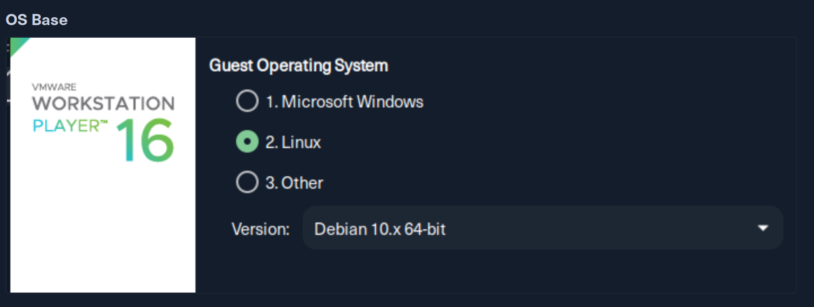

After that, we assign a name for the VM with the label we want to have for it
and then set the path where it will be stored. 

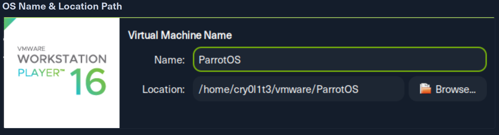

After that we can set the maximum size of the VM. Here it is recommended to set
the size larger than 20GB because the VM will not be equal to the size we set
but will grow with the packages and applications we install during setup and
regular usage. It is also recommended to save the VM in a single file and not
split into several to make moving the VM easier in the future if necessary. 

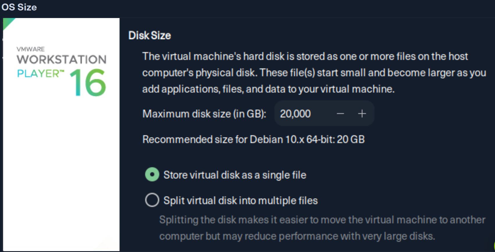

## ParrotOS Installation

Once we have created our VM, we can start it and get to the GRUB menu to select
our options. Since we want to install ParrotOS, we should select this option.
Once we click on the VM window, our mouse will be trapped there. This means that
our mouse cannot leave this window. To move the mouse freely again, we have to
press [CTRL] + [ALT] (in most cases). However, we should verify this key
combination in the VMware Workstation window under Edit > Preferences > Hot
Keys.

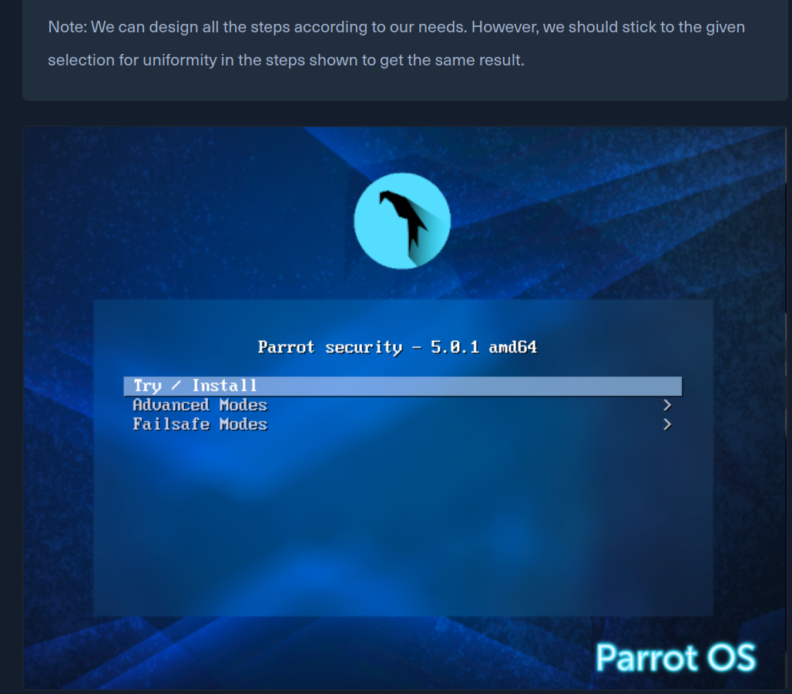

**Not me, I use Arch btw**

Once the installation procedure starts, we are asked to select our settings for
language, location, and keyboard, and how we want to partition it. 

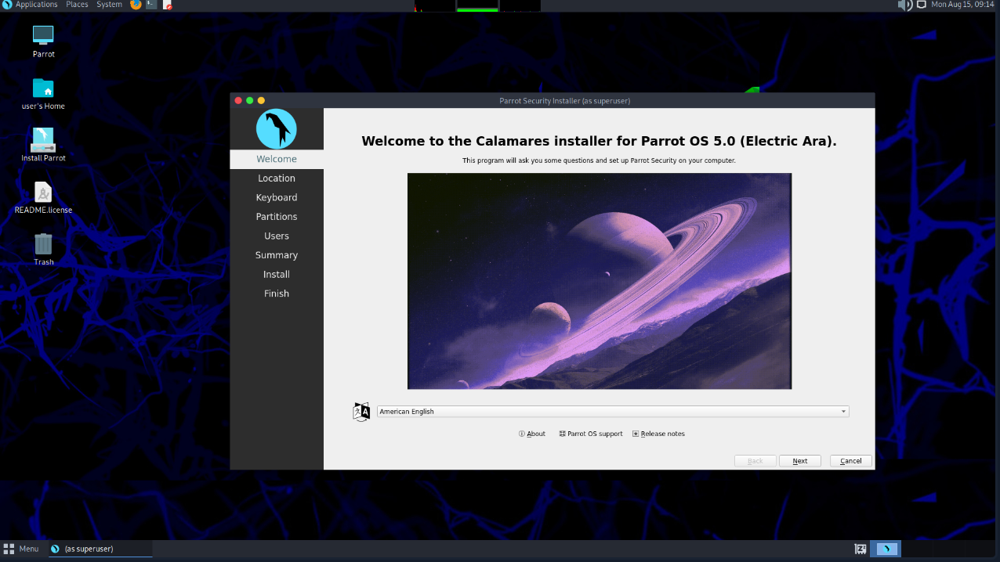

Since we want to encrypt our data and information on the VM using Logical Volume
Manager (LVM), we should select the "Encrypt System" option. It is also
recommended to create Swap (no Hibernate) for our system. 

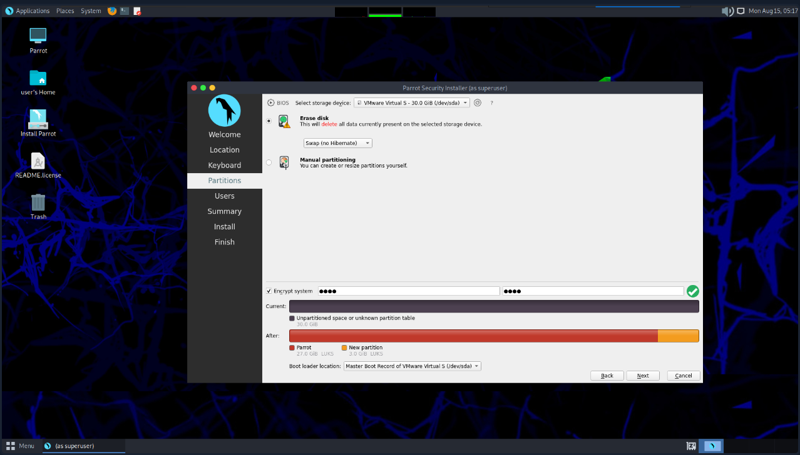

LVM is a partitioning scheme mainly used in Linux and Unix environments, which
provides a level of abstraction between disks, partitions, and file systems.
Using LVM, it is possible to form dynamically changeable partitions, which can
also extend over several disks. After that we will be asked to specify our
username, hostname, and password.

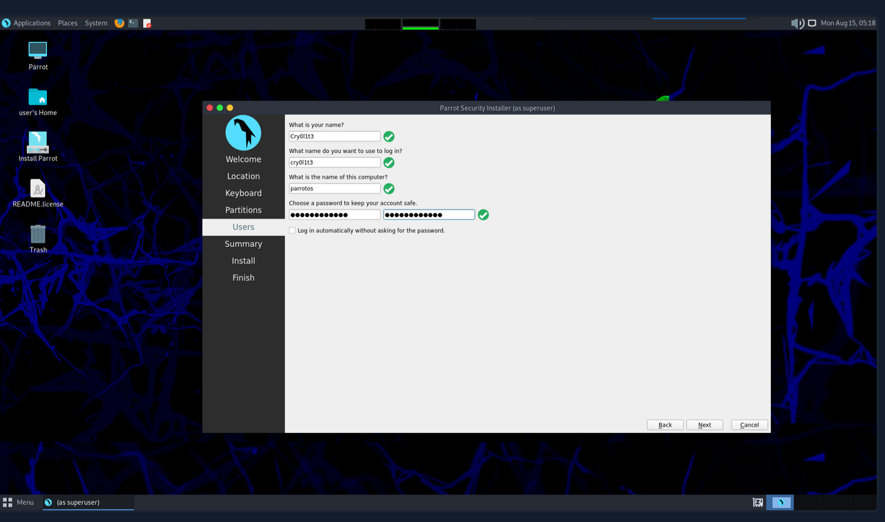

Once we have made all the required entries, we can confirm them and start
configuring LVM. 

## LUKS Encryption

LVM is an additional abstraction layer between physical data storage and the
computer's operating system with its logical data storage area and the file
system. LVM supports the organization of logical volumes in a RAID array to
protect computers from individual hard disk failure. Unlike RAID, however, the
LVM concept does not provide redundancy. It has been present in almost all Unix
and Linux distributions but also for other operating systems. Windows or MacOS
also have the concept of LVM but use different names like Storage Spaces
(Windows) or CoreStorage (macOS). 

Once we get to the partition disk step, we will be asked for an encryption
passphrase for encryption and decryption. We should keep in mind that this
passphrase should be very strong, and we should use a password manager of our
choice to store it. We will then have to enter this passphrase again to make
sure that we did not make a mistake when we first entered it. 

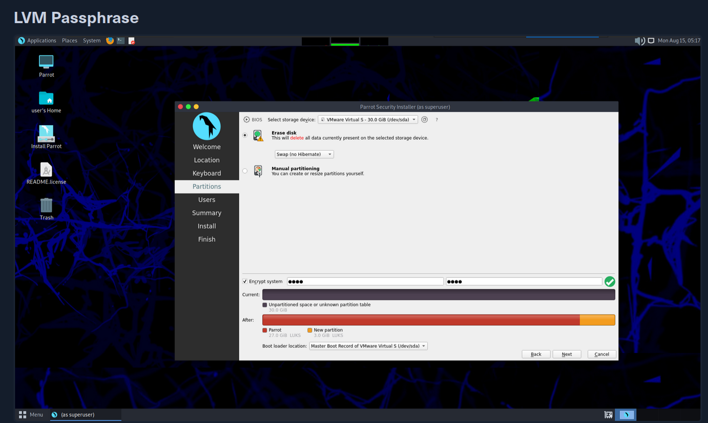

After selecting the passphrase and confirming it, we will get an overview of all
the partitions that have been created and configured. We will have other options
available to us, as listed above. If we do not want to make any further
configurations, we can now finish partitioning and let the changes be written
accordingly. 

Now the operating system's installation takes place, and as soon as it is
finished, the VM is restarted. After the restart, we get a window that asks us
for our passphrase to unlock the system.

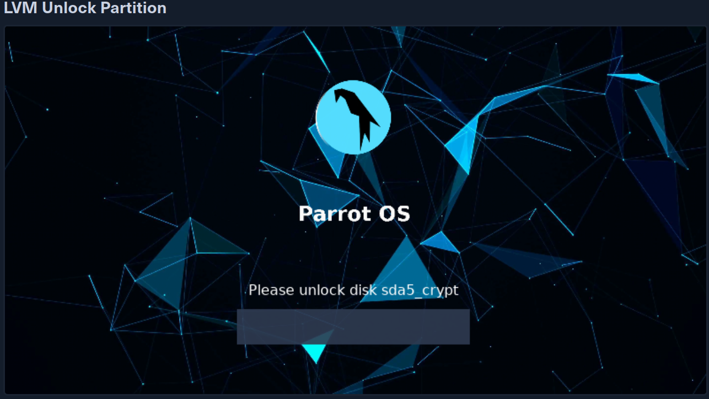

If we have entered the password correctly, then the operating system will boot
up completely, and we will be able to log in. Here we enter the password for the
username we have created. 

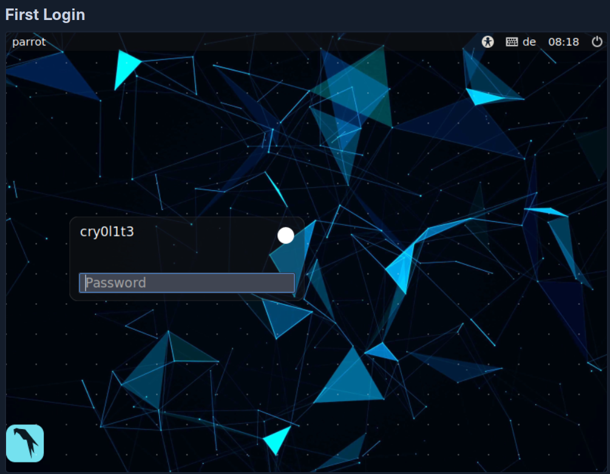

## Updates & APT Package Manager

Now that we installed the operating system, we need to bring it up to date. For
this we will use the APT package management tool. The Advanced Packaging Tool
(APT) is a package management system that originated in the Debian operating
system that used dpkg for actual package management. The package manager is used
for package management. This means that we can search, update and install
program packages. APT uses repositories (thus package sources), which are
defined in the directory /etc/apt/sources.list (in our case for ParrotOS:
/etc/apt/sources.list.d/parrot.list/).

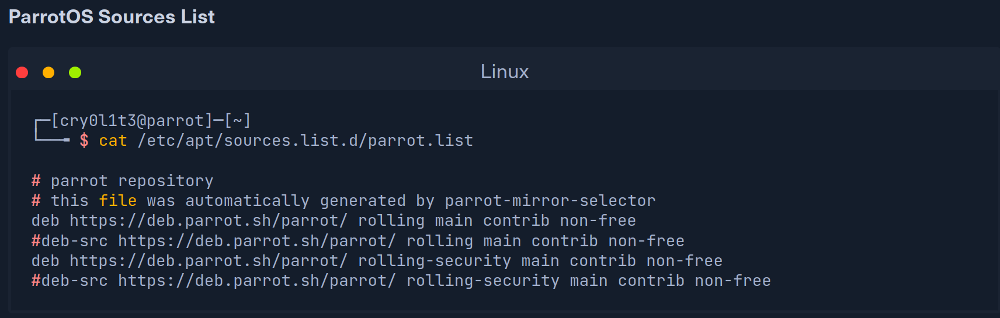

Here the package manager can access a list of HTTP and FTP servers and obtain
and install the corresponding packages from there. If packages are searched for,
they are automatically loaded from the repositories list, updating existing
program packages under APT is relatively easy and comfortable. 

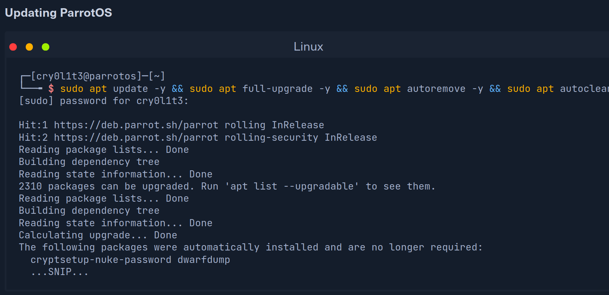

If there are only a few packages that we want to install, we can enter them
manually in the following command. 

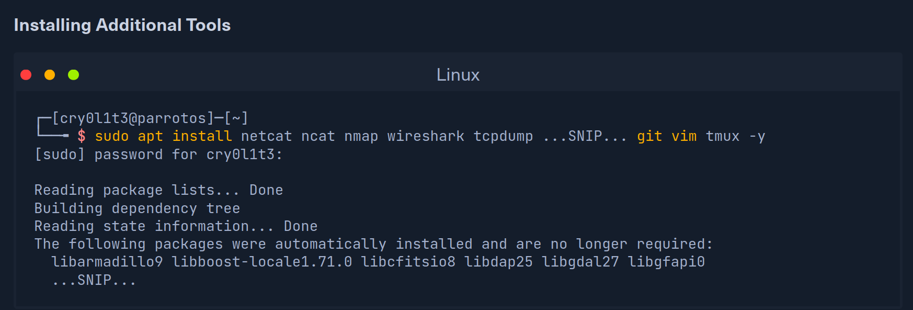

However, if the list contains more than just 5 packages, we should always
create a list and keep it updated. With the following command, we will install
all the tools from the list at once using APT.

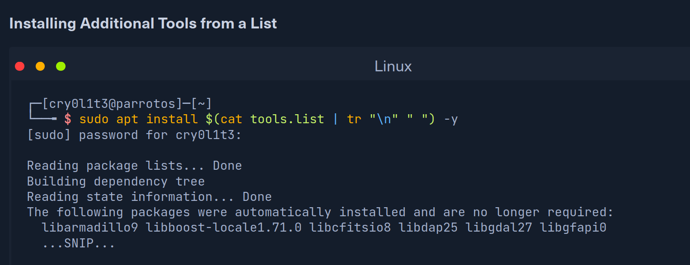

We will also come across tools that are not found in the repositories and
therefore have to download them manually from GitHub. For example, we are still
missing specific tools for Privilege Escalation and want to download the
Privilege-Escalation-Awesome-Scripts-Suite. We can do that using the following
command:

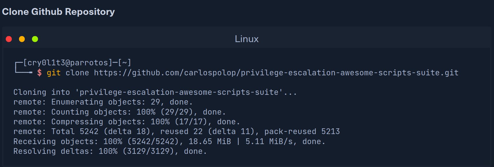

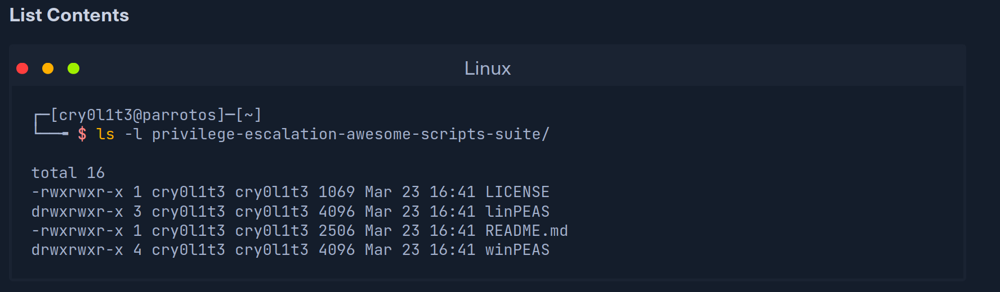

## Snapshots

After installing all known and relevant repositories, it is highly recommended
to take a VM Snapshot. In the following steps, we will make changes to specific
configuration files. If we are not careful, this can make parts of the system or
even the entire system unusable. We do not have to repeat all our previous
steps, and we should now create a snapshot and call it "Initial Setup".

Nevertheless, before we create this snapshot, we should shut down the OS. This
will significantly reduce the time required to create the snapshot. Otherwise,
the snapshot will be taken from a running system that we will return to whenever
we return to it. 

If we break the system in some way while performing subsequent configuration
steps, we can revert back to a good, known, working copy. A snapshot (powered
off) should be taken after every major configuration stage. It is also a good
idea to periodically take VM snapshots during a penetration test in case something
goes wrong. 

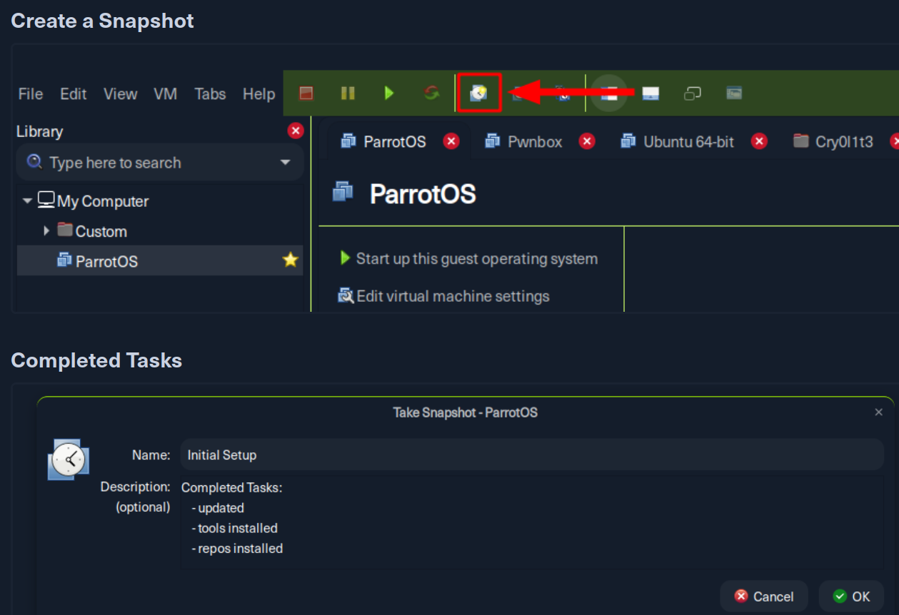

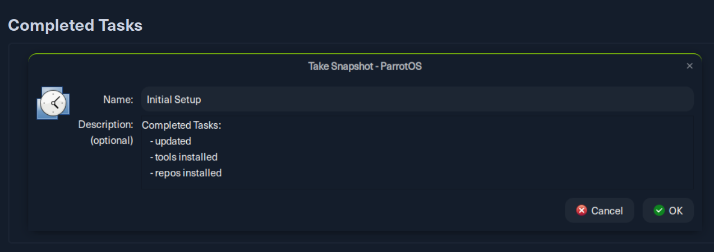

## Terminal Adjustment

Now that we have created a snapshot and can work with our configurations, let us
look at our terminal environment. Many different terminal emulators emulate the
actual command-line input we use to enter and execute system commands. The one
that is best for us depends on personal desires and expectations. Here is a
small list of very popular terminal emulators:

- Terminator
- Guake
- iTerm2
- Terminology

A very efficient alternative, which can also be used as an extension, is Tmux.
Tmux is a terminal multiplexer that allows creating a whole shell session with
multiple windows and subwindows from a single shell window. As we know, started
processes abort when the terminal session or SSH connection disappears. Tmux's
console keeps the process alive by working with sessions. For example, if we are
connected to a constantly running server in this way, we can close the terminal
or shut down the computer on the local client without terminating the Tmux
session. If we log back into the remote server via SSH, we can view the
existing sessions and join the desired session. 

Ippsec has also created a short video where he introduced tmux. There he
explains some of the advantages of Tmux and shows with examples how he works
with it. We will see his approach in all his videos. 

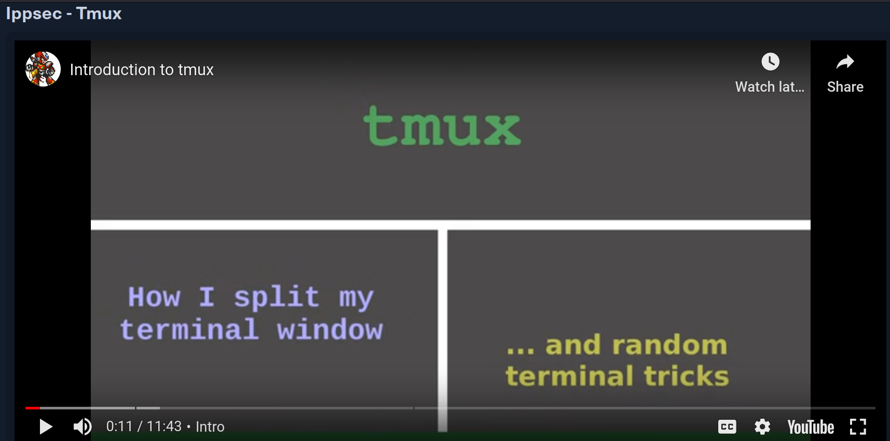

Another handy component that we should adapt to our needs is the Bash prompt.
The Bash Prompt Generator makes it very easy for us to design our bash prompt
the way we want it displayed. For our penetration tests, it is crucial to have
the order of the given commands to configure our bash prompt to display
timestamps. 

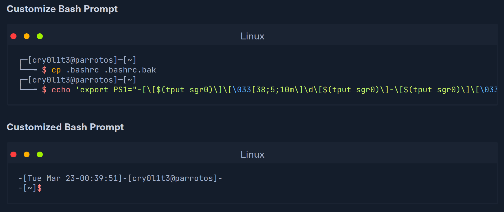

Another advantage is that we can filter out our commands by the minus (-) at the
beginning later in our logs and thus see a list with only the date, time, and
the command specified. There are countless variations on how we can also design
the look and feel of the Linux distro (I already did that btw ;/). Apart from
the terminal, we can also customize our desktop manager. There is even a
community on Reddit which designs the GUIs in many different ways. 

## Automation

The automation part is also an essential part of our preparation for penetration
testing. Especially when it comes to internal penetration tests, where we have
internet access and can adapt the workstation we are working on to our needs.
This should be fast and efficient. For this, we have to create (in the best
case) Bash scripts that automatically adjust our settings to the new system. Let
us take the configuration and adjustment of our bash prompt as an example. An
example script can consist of the same commands we already configured.

If we then host this script on our VPS, we can retrieve it from our customer's
Linux workstation and apply it. 

A simple designation of these scripts is also of great use. For example, suppose
that we assume that we want to configure our Bash prompt and other operating
system components. In that case, we need to name the scripts as understandibly
as possible. If we have created several scripts like this, we can write a simple
Bash script from memory on the working station, which then does all the
configuration. Let us assume we have created the following list of scripts, and
we are hosting those on our Virtual Private Server (VPS):

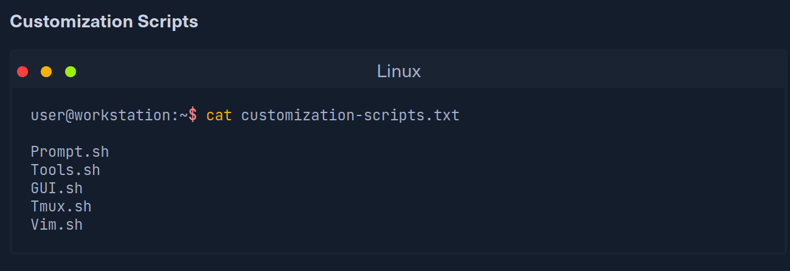

Now we need to write a bash script that takes all of these settings for us or
even combines them into a single command:

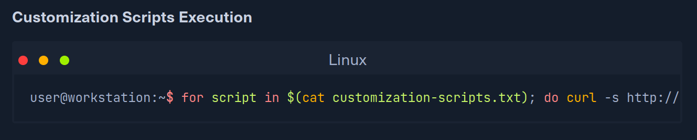

With this command, each customization script is retrieved and executed one by
one from our VPS. This allows us to make changes to the workstation or our new
VM quickly from memory. 

## Final Snapshot

Let us get back to our VM. Once we have adjusted all our configurations and
settings, we should create a final snapshot again to save our settings. We will
want to add all the changes and tasks to the description of our snapshot. 

If we want to test the installation scripts to see if they work the way we want
them to, we can copy them to our host system, revert our VM to the Initial Setup
snapshot and run those scripts there. When we are satisfied with our scripts, we
can then switch back to our Final Snapshot and continue with VM encryption. 

## VM Encryption

In addition to LVM encryption, we can encrypt the entire VM with another strong
password. This gives us an extra layer of protection that will protect our
results and any customer data residing on the system. This means that no one
will be able to start the VM without the password we set. 

Now that we have shut down and powered off the VM, we go to Edit Virtual Machine
Settings and select the Options tab. 

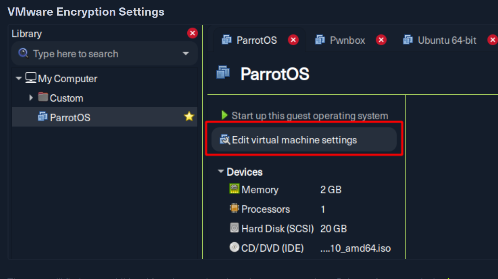

There we will find more additional functions and settings we can use later.
Relevant for us now is the Access Control settings. Once we have encrypted it,
we will not be able to create a clone of it without first decrypting it. More
about this can be found in the VMware documentation. 

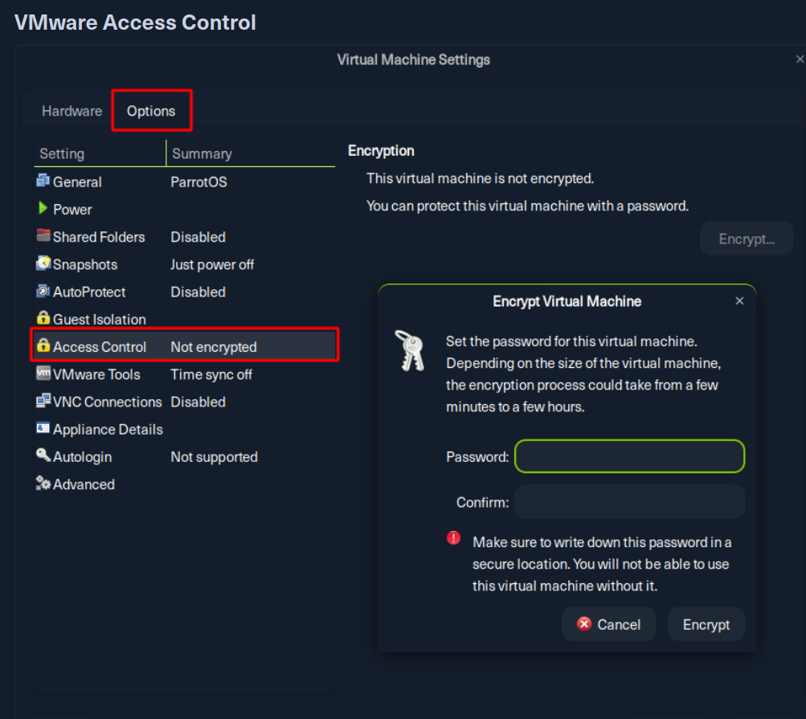

When we close VMware and open it again, we are asked for the password for this
VM. Once this has been entered correctly, we can then boot and work with it
accordingly. 

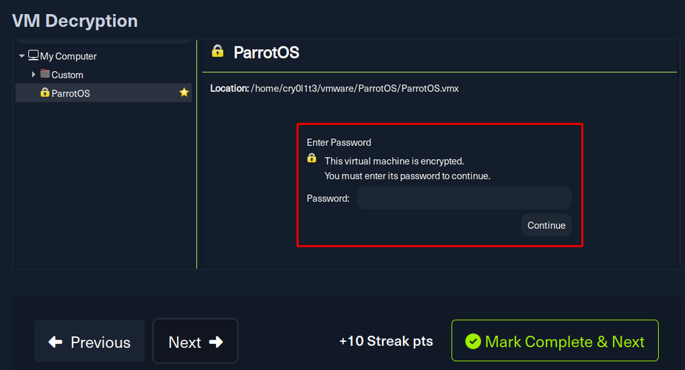

**YAAAAY**

