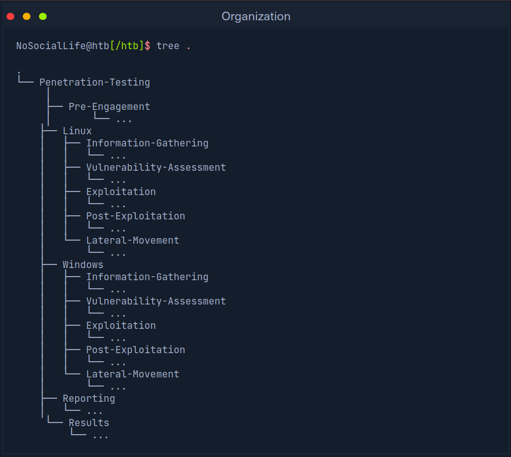
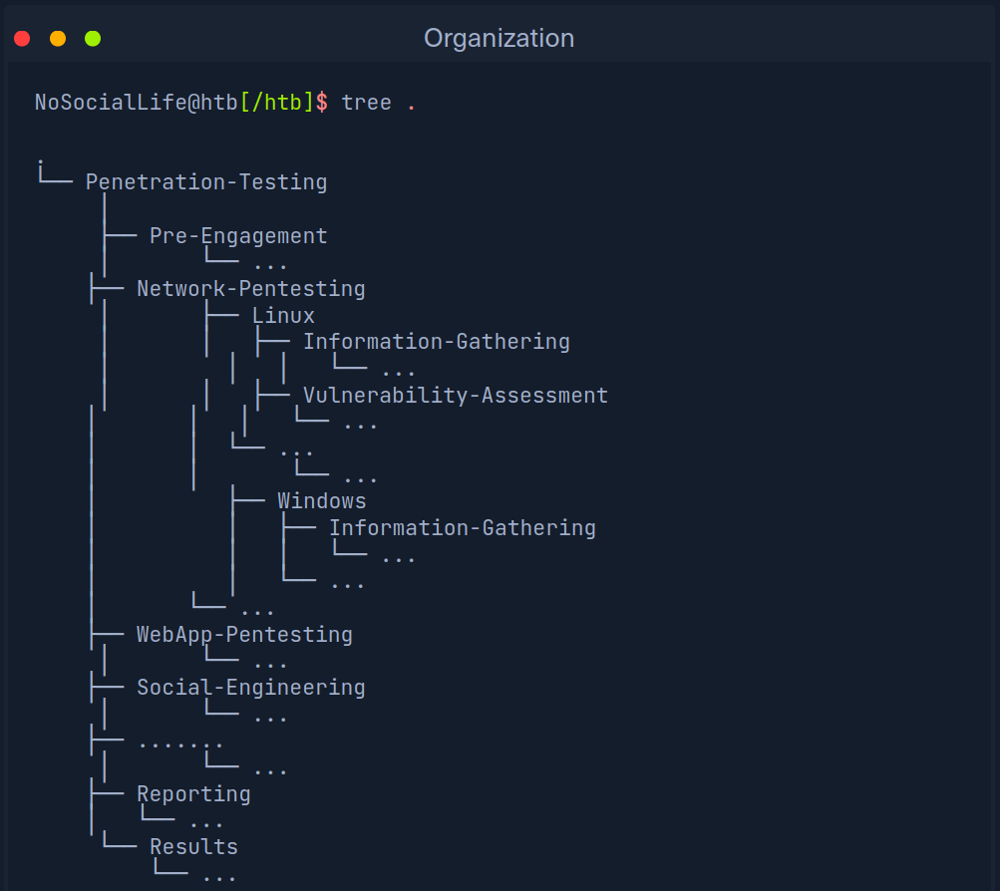
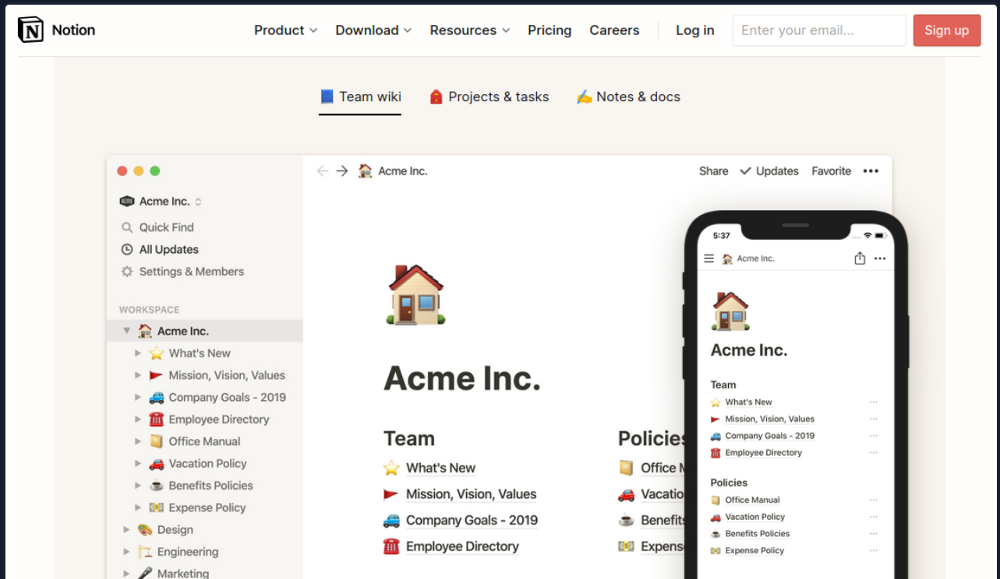
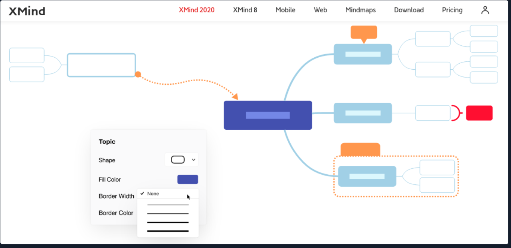
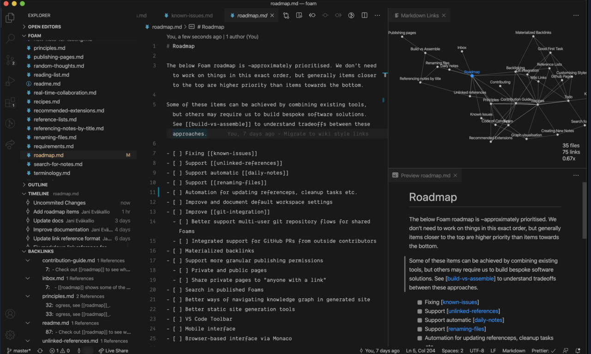
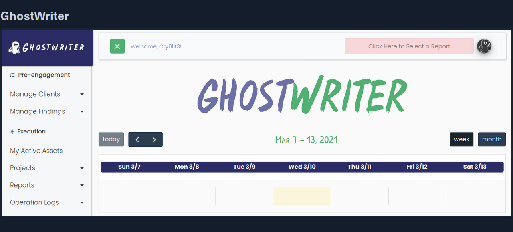
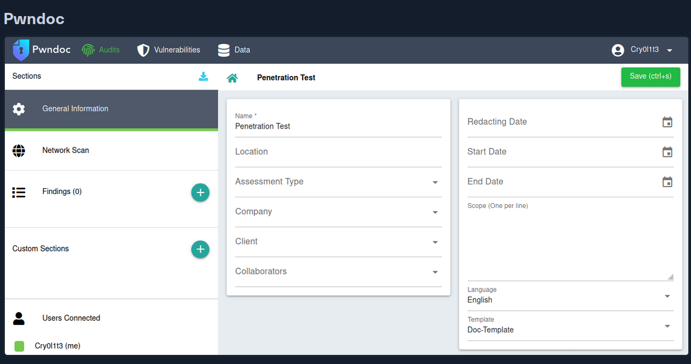
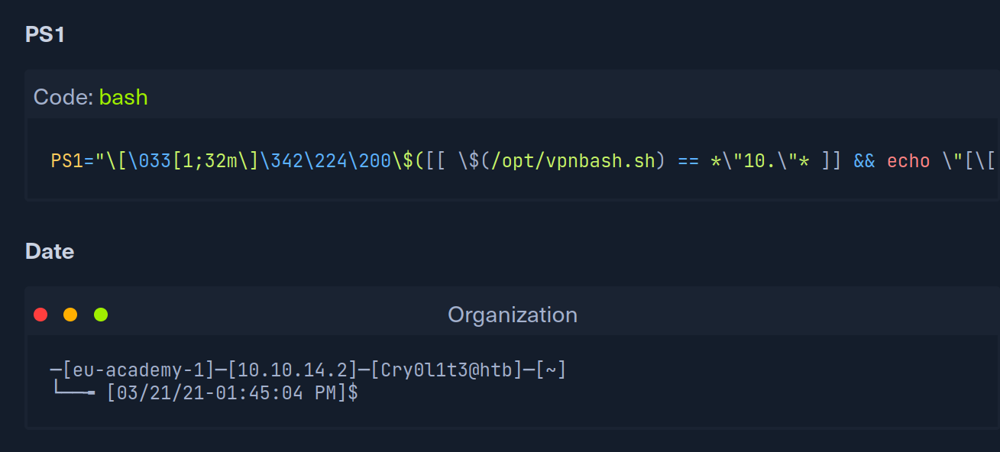
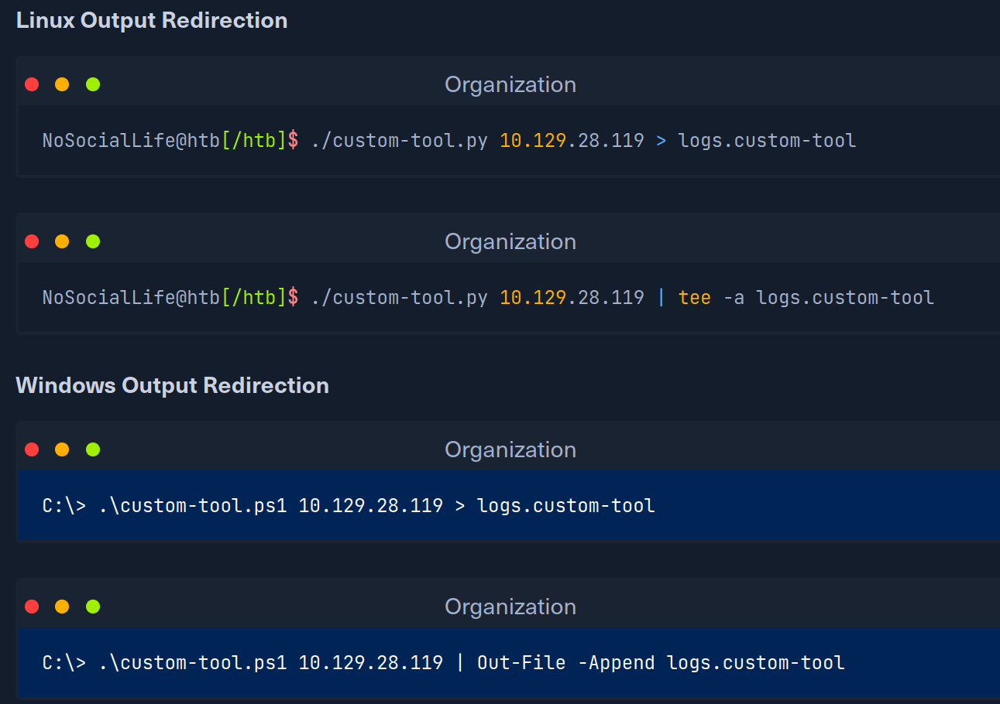
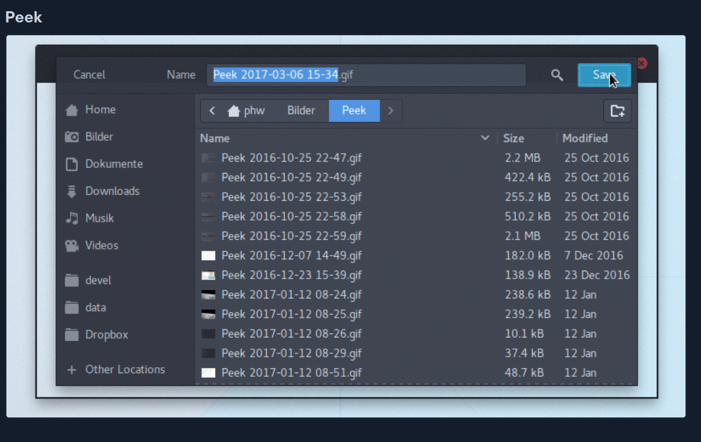

## Organization

As we have already seen in the Learning Process module, organization plays a
significant role in our penetration tests. It doesn't matter what type of
penetration test it is. Having a working environment that we can navigate almost
blindly saves a tremendous amount of time researching resources that we are
already familiar with and have invested our time learning. These sources can be
found within a few minutes, but once we have an extensive list of resources
required for each assessment and include installation, this results in a few
hours of pure preparation. 

Corporate environments usually consist of heterogeneous networks (hosts/servers
having different Operating Systems). Therefore, it makes sense to organize
hosts and servers based on their Operating System. If we organize our structure
according to penetration testing stages and the targets' Operating System, then
a sample folder structure would look something like this. 

If we are specialized in specific penetration testing fields, we can, of course,
reorganize the structure according to these fields. We are all free to develop a
system with which we are familiar, and in fact, it is recommended that we do so.
Everyone works differently and has their strengths and weaknesses. If we work in
a team, we should develop a structure that each team member is familiar with.
Take this example as a starting point for creating your system.

Proper organization helps us in both keeping track of everything and finding
errors in our processes. During our studies here, we will come across many
different fields that we can use to expand and enhance our understanding of the
cybersecurity domain. Not only can we save the cheatsheets or scripts provided
within the Modules in Academy, but we can also keep the notes regarding all the
phases of a penetration test we will come across in HTB Academy to ensure that
no critical steps are missed in future engagements. We recommend starting with
small structures, especially when entering the penetration testing field.
Organizing based on the Operating System is, therefore, more suitable for
newcomers. 

While organizing things for ourselves or our entire team, we should make sure
that we all work according to a specific procedure. Everyone should know how
where they fit in and where each member fits in throughout the penetration
testing process. There should also be a common understanding regarding the
activities of each member. Otherwise, things may end up in the wrong subdirectory, 
or evidence necessary for reporting could be lost or corrupted. 

## Bookmarks

Numerous browser add-ons exists that can significantly enhance both our
penetration testing activities and efficiency. Having to reinstall them over and
over again takes time and slows us down unnecessarily. Thankfully Firefox offers
add-on and bookmark synchronization after creating and using a Firefox account.
All add-ons installed using our account are automatically installed and
synchronized when we log in again. The same applies to any saved bookmarks.
Therefore, logging in with a Firefox account will be enough to transfer
everything from a prefabricated environment to a new one. 

We should be cautious not to store any resources containing potentially
sensitive information or private resources. We should always keep in mind that
third parties could view these stored resources. Therefore, customer-related
bookmarks should never be saved. A list of bookmarks should be created with a
single principle:

This will be seen by third parties sooner or later. 

For this reason, we should create an account for penetration testing purposes
only. If our bookmark list must be edited and extended, then the safest route is
to store the list locally and import it to the pentesting account. Once we have
done this, we should change our private one (not the pentesting one). 

## Password Manager

One other essential component for us is password managers. Password managers can
prove helpful not only for personal purposes but also for penetration tests. One
of the most common vulnerabilities or attack methods within a network is 
"password reuse". We try to use found or decrypted passwords and usernames to
log in to multiple systems and services within the company network through this
attack. It is still quite common to come across credentials that can be used to
access several services or servers, making our work easier and offering us more
opportunities for attack. There are only three problems with passwords:

1. Complexity
2. Re-usage
3. Remembering

### 1.Complexity

The first problem with passwords is complexity and remembering it. It is already
a challenge for standard users to create a complex password, as they are often
associated with content that users know and can remember. NordPass has created a
list of the most commonly used passwords that we can view
[here](https://nordpass.com/most-common-passwords-list/). We can see here that
these passwords can be guessed within seconds without any special preparations,
such as password mutation. 

### 2.Re-usage

Once the user has created and memorized a complex password, only two problems
remain. Remembering a complex and hard-to-guess password is still within the
realms of possibility for a standard user. The second problem is that this
password is then used for all services, which allows us to work across several
components of the company's infrastructure. To prevent this, the user would have
to create and remember complex passwords for all services used. 

### 3.Remembering

This brings us to the third problem with passwords. If a standard user uses a
couple dozen services, human nature forces them to become lazy. Very few will
make an effort to actually remember all the passwords. If a user creates
multiple passwords, the risk of forgetting them or mixing them up with other
password components is high if a secure password-keeping solution is not used. 

Password Managers solve all the problems mentioned above not only for standard
users but also for penetration testers. We work with dozens, if not hundreds, of
different services and servers for which we need a new, strong, and complex
password every time. Some providers include the following, but are not limited
to:

- 1Password
- LastPass
- BitWarden
- Keeper

Another advantage is that we only have to remember one password to access all
our other passwords. One of the most recommended is 1Password password manager,
which offers 1GB (personal), or 5GB/person (teams) of storage and a 2FA function
for entire teams. This storage space can be used to store important notes and
results collected during penetration tests. Furthermore, a security key can be
installed on a physical device that can serve as an additional 2FA. 

Let's assume we need to perform an internal penetration test. 

1. Before we go to the company, we generate a new Secret Key and Master Password
   and make sure that the 2FA function is enabled. 
2. Once we are at a company's internal host, we can install the 1Password add-on
   for Firefox and log in with the newly generated keys. Even if this host is
   compromised and a keylogger runs on it, our vault cannot be used by third
   parties without our 2FA code.

3. Once we are logged in, we can log in with the firefox account credentials
   stored in 1Password, and all our add-ons and bookmarks will be available in a
   few seconds. 

## Updates and Automation

We should continually upgrade the components we have organized before starting a
new penetration test. This applies to the operating system we use and all the
GitHub collections we will collect and use over time. It is highly recommended
to record all the resources and their sources in a file to more easily automate
them later. Any automation scripts can also be saved in 1Password to download
them directly when needed. 

When we create automated scripts, they are operating system-dependent. For
example, we can work with Python, Bash, and PowerShell. Creating automation
scripts is a good exercise for learning and practicing scripting and can help us
prepare and even reinstall a system more efficiently. We will find more tools,
practical explanations, and cheatsheets when learning new methods and
technologies. It is recommended that we keep those in a record and keep entries
up to date.

## Note Taking

Note-taking is another essential part of our penetration testing because we
accumulate a lot of different information, results, and ideas that are difficult
to remember all at once. There are five different main types of information that
need to be noted down:

1. Newly discovered information
2. Ideas for further tests and processing 
3. Scan results
4. Logging
5. Screenshots

### 1.Discovered Information

By discovered information we mean, general information, such as new IP
addresses, usernames, passwords, and etc., that we have identified and related
to the penetration testing engagement and process. This is the information that
we can use against our target company. We often obtain such information through
OSINT, active scans, manual analysis of given information resources and
services. 

### 2.Processing

We will receive a lot of different information during our penetration testing
that will require us to adapt our approach. These results may give us ideas of
the subsequent steps we can take, and other vulnerabilities or misconfigurations
may be forgotten or overlooked. Therefore we should get in the habit of noting
down everything we see that should be investigated as part of the assessment.
Notion.so, Obsidian, and Xmind are very suitable for this. 

Notion.so is a fancy online markdown editor that offers many different functions
and gives us the ability to shape our ideas and thoughts according to our
preferences. 

Xmind is an excellent mind map editor that can visualize relevant information
components and processes very well. 

Obsidian is a powerful knowledge base that works on top of a local folder of
plain text markdown files. 

### 3.Results

The results we get after our scans and penetration testing steps are
significant. With such a large amount of information in a short time, one can
quickly feel overwhelmed. It is not easy at first to filter out the most
critical pieces of information. This is something that will come with experience
and practice. Only through practice, our eyes can be trained to recognize the
essential small fragments of information. Nevertheless, we should keep all the
information and results not to miss something meaningful and because a piece of
information may prove helpful later in the engagement. Besides, these results
are also often used for documentation. For this, we use GhostWriter or Pwndoc.
These allow us to generate our documentation and have a clear overview of the
steps we have taken. 

### 4.Logging

Logging is essential for both documentation and our protection. If third parties
attack the company during our penetration test and damage occurs, we can prove
that the damage did not result from our activities. For this, we can use the
tool "script" and "date". Date can be used to display the exact date and time of
each command in our command line. With the help of script, every command and the
subsequent result is saved in a background file. To display the date and time,
we can replace the PS1 variable in our .bashrc file with the following content. 

To start logging with script (for Linux) and Start-Transcript (for Windows), we
can use the following command and rename it according to our needs. It is
recommended to define a certain format in advance after saving the individual
logs. One option is using the format <date>-<start time>-<name>.log.

This will automatically sort our logs in the right order, and we will no longer
have to examine them manually. This also makes it more straightforward for our
team members to understand what steps we have taken and when. 

Another significant advantage is that we can later analyze our approach to
customize our process. If we repeat one or two steps repeatedly and use them in
combination, it may be worthwhile to examine these steps with the help of a
simple script to save time. 

In addition, most tools offer the possibility to save the results in separate
files. It is highly recommended to always use these functions because the
results can also change. Therefore, if specific results seem to have changed, we
can compare the current results with the previous ones. There are also terminal
emulators, such as Terminator and Tmux, which allow, among other things, to log
all commands and output automatically. If we come across a tool that doesn't
allow us to log the output, we can work with redirections and the program tee.
This would look like this:

### 5.Screenshots

Screenshots serve as a momentary record and represent proof of results obtained,
necessary for Proof-Of-Concept and documentation. One of the best tools for this
is Flameshot. It has all the essential functions that we need to quickly edit
our screenshots without using an additional editing program. We can install it
using our APT package manager or via download from GitHub. 

### Flameshot

Sometimes, however, we cannot show all the necessary steps in one or more
screenshots. We can use an application called Peek and create GIFs that record
all the required actions for us. 

