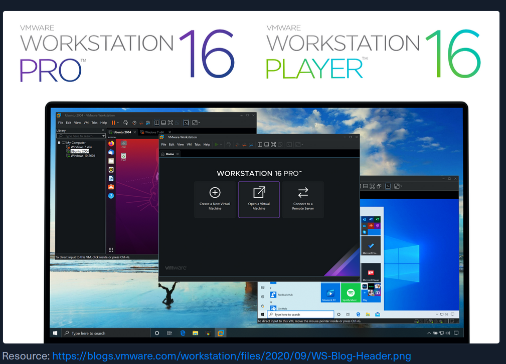
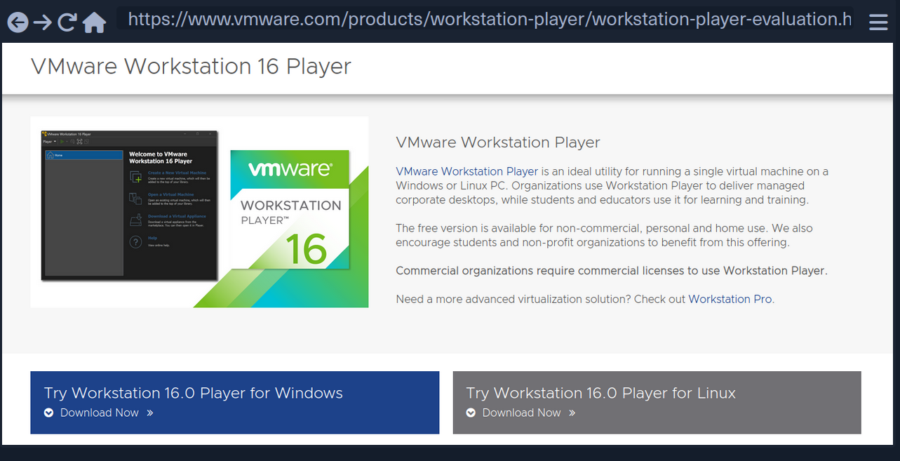
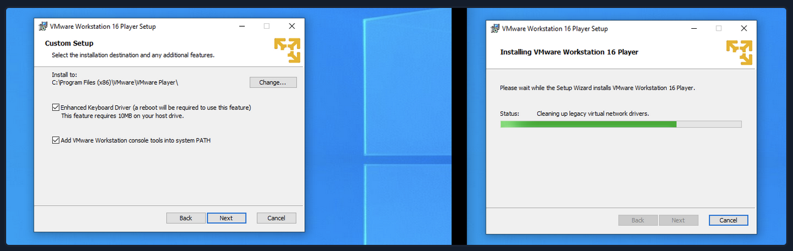
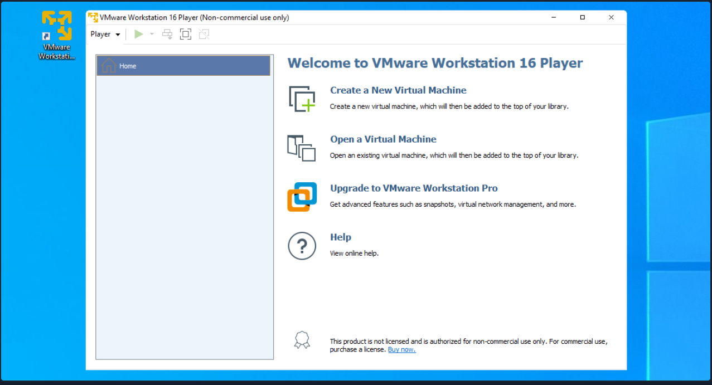
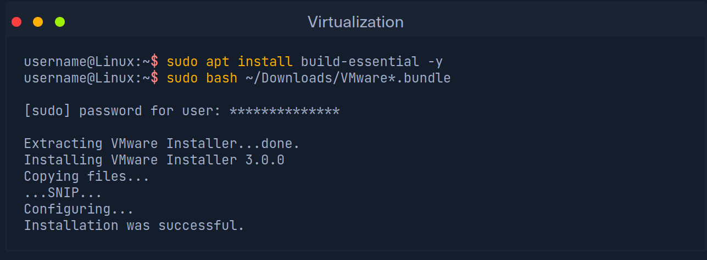
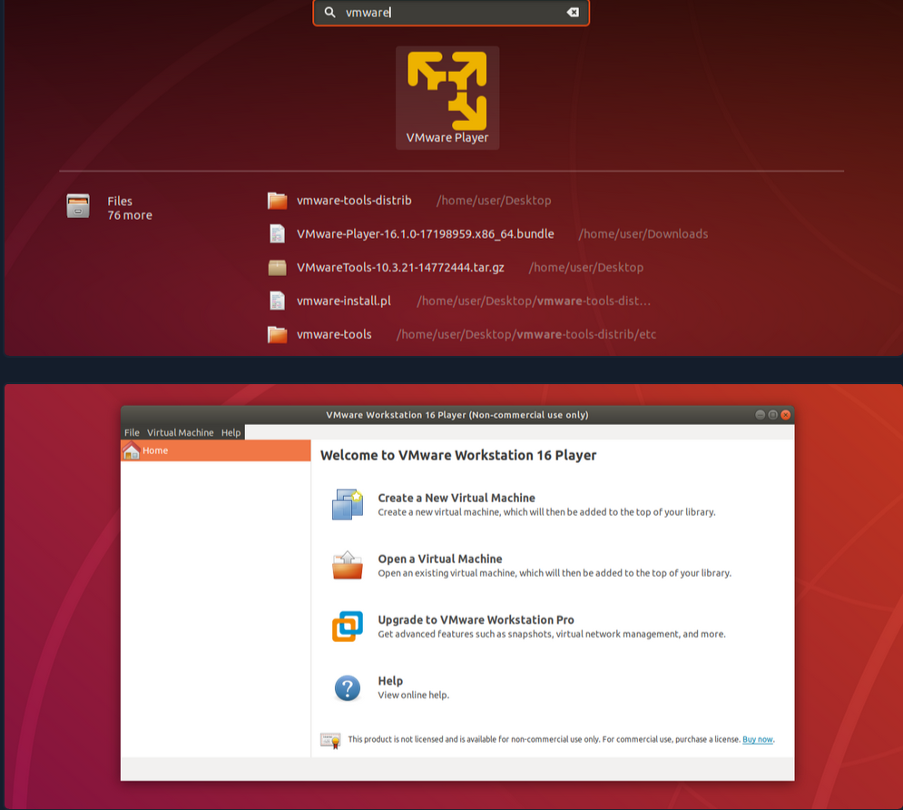
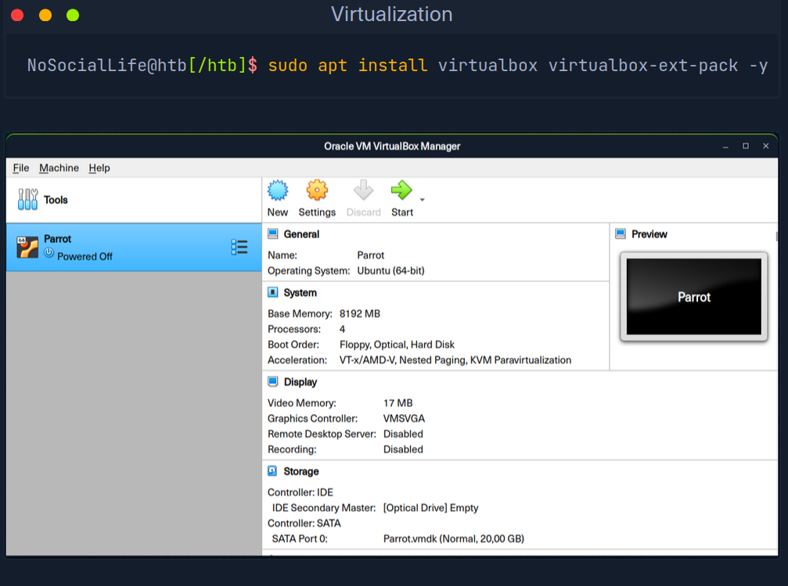

# Virtualization

Virtualization is an abstraction of physical computing resources. Both hardware
and software components can be abstracted. A computer component created as a
part of virtualization is referred to as a virtual or logical component and can
be used precisely as its physical counterpart. The main advantage of
virtualization is the abstraction layer between the physical resource and the
virtual image. This is the basis of various cloud services, which are becoming
increasingly important in everyday business. Virtualization must be
distinguished from the concepts of simulation and emulation. 

Virtualization involves the abstraction of physical computing resources such as
hardware, software, storage, and network components. The aim is to make these
resources available at a virtual level and distribute them to different
customers in a manner that is as flexible as it is demand-driven. This should
ensure improved utilization of computer resources. The aim is to run
applications on a system that is not supported by it. In virtualization, we
distinguish between: 

- Hardware virtualization
- Software virtualization
- Storage virtualization
- Data virtualization
- Network virtualization

Hardware virtualization is about technologies that enable hardware components to
be made available independently of their physical basis using hypervisor
software. The best known example of this is the virtual machine (VM). A VM is a
virtual computer that behaves like a physical computer, including hardware and
operating system. Virtual machines run as virtual guest systems on one or more
physical systems referred to as hosts. 

## Virtual Machines

A virtual machine (VM) is a virtual operating system that runs on a host system
(an actual physical computer system). Several VMs isolated from each other can
be operated in parallel. The physical hardware resources of the host system are
allocated via hypervisors. This is a sealed-off, virtualized environment with
which several guest systems can be operated, independent of the operating
system, in parallel, on one physical computer. The VMs act independently of each
other and do not influence each other. A hypervisor manages the hardware
resources, and from virtual machine's point of view, allocated computer power,
RAM, hard disk capacity, and network connections are exclusively available. 

From the application's perspective, an operating system installed withing the VM
behaves as if installed directly on the hardware. It is not apparent to the
applications or the operating system that they are running in a virtual
environment. Virtualization is usually associated with performance losses for
the VM because the intermediate virtualization layer itself requires resources. 
VMs offer many advantages over running an operating system or application
directly on a physical system. The most important benefits are:

1. Applications and services of a VM do not interfere with each other 
2. Compile independence of the guest system from the host system's operating
   system and the underlying physical hardware
3. VMs can be moved or cloned to other systems by simple copying 
4. Hardware resources can be dynamically allocated via the hypervisor 
5. Better and more efficient utilization of existing hardware resources
6. Shorter provisioning times for systems and applications
7. Simplified management of virtual systems
8. Higher availability of VMs due to independence from physical resources

## Introduction to VMware

VMware produces software products for the virtualization of computer systems.
VMware Workstation Pro and VMware Workstation Player are the most interesting.
The difference between the two is that, unlike Workstation Pro, Workstation
Player can only run one VM at a time. 

For both operating systems, Windows and Linux, the installation files for VMware
Workstation Pro can be downloaded [here](https://access.broadcom.com/default/ui/v1/signin/)
but it requires to register a Broadcom account. Since most people are familiar
with Windows, we will install it on a Windows operating system. 

## VMware Installation on Windows

The installation itself is done by downloading the installation file and running
it. There we are asked for some additional features that we can install if
necessary. We should read through these features and then decide if we want to
use them. After completing the installation, the operating system must be
restarted. 

After the installation is complete and we restart the operating system, we will
be able to see an icon on our desktop, and when running, VMware Workstation
Player will look something like this:

Here we now have the option to create a new VM or to include an existing one.
Existing VMs from VMware are deployed in Open Virtualization Format (OVF). OVF
is an open standard to package and distribute virtual appliances or, more
generally, software running in virtual machines. The OFV standard is not limited
to specific hypervisors or processor architectures and can be used by many
different platforms like VMware, VirtualBox, XenServer, Oracle VM, and others.
The entity involved in packaging and distribution is called an OVF Package
containing one or more virtual systems, including a virtual machine. More about
this format can be found here. 

## VMware installation on Linux

The installation of VMware Workstation Player on a Linux-based operating system
looks a little different. However, we need to download the installation file
first. Once we have downloaded it, we can run the installation with the
following commands:

## Introduction to VirtualBox

An excellent and free alternative to VMware Workstation is VirtualBox. With
VirtualBox, hard disks are emulated in container files, called Virtual Disk
Images (VDI). Aside from the VDI format, VirtualBox can also handle hard disk
files from VMware virtualization products (.vmdk), the  Virtual Hard Disk format
(.vhd), and others. We can also convert these external formats using the
VBoxManager command-line tool that is a part of VirtualBox. We can install
VirtualBox from the command-line or download the installation file from the
official website and install it manually. 

### Virtualbox Installation

From the example of the created VM shown above, we can see what configuration
options are available for the VDI within the VirtualBox. Also we have the
possibility and function to encrypt the VM, which you should always use. We will
use this option as soon as we have prepared our VM accordingly and ready for
use. 

