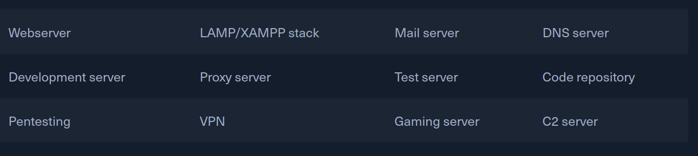
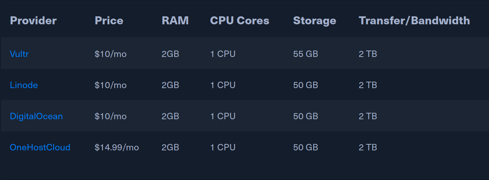

# VPS Providers

A Virtual Private Server (VPS) is an isolated environment created on a physical
server using virtualization technology. A VPS is fundamentally part of
Infrastructure-as-a-Service (IaaS) solutions. This solution offers all the
advantages of an ordinary server, with specially allocated resources and
complete management freedom. We can freely choose an operating system and
applications we want to use, with no configuration restrictions. This VM uses
the resources of a physical server and provides users with various server
functionalities comparable to those of a dedicated server. It is therefore also
referred to as Virtual Dedicated Server (VDS).

A VPS positions itself as a compromise between inexpensive shared hosting and
the usually costly rental of dedicated server technology. This hosting model's
idea is to offer the users the most comprehensive possible range of functions at
manageable prices. The virtual replication of individual computer systems on a
standard host system involves significantly less effort for a web hoster than
the provision of separate hardware components for each customer. Extensive
independence of the individual guest systems is achieved through encapsulation.
Each VPS on the shared hardware acts isolated from other, parallel operating
systems. In most cases VPS is used for the following purposes, but not limited
to:

We can choose from a range of Windows and Linux operating systems to provide the
requested operating environment for our desired application or software during
installation. 

