# VPS Setup

Whether we are on an internal or external penetration test, a VPS that we can
use is of great importance to us in many different cases. We can store all our
resources on it and access them from any point with internet access. Apart from
the fact that we first have to set up the VPS, we also have to prepare the
corresponding folder structure and its services. In this example, we will deal
with a provider called Vultr and set up our VPS there. For the other providers,
the configuration options look almost identical. 

We should still read the individual information about their components and
understand what kind of VPS we will be working with in the future. In Vultr, we
can choose one of four different servers. For our purposes, the Cloud Compute
server is sufficient for now. 

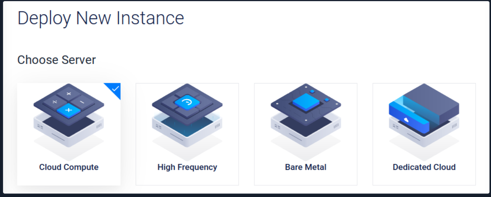

Next we need to select the location closest to us. This will ensure an excellent
connection to the server. If we need to perform a penetration test on another
continent, we can also set up a VPS there using our automation scripts and
perform the penetration test from there. 

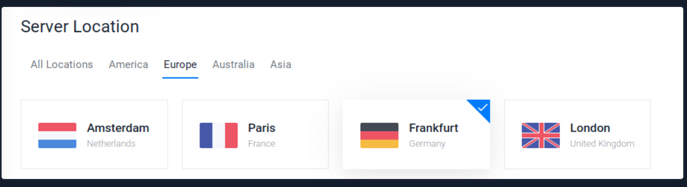

For the server type, we select which operating system should be installed on the
VPS. Parrot OS is based on Debian, just like Ubuntu. Here we can choose one of
these two or go to advanced options and upload our ISO. 

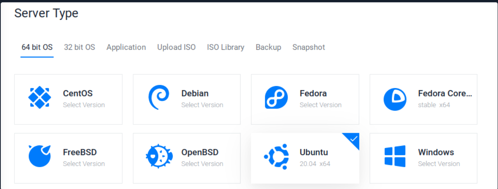

If we want to upload our ISO, we have to do it via a public link to that ISO. We
can go to the ParrotOS website, copy the link to the mirror server for the
appropriate version, and paste it into Vultr. 

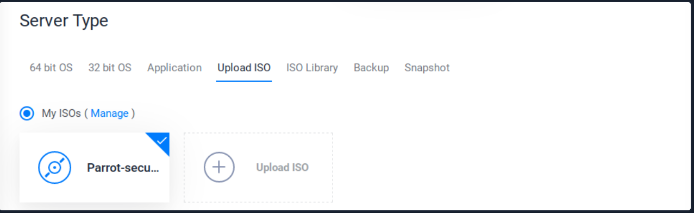

Next, we need to choose the performance level for our VPS. This is one of the
points where the cost may change a lot. For our purposes, however, we can choose
one of the two options on the left. However, we need to select the performance
for which we want to use the VPS. If the VPS is to be used for advanced purposes
and provides many requests and services, 1024MB memory will not be enough.
Therefore, it is advisable to first set up the installation of our OS locally in
a VM and then check the services' load. 

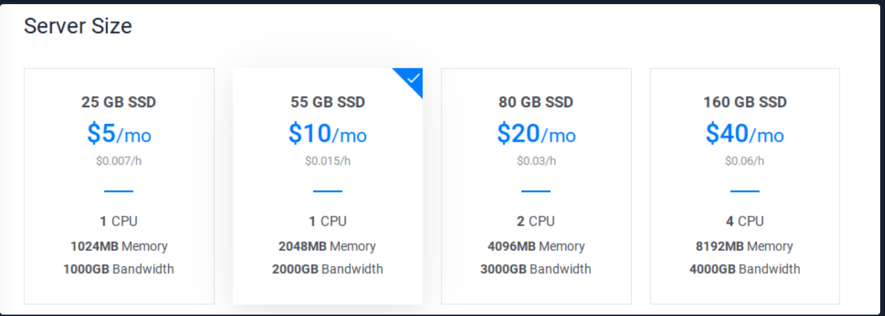

Next, we have the choice if we want to use IPv6 for our VPS. This is highly
recommended because many firewalls are only protected against IPv4, and IPv6 is
often forgotten. We can also allow automatic backups, private networking, and
DDoS protection, but at a higher cost. 

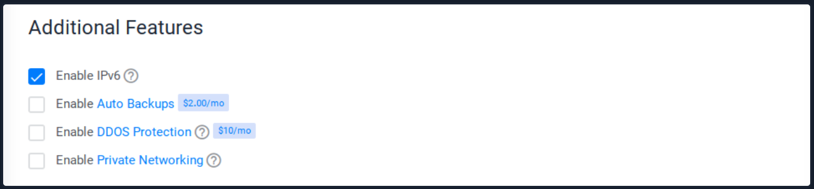

After that, we can generate our SSH keys, which we can use to log into the VPS
via SSH later. We can also generate these keys on our VPS or VM or own host
operating system. Let us use our VM to generate the key pair.  

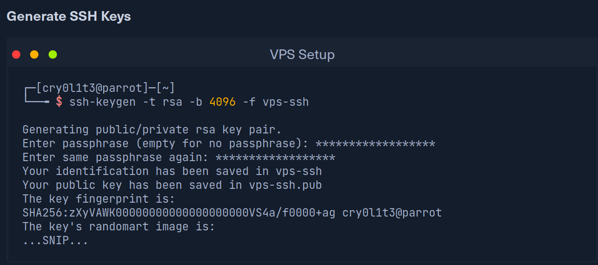

With the command shown above, we generate two keys. The vps-ssh is the private
key and must not be shared anywhere or with anyone. The second vps-ssh.pub is
the public key which we can now insert in the Vultr control panel. 

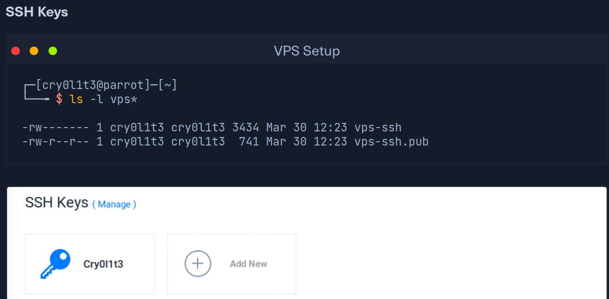

Finally, we choose a hostname and the server label with which we want to name our
VPS. 

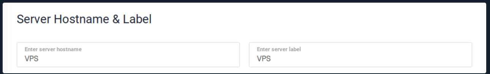

Once the VPS is installed, we can access it via SSH.

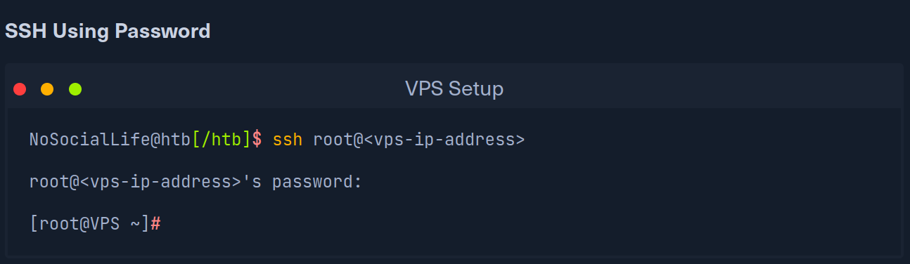

After that, we should add a new user for the VPS to not run our services with
root or administrator privileges. For this, we can generate another SSH key and
insert it for this user. 

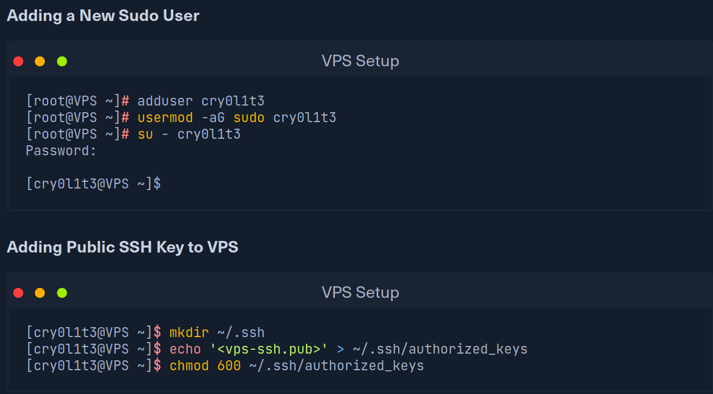

Once we have added this to the authorized_keys file, we can use the private key
to log into the system via SSH. 

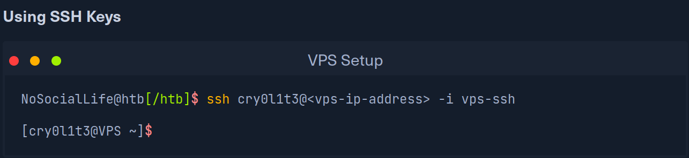

**YAYY**

