# Windows

Windows computers serve an essential role as testbeds and victims for aspiring
penetration testers like ourselves. However, it can make for a great penetration
testing platform as well. There are some advantages to using Windows as our
daily driver. It will blend in most enterprise environments so that we will
appear physically and virtually less suspicious. It is easier to navigate and
communicate with other hosts on an Active Directory domain if we use Windows
versus Linux and some Python tooling. Traversing SMB and utilizing shares is
much easier this way. With this in mind, it can be beneficial to familiarize
ourselves with Windows and set a standard that ensures we have a stable and
effective platform to perform our actions. 

Building our penetration testing platform can help us in multiple ways:

1. Since we built it and installed only the tools necessary, we should have a
   better understanding of what is happening under the hood. This also allows us
   to ensure that we do not have any unnecessary services running that could
   potentially be a risk to ourselves and the customer when on an engagement. 

2. It provides us the flexibility of having multiple operating system types at
   our disposal if needed. These same systems used for our engagements can also
   serve as a testbed for payloads and exploits before launching them at the
   customer. 

3. By building and testing the systems ourselves, we know they will function as
   intended during the penetration test and save ourselves time troubleshooting
   during the engagement. 

With all this in mind, where do we start? Fortunately for us, there are many new
features with Windows that were not available just a few years ago. Windows
Subsystem for Linux (WSL) is an excellent example of this. It allows for Linux
operating system to run alongside our Windows install. This can help us by
giving us a space to run tools developed for Linux right inside our Windows host
without the need for a hypervisor program or installation of a third-party
application such as VirtualBox or Docker. 

This section will examine and install and examine the core components we will
need to get our system in fighting shape, such as WSL, Visual Studio Code,
Python, Git, and the Chocolatey Package Manager. Since we are utilizing this
platform to perform penetration test functions, it will also require us to make
changes to our host's security settings. Keep in mind, most exploitation tools
and code are just that, USED for EXPLOITATION and can be harmful to your host if
not careful. Be mindful of what we install and run. If we do not isolate these
tools off, Windows Defender will almost certainly delete any detected files and
applications it deems harmful, breaking our setup. OK, let us dive in. 

## Installation Requirements

The installation of Windows VM is done in the same way as the Linux VM. We can
do this on a bare-metal host or in a hypervisor. With either option, we have
some requirements to think about when installing Windows 10. 

Ideally, we have a moderate processor that can handle intense loads at times. If
we are attempting to run Windows virtualized, our host will need at least four
cores to give two to the VM. Windows can be a bit beefy with all updates and
tool installs, so 80GB of storage or more is ideal. When it comes to RAM, 4G
would be a minimum to ensure that we do not have any latency or issues when
performing our penetration tests.

## Software Requirements

Unlike most Linux distributions, Windows is a licensed product. To stay in good
standing, ensure we are adhering to their terms of use. For now a great place to
start is to grab a copy of a Developer VM
[here](https://developer.microsoft.com/en-us/windows/downloads/virtual-machines/).
We can use this to begin building out our platform. The Developer Evaluation
Platform comes pre-configured with:

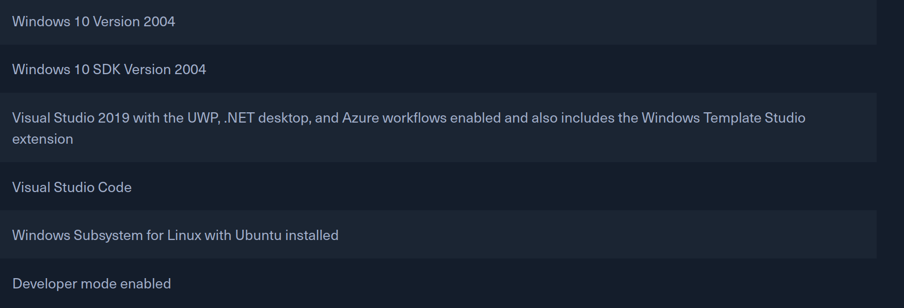

The VM comes preconfigured with a user: IEUser and Password Passw0rd!. It is a
trial virtual machine, so it has an expiration date of 90 days. Keep this in
mind when configuring it. Once we have a baseline VM, take a snapshot. 

## Core Changes

To prepare our Windows host, we have to make a few changes before installing our
fun tools:

1. We will need to update our host to ensure it is working at the required level
   and keep our security posture as strong as possible. 

2. We will want to install the Windows Subsystem for Linux and the Chocolatey
   Package Manager. Once these tasks are completed, we can make our exclusions
   to Windows Defender scanning policies to ensure they will not quarantine our
   newly installed tools and scripts. From this point, it is now time to install
   our tools and scripts of choice. 

3. We will finish our buildout by taking a backup or snapshot of the host to
   have a fallback point if something happens to it.

## Updates

To keep with our command-line use, we will work at utilizing the command-line
whenever possible. To start installing updates on our host, we will need the
PSWindowsUpdate module. To acquire it, we will open an administrator Powershell
window and issue the following commands:

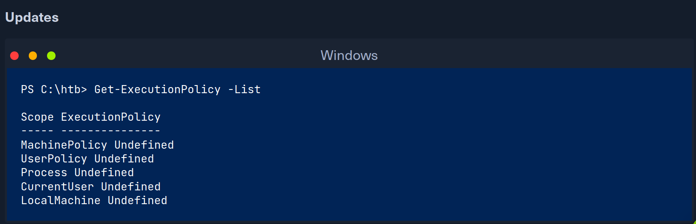

We must first check our system execution policy to ensure we can download, load,
and run modules and scripts. The above command will show us a list output with
the policy set for each scope. In our case, we do not want to this change to be
permanent, so we will only change the ExecutionPolicy for the scope of Process. 

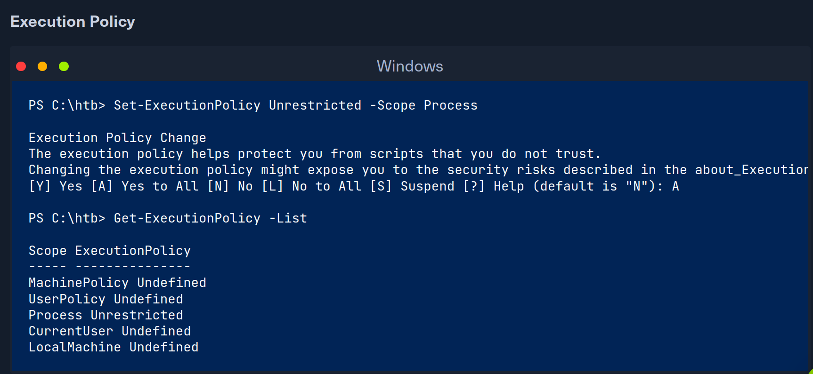

Once we set our ExecutionPolicy, recheck it to make sure our change took effect.
By changing the scope process policy, we ensure our change is temporary and only
applies to the current Powershell process. Changing it for any other scope will
modify a registry setting and persist until we change it again. 

Now that we have our execution policy set, let us install PSWindowsUpdate module
and apply our updates. We can do so by:

Once this module installation  completes, we can import it and run our updates.

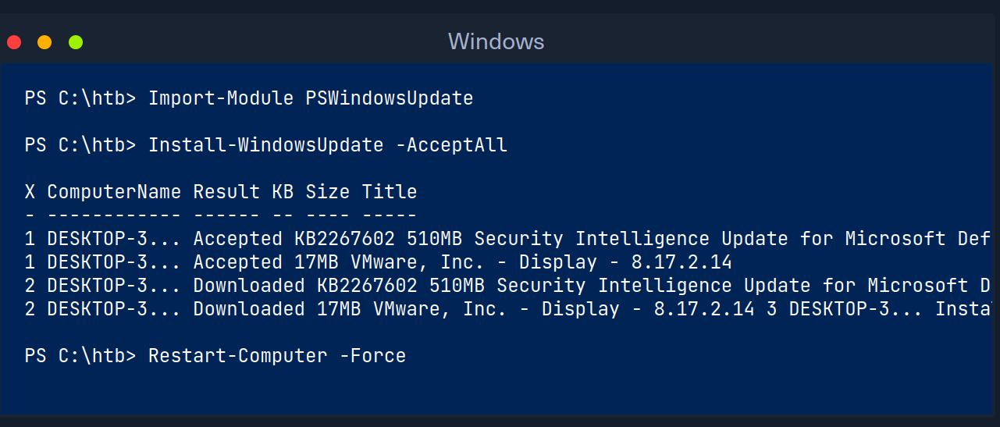

The above Powershell example will import the PSWindowsUpdate module, run the
update installer, and then reboot the PC to apply the changes. Be sure to run
the updates regularly, especially if we plan to use this host frequently and not
destroy it at the end of each engagement. Now that we have our updates
installed let us get our package manager and other essential core tools. 

## Chocolatey Package Manager

Chocolatey is a free and open software package management solution that can
manage the installation and dependencies for our software packages and scripts.
It allows for automation with Powershell, Ansible, and several other management
solutions. Chocolatey will enable us to install the tools we need from one
source instead of downloading and installing each tool individually from the
internet. Follow the Powershell windows below to learn how to install Chocolatey
and use it to gather and install our tools.

We have now installed chocolatey. The powershell string we issued sets our
ExecutionPolicy for the session and then downloads the installer from
chocolatey.org and runs the script. Next, we will update Chocolatey and start
installing packages. To ensure no issues arise, it is recommended that we
periodically restart our host. 

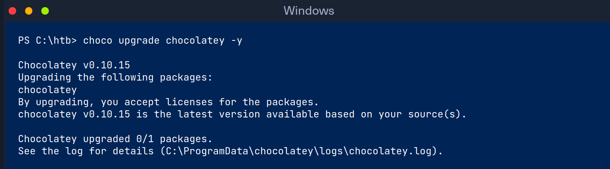

Now that we are sure that chocolatey is up-to-date let us run our packages. We
can use choco to install packages by issuing choco install pkg1 pkg2 pkg3
command listing out the package you need one by one separated by spaces.
Alternatively, we can use a packages.config file for the installation. This is
an XML file formatted so that chocolatey can install a list of packages. One
helpful command to use is choco info pkg. It will show us various information
about a package if it is available in the choco repository. See the [install
page](https://docs.chocolatey.org/en-us/choco/commands/install) for more info on
how to utilize chocolatey. 

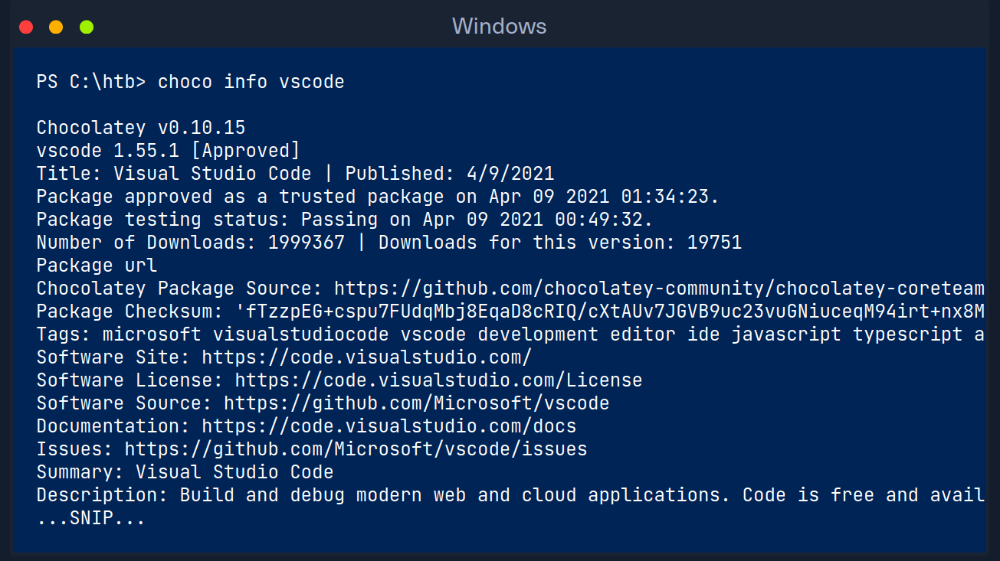

Above is an example of using the info option with chocolatey. 

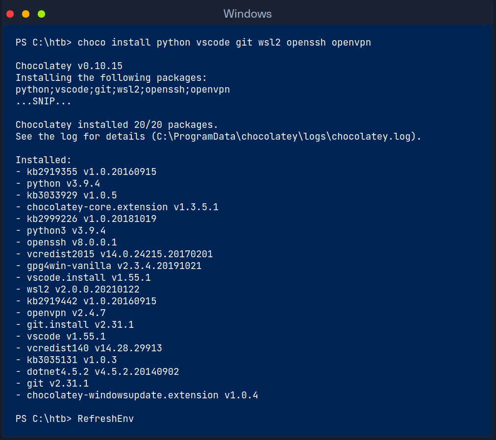

We can see in the terminal above that choco installed the packages we requested
and pulled any dependencies required. Issuing the RefreshEnv command will update
Powershell and any environment variables that were applied. Up to this point, we
have our core tools installed. These tools will enable our operations. To
install other packages, use the choco install pkg command to pull any
operational tools we need. We have included a list of helpful packages that can
aid us in completing a penetration test below. See the automation section
further down to begin automating installing the tools and packages we commonly
need and use. 

## Windows Terminal

Windows terminal is Microsoft's update release for a GUI terminal emulator. It
supports using many different command-line tools to include Command Prompt,
PowerShell, and Windows Subsystem for Linux. The terminal allows for the use of
customizable themes, configurations, command-line arguments, and custom actions.
A terminal is a versatile tool for managing multiple shell types and will
quickly become a staple for most. 

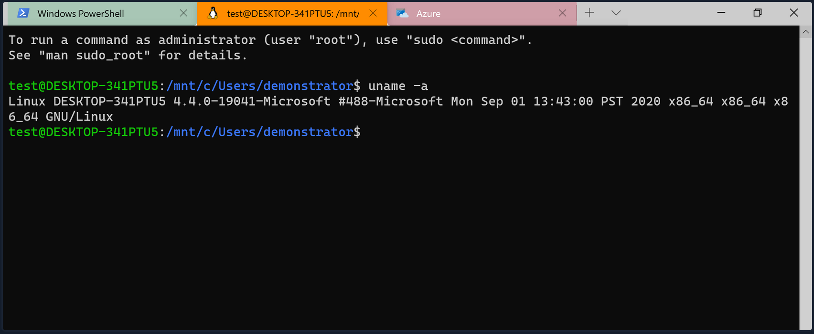

To install Terminal with Chocolatey:

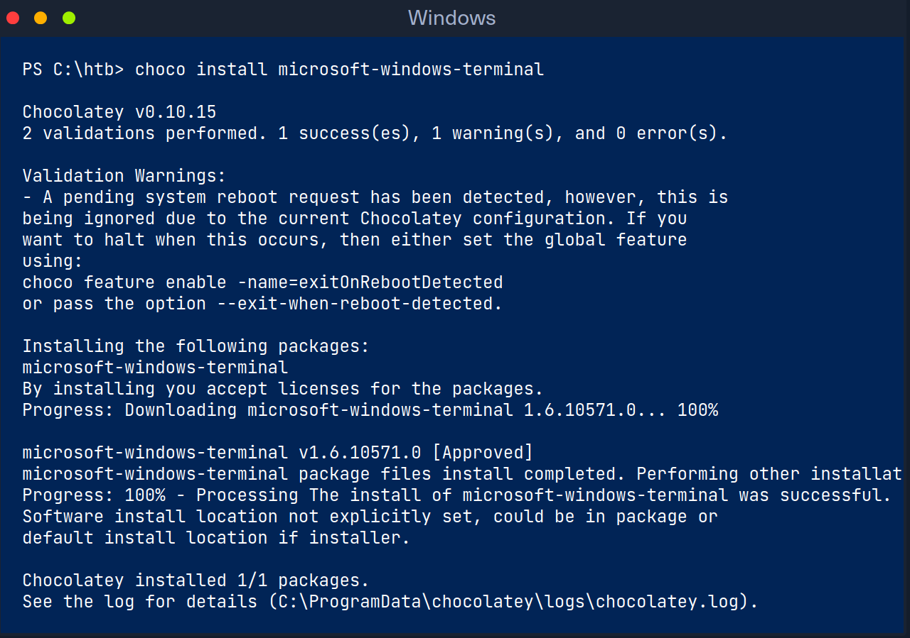

## Windows Subsystem for Linux 2

Windows Subsystem for Linux 2 (WSL2) is the second iteration of Microsoft's
architecture that allows users to run Linux instances, provides the ability to
run Bash scripts and other apps like Vim, Python, etc. WSL also allows us to
interact with the Windows Operating System and file structure from a Unix
stance. Best of all, it is done without the use of a hypervisor like VirtualBox
or Hyper-V. 

What does this mean for us? Having the ability to interact and utilize Linux
native tools and applications from our Windows host provides us with a hybrid
environment and the flexibility that comes with it. To install the subsystem,
the quickest route is to utilize chocolatey.

Once WSL is installed, we can add the Linux platform of our choice. The most
common one to find is Ubuntu on the Microsoft Store. Current Linux distributions
supported for WSL are:

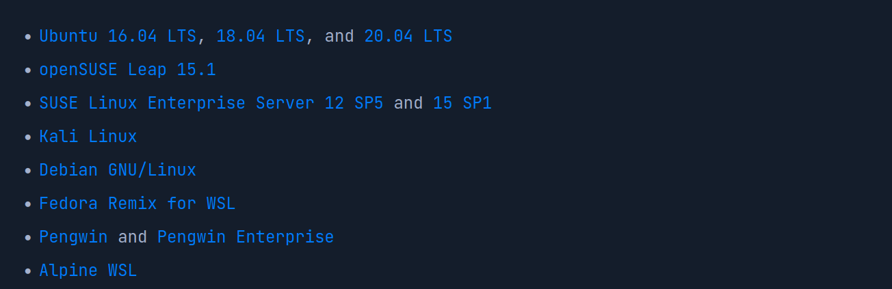

To install the distro of our choice, just click on the link above, and it will
take us to the Microsoft Store page for the distro. Once we have it installed,
we need to open a PowerShell prompt and type bash. 

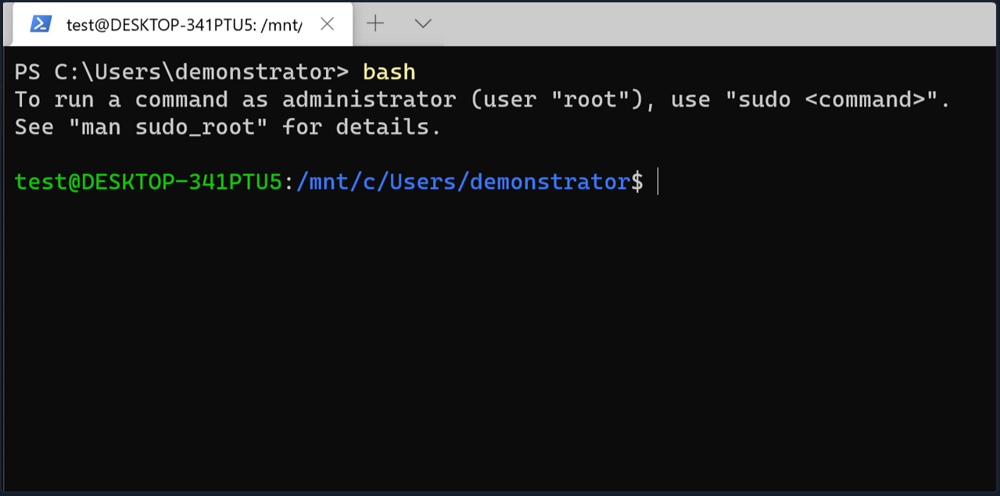

From this point, we can use it as a regular OS, alongside our Windows install.

## Security Configurations and Defender Modifications

Since we will be using this platform as a penetration testing host, we may rot
into some issues with Microsoft Defender finding our tools unsavory. Windows
Defender will scan and quarantine or remove anything it deems potentially
harmful. To make sure Defender does not mess up our plans, we will add some
exclusion rules to ensure our tolls stay in place. 

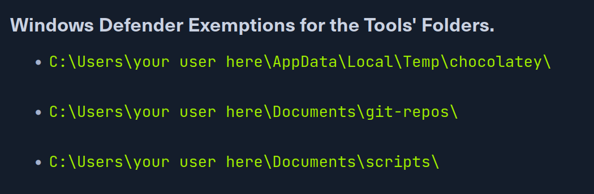

These three folders are just a start. As we add more tools and scripts, we may
need to add more exclusions. To exclude these files, we will run a PowerSHell
command.

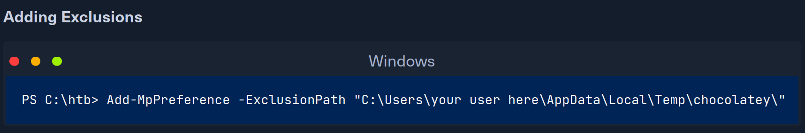

Repeat the same step for each folder we wish to exclude. 

## Tool Install Automation

Utilising Chocolatey for package management makes it super easy to automate the
initial install of core tools and applications. We can use a simple PowerShell
script to pull everything for us in one run. Here is an example of a simple
script to install some of our requirements. As usual, before executing any
scripts, we need to change the execution policy. Once we have our initial script
built, we can modify it as our toolkit changes and reuse to speed up our setup
process. 

When scripting with Chocolatey, the developers recommend a few rules to follow:

- always use choco or choco.exe as the command in your scripts. cup or cinst
  tends to misbehave when used in a script

- when utilizing options like -n it is recommended that we use the extended
  option like --name

- do not use --force on scripts, because it overrides Chocolatey's behavior

Not all our packages can be acquired from Chocolatey. Fortunately for us, a
majority of what is left resides in GitHub. We can set up a script for this and
download the repositories and binaries we need, then extract them to our scripts
folder. Below we will build out a quick example of a Git script. First, let us
see what it looks like to clone a repository to our local host. 

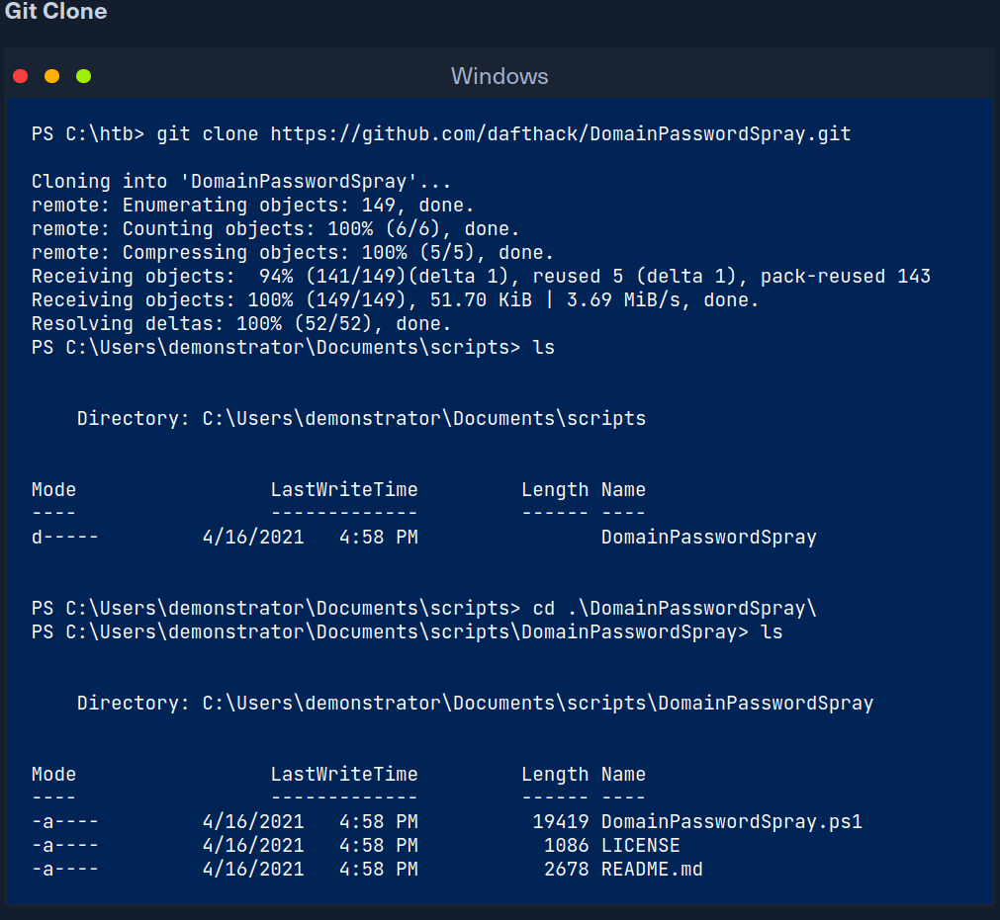

We issued git clone command with the URL to the repositories we needed. From the
output, we can tell it created a new folder in our scripts folder then populated
it with the files from the GitHub repository.

## Testing VMs

It is common and very relevant to prepare our penetration testing VMs and VMs
for the most common operating system and their patch levels. This is especially
necessary if we want to mirror our target machines and test our exploits before
applying them to real machines. For example, we can install a Windows 10 VM that
is built on different patches and releases. This will save us considerable time
in the course of our penetration tests to configure them again. These VMs will
help us test our approach and exploits to understand better how the
interconnected system might react to them because it may be that we will only
have one attempt to execute the exploit. 

The good thing here is that we do not have to set up 20 VMs for this but can
work with snapshots. For example, we can start with Windows 10 version 1607 (OS
build 14343) and update our system step by step and create a snapshot of the
clean system for each of these updates and patches. Updates and patches can be
downloaded from the Microsoft Update Catalog. We just need to use the Kb article
designation, and there we will find the appropriate files to download and patch
our systems. 

Tools that can be used to install older versions of Windows:

- Chocolatey

- MediaCreationTool.bat

- Microsoft Windows and Office ISO Download tool 

- Rufus

## Next Steps

Now that we have our Linux and Windows VMs configured, let's dive into Virtual
Private Server (VPS) setup and usage. 

**HOOray@@**

